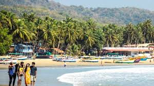

# 🇮🇳 Goa and The Stuff

My friend, “M” one day in 2016, did the craziest thing ever. He sold his house, his Ford F350 and all his belongings and quit his job and relocated his entire life to India, specifically; Goa.

He loved Goa so much, but love is cruel. One day he got mixed up with some shady group regarding drugs and ended up in jail. Just a few months ago he got out and you’d think he’ll fly back to Jordan immediately, but no, he’s still there living his life and loving every minute.

Beautiful things are always dangerous. And in case you visit Goa one day and wish to play it safe but also smoke some dope! Here’s a little guide for you:

Well, as beautiful as Goan beaches are, I wouldn't tell you to go smoke weed on any beach at all. Beaches in the North are always buzzing with people so places like Baga, Calangute, Candolim or Miramar are a big no-no. You never know who's coming after you.

Anjuna and Vagator are realtively relaxed so you could easily sit in Curlies' and see the waves come and go while you smoke that blunt. Morjim is yet another beautiful beach and somehow doesn't stay crowded. From my personal experience, an early-morning session at Morjim would be no less than magical.

However, I must warn you about the consequences. Goan police is really strict about drugs and especially when it's with tourists so you better keep your eyes open while you're smoking. If you're not a regular smoker and don't have a lot of experience smoking in public places, take extra care.

Also, I'm assuming if you're traveling to Goa, you would spend most part of your trip in the North but beaches in the South are far more secluded and cleaner so you might want to make that extra effort in your pursuit of trying to be one with nature.

You are a noob in Goa, or even a noob to ‘stuff’ normally (and just wish to smoke up in Goa to own a time of your life), here are some general recommendations on where to find your stuff cc: Goa.

The Capris/Cigarette Shops: the most effective and most reliable leads may be found at your nearest Paanwala if he doesn't keep the things with himself. The likelihood is he’ll have some to sell it to you, but if he doesn’t he will direct you to the closest peddler.

You'll completely trust your Paanwala for this information; they never lie regarding anything because they need their cuts sorted.

The Internet Cafes/Money-Exchange Shops: This culture is exclusively credited to Goa alone, where the peddlers operate right out of those internet cafes. They'll obviously not provide you with the things right then & there, but 99 out of 100 times, they might have what you wish.

And there's actually a logic behind it – since all the firangs (read: Russians) are certain to visit the money-exchange shops once they land in Goa, these shop owners became stuff-operators in due course time taking their cuts for every sale. Whether you reside in Palolem, Arambol, Baga, or Calangute, these shops are everywhere and now you recognize why.

The restaurant waiters: Although it's going to sound outrageous initially, it's completely safe to ask any restaurant waiter where you'll get your “quote”. Just confirm that the waiter is comparatively young to stay in the safer side. they're another species within the state that thrives on the ‘middleman's commission’ for the things.

The bike/car/scooter lenders: These are probably the primary guys you’d attend see after checking during a hotel or a shack because you simply can’t do without an Activa in Goa. It's absolutely safe to ask them for the whereabouts of stuff.

The shack owners: If you're staying or dining in an exceeding shack on a Goa beach, it's extremely easy to seek out the great stuff. Just enquire the person sitting at the counter. He may or might not be directly involved but 7 out of 10 times he would direct you to the one that may have the data on what you would like. But only ask if the owner’s an Indian, never ask from a firing owner.

## About the Author

Mujahid Al-Majali, a 29-year-old former air force soldier and an economic development and business specialist, also does translation and copywriting. Loves long drives, chill music and old school movies. A nicotine addict and a huge fan of Jack Daniel’s whiskey. Owned multiple businesses in Amman and southern of Jordan PRE-COVID and now focusing on translation and copywriting part of my experience through Upwork.
