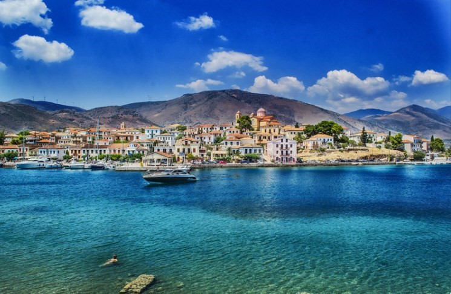
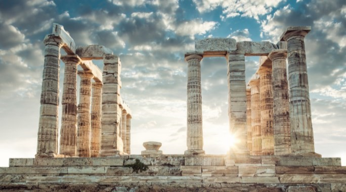

# 🌊 Greece

This country is famous for the beauty of its beaches and its islands, being one of the destinations that is at the top of the ranking when planning vacations. A true earthly paradise with beaches with transparent and incredibly blue waters, you can enjoy spectacular sunsets, choose a traditional tavern and savor exquisite meals, but also stay chatting with the cheerful and charming locals until late at night or simply dance, for those people who have more energy and can enjoy a beach club in the morning.

A vacation in Greece can give you the impression of taking an epic trip, whether on an island, in the capital or in any little-known city that remains in the interior of the country, the myth is always part of this country through ancient temples that are perfectly preserved, with a prestigious museum that contains the first great artistic works of humanity. If your interest is to go with your partner to a romantic getaway you will have arrived at the perfect place, but also if you are a young person looking for unbridled fun or what you want is simply to rest and forget about stress, Greece continues to be the ideal destination.

Tourism in this country is highly developed, so there are apartments and hotels for all needs, you can also count on ferries and flights to reach your favorite places. In Greece you can enjoy the typical Mediterranean climate that is characterized by hot summers and mild winters, however, in the maritime areas that are at high temperatures are mitigated by the wind. The recommendation is to go to Greece during the summer, but if you can avoid the months of July and August you could save a significant amount of money, since they are the months of high season and of course the accommodation, in addition to the tickets, are more expensive and busy, so the best time is definitely the months of June or September. In some cases it is even possible to swim even in the month of October, but in this month the seasonal flights are no longer in service.

Many tourists choose to go to Greece for its excellent beaches and its rich artistic and historical heritage. But is it better to stay on the mainland or visit one of the islands? It is advisable not to miss the most important places in Greece, when we talk about the islands it is advisable to visit Athens, where the Acropolis and the Parthenon are located, which are enough to make Athens a mandatory stop if you want to know these wonders and also not It only has a magnificent view that is unique in the world, it is also loaded with rock festivals, noisy taverns, trendy clubs and from the hill you can enjoy romantic sunsets. You can even take fabulous day trips, such as to the Cyclades Islands. There you can enjoy a sea with exuberant blue tones, a generous sun, a beautiful church on top of a hill and white houses with blue balconies

Each island of Greece has its charms, the glamorous place par excellence is Santorini, while the most transgressive is Mykonos, with Milos being the preferred island for those who want to avoid the tourist crowds and prefer a mix between tradition and nightlife. You can visit Naxos, Paros, Amorgos or Anafi. However Crete is the largest island and for many tourists it is the most beautiful, being the mythical palace of the Minotaur (Palace of Knossos) one of its biggest attractions, but it also includes archaeological museums, mountain trails and palm groves.

The wonderful islands of the Dodecanese such as Rhodes, Karpathos, Kos, Skopelos and Skiathos are the closest to Spain, while the Ionian Islands are very easily accessible from Italy via ferry, Corfu being the best known and with a more accommodation. Zakynthos is also very beautiful, iconic shipwreck beach and the island of the poet, but remember that there is also Ithaca, the mythical island of Ulysses and if you want to stay in mainland Greece, the alternative is also valid as it is just as fascinating but much cheaper and less visited. You can find wonderful beaches both in the east and in the west. Although it is true that archaeological sites are found throughout Greece, in case you do not have too much time it is important that you visit Delphi and Olympia. In the Meteora complex there are 6 ancient monasteries built on imposing stone towers, which are definitely a very unique attraction.

People in Greece are characterized by being jovial and welcoming. The accommodations manage to satisfy the needs of any tourist, since its facilities range from the lowest cost to the rooms with the most unbridled luxury. Of course, everything will depend on your budget and the vacation you want to have, since you can choose accommodation in large resorts with a private beach, gardens, swimming pools and endless amenities or accommodation in simple guest houses or in studios that are typical of the islands and are the best relationship between charm, price and comfort.
There are five-star hotels that have an infinity pool or may include a private pool and most accommodations allow free cancellation, that is, they can be revoked without penalty. They also have 24-hour telephone assistance, in most languages.

While it is true that mainland Greece does not adjoin land borders to the east and west, it is bordered to the north and northeast by Albania, Bulgaria, North Macedonia and Turkey. There are three seas that bathe Greece and they are: the Ionian Sea, the Aegean Sea and the Sea of Crete. There are the Greek Islands and the Ionian Islands, their western shores are towards Italy, while in the Dodecanese Islands they are less than 20 km from Turkey.

## About The Author

 Idais, Graduated in Mechanical Engineering, and a master’s degree in teaching component, she gave classes in several institutes of mathematics and physics, but she also dedicated several years of my life as a television producer, she did the scripts for mikes, the camera direction, editing of video and even the location. Later she was dedicated to SEO writing for a couple of years. she like poetry, chess and dominoes