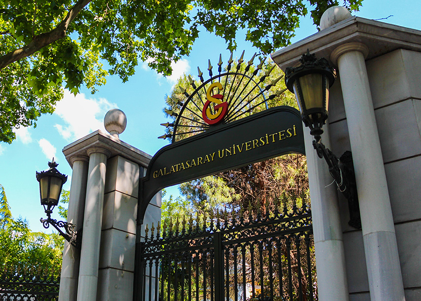
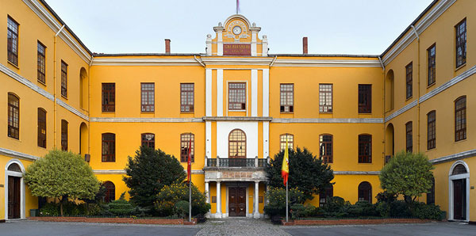
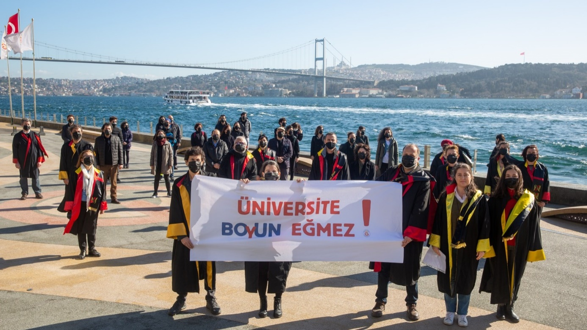
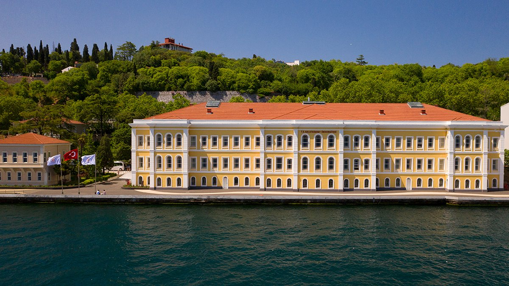
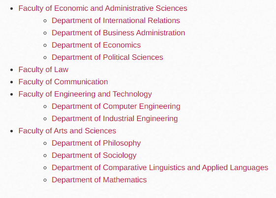

# 🦁 Galatasaray University

 

Galatasaray University (GSU) is a half-Turkish, half-French state university founded in 1992. It is the only university in Turkey that uses the French language for education. Located in Beşiktaş, Istanbul, Turkey, the Galatasaray University uses an old palace as its main building. It is situated on the Bosporus shore, and hence, you can see amazing landscapes even as you're relieving yourself!

 

The history of the university dates back to 1481, when Bayezid II established a school named “Galata Sarayı”. This translates to “the Palace of the Galata”, where Galata is the name of a neighborhood in Istanbul. The school also served as a university for the Ottoman Empire. Here, officers were trained for state administration. In 1838, the building was reconstructed to serve as a medical institute. In 1868, Galatasaray Mekteb-i Sultanisi was founded, with its main focus on free education. In 1874, three academic branches were created, and their curriculum was designed in line with Sorbonne University. Then, in 1924, with the decision of the Great Atatürk, the school eventually became the Galatasaray High School. In order to be accepted, students must score a total of 500 out of 500 in the entrance exams. This made Galatasaray High School the most difficult high school to enter.

 

During a ceremony at Galatasaray High School in 1992, President François Mitterrand of France and President Turgut Özal of Turkey signed an agreement establishing Galatasaray University, also known as L’université Galatasaray. The university is part of the Galatasaray Community as Galatasaray High School and Galatasaray Sports Club, which you may be familiar with. It is among the most prestigious, successful universities in Turkey. As founded in its roots, the tradition of secular and free education is deemed important.

 

Although the primary language for education is French, Galatasaray University is actually a trilingual university. Courses are being offered in three languages: French, Turkish, and English. In order to graduate, students must know how to speak French and English fluently. They are also required to study a third foreign language, which can either be German or Spanish.

 

Since French is the official language for education, students are required to undergo one year of linguistics training during the preparatory period. However, if you are a student taking up linguistics, the training is extended for up to two years.

 

As of this writing, there are 5 faculties and 12 programs in the university, as follows:

 

Lastly, there are three ways for students to be accepted into the university. Galatasaray University accepts 50% of its students from entrance exams, 25% from Galatasaray High School, and the remaining 25% from other high schools that offer French education, such as Saint Joseph High School and Saint Benoit High School.
