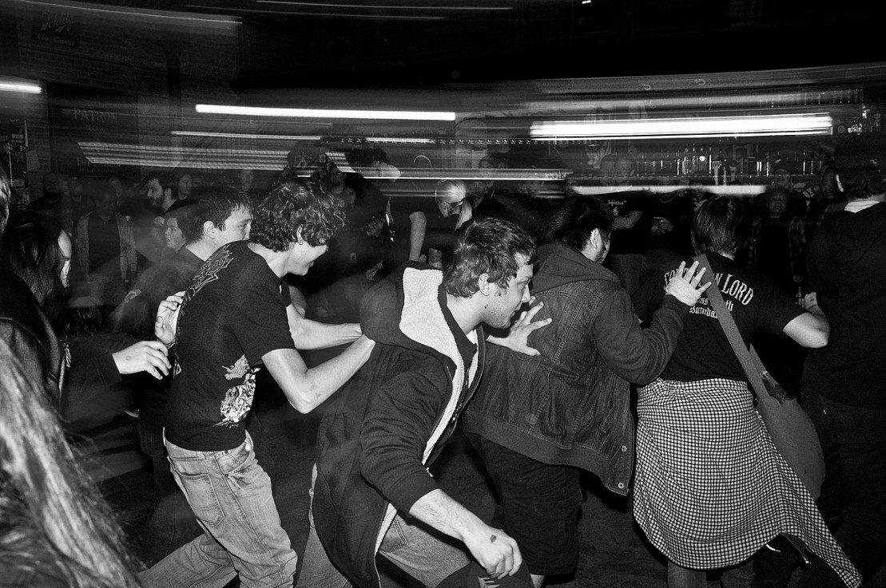

# 🎸 Hardcore

"Hardcore is rooted in the 1970s and early 1980s industrial music, specifically
the elements of hard electronic dance music. Groups such as Throbbing Gristle,
Coil, Cabaret Voltaire, SPK, Foetus and Einstürzende Neubauten produced music
using a wide range of electronic instruments. The message diffused by industrial
was then very provocative. Some of the musical sounds and experimentation of
industrial have directly influenced hardcore since the beginning of the
movement."

"Hardcore is Rave taken to another level. A more harder level. You might say a
hard core level.

There is a logical progression to all this. Hardcore is a harder version of
Rave, which was a harder version of Euro Techno, which was a harder version of
Bleep Techno, which was a misunderstood interpretation of Detroit Techno. There
may be other influences but that is the general gist.

This is how we got to this point -- everyone outdoing one another each week by
coming out with something harder and more menacing, in much the same way The
Beatles wanted to make a harder record than The Who so they came up with Helter
Skelter. And then a year later Black Sabbath came out with Paranoid."

"The original hardcore usually starts at 150 BPM, and the sky is the limit. The
pace is amazing, and if we add the armada of various distortions, larsen's
preference, the hypnotic, insane, ecstatic effect on the crowds is nothing to be
surprised about. Simple music that can be called almost primitive. Some critics
see it as the electronic equivalent of the heavy metal trashmetal subspecies."

"Nu Style Gabber has essentially dominated Hardcore ever since, only lately it
has slowed to the point where it sounds indistinguishable from Hardstyle,
effectively merging the genres which is fine because the same Dutch prodouchers
make both and the same Dutch douchelords listen to both.

So there's almost no distinction anymore, both in the DJs who cane the crap at
Sensation Black and the raging dorkmongers in attendance who think they're too
good for Rob Gee."

You can find more details about its formation and development on Ishkur's Guide
to Electronic Music, and you can listen to acid house music right away.
<https://music.ishkur.com/?query=Hardcore>

The Every Noise at Once platform provides an opportunity for people to get to
know better the names of the creators who have ever been in the genre and thus
the peculiarities of it.

Sources :

- MENNYEK KAPUI - Az elektroniks zene évtizede (The decade of electronic music)
- Wikipedia
- Ishkur's Guide to Electronic Music
- Every Noise at Once

## About the Author

"Guido F. Matis (a.k.a. widosub), a seasoned producer-composer authority with an
unquenchable compassion towards the musical expression, and many years of
experience in the fields of event organizing, movie post-production, and
recording with professional musicians. His devotion to movie sounds shows in his
art - widosub's music is filled with landscapes of emotions, dramatic twists and
melancholic moods. He's one of the hosts of Tilos Rádió's MustBeat show, in
which he's is focusing on drum'n'bass and chillout music. He's also one half of
the duo Empty Universe."
