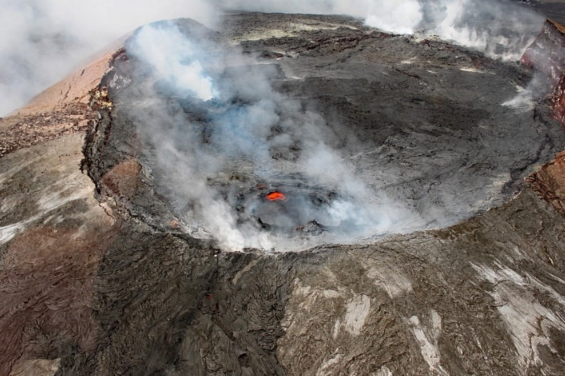
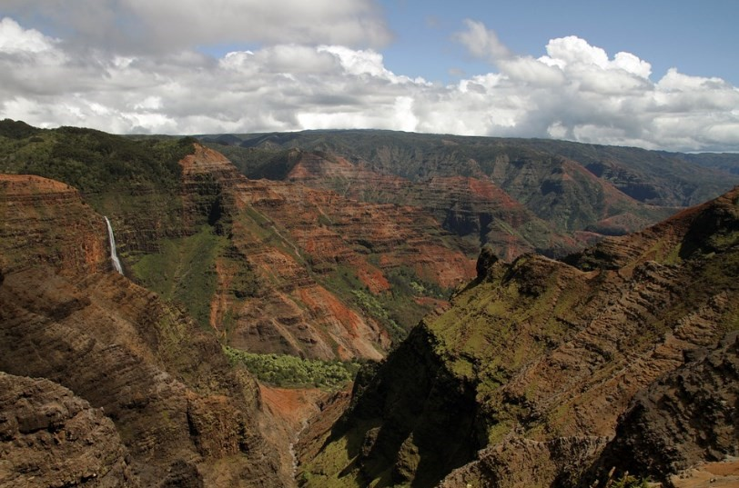

# 🏄 Hawaii

Hawaii is a state (number 50) of the United States, with Honolulu being its capital located on the island of Oahu and its most populous city. Although it is true that Hawaii belongs to the United States, they are not even on the same continent since this archipelago belongs to Polynesia, which is part of Oceania, however, it is closer to America than to Australia, which is the territory closest to Hawaii of the main landmass of Oceania.
The Hawaiian archipelago is made up of eight main islands, the largest being Hawaii or also called the Big Island, Oahu, Molokai, Maui, Kauai, Lanai, Niihau and Kahoolawe.
The state of Hawaii offers you beautiful white sand beaches and a wide range of cultural and tourist attractions. On Oahu you can view World War II ships or swim in the famous white shores of Waikiki Beach. On the Big Island you will find green sand beaches, even black.
This article is intended to guide you through the most emblematic places in Hawaii, so you do not miss the most important places in the archipelago.

## Hawaii Volcanoes National Park

On the Big Island is Hawaii Volcanoes National Park where you can see the Klauea volcano, which is one of the most active in the world, as well as Mauna Loa, which is the largest volcano on the planet. This park has great meaning for the Hawaiian people because it is considered the home of the Goddess Pelé. The best way to access stunning images of a large crater is to go to the Kilauea Visitor Center where there is an observation deck and if you are lucky, you will be able to witness the molten earth boiling into the sea. You can also walk along the Crater Rim Road for stunning views, and the last tip is to explore the interior of the Thurston Lava Tube. We are sure that the experience in this park will remain etched in your memory forever.

## Waimea Canyon

Waimea Canyon is located on the island of Kauai and is called by many the Grand Canyon of the Pacific. This is one of the most amazing places you can see in Hawaii and due to its amazing size it can be compared to the Grand Canyon, even more beautiful for having a greater abundance of vegetation that mixes with the desert landscape. In general, the mornings are clearer of clouds and you will be able to have a greater visibility of the landscape. The best way to explore the Grand Canyon of the Pacific is by walking through the Koke'e State Park, where it is possible to camp if you want to enjoy the sunrise in this glorious place.

## Honolulu

Honolulu is the largest city in the entire archipelago, the state capital is a busy, bustling and exciting city to explore. It has many activities to do, the culminating site being Waikiki beach, which is actually several beaches that are interconnected. The most popular option is Duke Kahanamoku beach where both local surfers and tourists go and to enjoy one of the most impressive views of the city, the recommendation is to climb to the highest part of the Diamond Head crater.

Another of the essential sites is to visit Pearl Harbor, where the most prominent site is the USS Arizona Memorial, there you can get a historical view of the events of the Japanese attack and its subsequent consequences in World War II.

## Molokai

Molokai is one of the least developed islands in the archipelago, but one of the most picturesque in the state. It is known by many as the Friendly Island and its most famous attraction is the Kalaupapa National Historical Park, at one time this park served as a leper colony, but today most visitors to Molokai approach the island for its great unaltered and original beauty. You can swim at Papohaku beach where you will find very few families around you or if you prefer hiking, you can head to Pala'au State Park.

## Hapuna Beach

You can find a lot of magnificent beaches on the Big Island of Hawaii, but one of the best for its large stretch of fine white sand is Hapuna Beach. It is also within walking distance of popular hotel destinations such as Kona and Waikoloa. Due to its size it is very easy to find a place away from the other bathers and if you prefer you can snorkel near the reefs or practice body boarding.

## Haleakala National Park

Haleakala is a volcano that occupies half of the island of Maui and is over 3,000 meters high. Haleakala National Park revolves around its massive crater, which many consider comparable to a lunar landscape, with hiking being the most common way to explore the park. If you go on an excursion to the Pipiwai Trail you will come across 120-meter waterfalls and several pools, where you can cool off and enjoy the day.

## Na Pali Coast

Na Pali Coast is located on the island of Kauai and along the coast you will see cliffs covered in lush vegetation, at their base you will find secluded and private beaches. You will observe a landscape completely different from anything you have seen before, if you prefer, you can hike between the cliffs and the locals will be able to show you where to jump into the water safely.

## Oahu's North Shore

While it's true that most visitors to Oahu head to Honolulu, the north shore of the island also offers some really great beaches. But for surf lovers this area has the best waves in the world. You can watch the world class surfers on the Banzai Pipeline and maybe see international championships, it's quite a contrast to the more touristy spots on the island.

## Lanikai Beach

On the east coast of Oahu and just a half hour drive from Honolulu is Lanikai Beach, a true paradise on earth. You can swim in this half-mile beach of white sand, shaded by palm trees and turquoise waters.

## Kaanapali Beach

Kaanapali Beach is located on the west coast of Maui just outside of the tourist center of Lahaina, stretching from Back Rock to Canoe Beach. This beautiful beach has a number of rock monuments that have religious or historical significance to Hawaiians, the best known being Black Rock. You can also rent a boardwalk where you can admire the impressive views of the Pacific Ocean.

Hawaii a state full of beautiful beaches, volcanoes, paradisiacal sites and dream places!

## About the Author

Idais, Graduated in Mechanical Engineering, and a master’s degree in teaching component, she gave classes in several institutes of mathematics and physics, but she also dedicated several years of my life as a television producer, she did the scripts for mikes, the camera direction, editing of video and even the location. Later she was dedicated to SEO writing for a couple of years. she like poetry, chess and dominoes.
