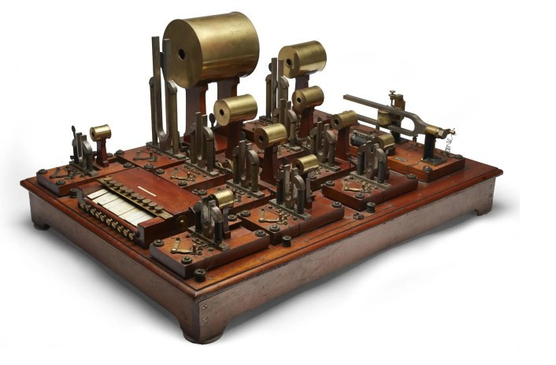
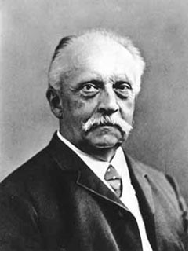

# 🎛️ Helmholtz Sound Synthesiser

Born in Potsdam, Germany, Helmholtz was a scientist and philosopher, best known for his work in physiology,electrodynamics, and for his law of the conservation of energy. He was particularly concerned with theories of vision and the mechanics of the eye. In 1851, Helmholtz invented the ophthalmoscope, a tool enabling observation inside of the eye. He is also known for his experiments on the speed at which signals travel along nerves, which he studied on a frog model.

Max Kohl AG founded on 14 March 1876 was a well known company that designed and built scientific mechanical and electrical instruments and was based on Andorfer Str,Chemnitz, Germany. The company created a huge range of equipment sold throughout the world to laboratories and universitiesincluding a sound instrument based on a design by Hermann von Helmholtz.

The Max Kohl AG factory in Chemnitz was destroyed by allied bombing during WW2 and most of the remaining equipment was transported intact after the war to the Soviet Union.

The ‘Sound Synthesiser’ was not intended as a musical instrument but a scientific tool to demonstrate and analyse the effect of overtones in complex sound as described in Helmholtz’s revolutionary book ‘On the Sensations of tone as a Physiological Basis for the Theory of Music‘ (Hermann von Helmholtz 1870) which had a huge impact on musicologists and instrument designers throughout the twentieth century. Using resonators, Helmholtz demonstrated the components of complex sounds are a combination of overtones of a fundamental note (e.g. a “fundamental” pitch G 440Hz contains a harmonic series of whole number multiples of this 440Hz frequency or overtones – 880Hz G , 1320Hz, 1760Hz, etc. at variable volumes). The Sound Synthesiser used a number of tuning forks – which produced almost pure tones – vibrated by electromagnets which in turn were amplified by a Helmholtz Resonator to generate overtones.The range of overtones could be ‘filtered’ by a mechanical shutter.The instrument helped in the understanding of the nature of speech and vowel sounds; vowel sounds being varied combinations of resonant overtones or ‘formants’ created by the muscles of the vocal tract.

[Herman Van Helmholtz]

Here you can see the Helmholtz Resonator in action: <https://youtu.be/A9XLNH8FPd0>

## Next topic: Choralcelo

## Sources

- Wikipedia / 120years.net / Braintour.harvard

## About the author

"Guido F. Matis (a.k.a. widosub), a seasoned producer-composer authority with an unquenchable compassion towards the musical expression, and many years of experience in the fields of event organizing, movie post-production, and recording with professional musicians. His devotion to movie sounds shows in his art - widosub's music is filled with landscapes of emotions, dramatic twists and melancholic moods. He's one of the hosts of Tilos Rádió's MustBeat show, in which he's is focusing on drum'n'bass and chillout
music. He's also one half of the duo Empty Universe."
