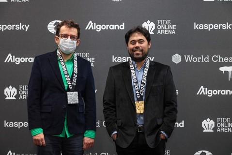

# 🦄 Hikaru wins first leg of Grand Prix: Levon stunned

Hikaru Nakamura won the first leg of Grand Prix series organized at Berlin in a spectacular way against Levon Aronian in tie breaks. With this win Nakamura pocketed 13 point and became one of the favorites to win spot in Candidates. Hikaru Nakamura won €24,000 in prize money.

Chess fans witnessed the dramatic fight between US grandmaster and streamer Hikaru Nakamura and top professional Levon Aronian. In a first tie break game Hikaru caught Levon off-guard and got out of opening with better position. Levon fought resiliently and got some chances to hold position but as Levon’s time was getting low mistake happened and Hikaru won by flagging Aronian anyways Levon was having lost position. In second game Aronian was white and played a slow Italian opening and got some edge out-off opening heading towards middle game. Levon was forced to go all in to force Armageddon, Even draw means losing in this situation. In this tough spot Levon over-pressed and gave advantage to Hikaru. Hikaru ultimately converted won position with great technique. And Hikaru won tiebreaks with sheer dominance on full time top professional chess player Levon Aronian.

Levon Aronian and Hikaru Nakamura. Photo: World Chess

Immediately after the final game of the tiebreak at the playing venue closing ceremony was conducted in which the winner and runner-up were awarded their winners medals by Ilya Merenzon, CEO Of World Chess and Ivan Syrovy, Chief Arbiter of the event.

Grand Prix point after completion of first leg are as follows;

1. Hikaru Nakamura, (USA), 2736 — 13 points

2. Levon Aronian (USA), 2772 — 10 points

3. Leinier Dominguez (USA), 2752 — 7 points

4. Richard Rapport (Hungary), 2763 — 7points

5. Wesley So (USA), 2772 — 4 points

6. Radoslaw Wojtaszek (Poland), 2686 — 4 points

7. Andrey Esipenko (Russia), 2714 — 4 points

8. Vidit Gujrathi (India), 2727 — 3 points

9. Daniil Dubov (Russia), 2720 — 3 points

10. Alexander Grischuk (Russia), 2764 — 2 points

11. Vladimir Fedoseev (Russia), 2704 — 2 points

12. Pentala Harikrishna (India), 2717 — 2 points

13. Grigoriy Oparin (Russia), 2681 — 0 points

14. Etienne Bacrot (France), 2642 — 0 points

15. Vincent Keymer (Germany), 2664 — 0 points

16. Alexei Shirov (Spain), 2704 — 0 points

The winner of first leg and streamer Hikaru said in interview “Definitely I didn’t prepare anything because I was not expecting to win. First of all I would like to thank the organizers and arbiters. I want to thank the fans. They are very interested in chess and Germany has a long history with this great game and seeing them coming was very nice. And of course to Levon he played really well, he came a bit short to the last games but I hope we both have chances to qualify for the Candidates. It was generally a great experience and looking forward to be back in Berlin in about 3 weeks. Thank you!”

## Reference

https://worldchess.com

## About the Author

Jashwaneel Patil is a student pursuing Bachelor of Engineering in Electrical and a young mind who likes to explore and research in different areas. His vision lies in making Earth to make a better place to live with taking small steps towards sustainability and making best use of technology available to make easier life for mankind.
