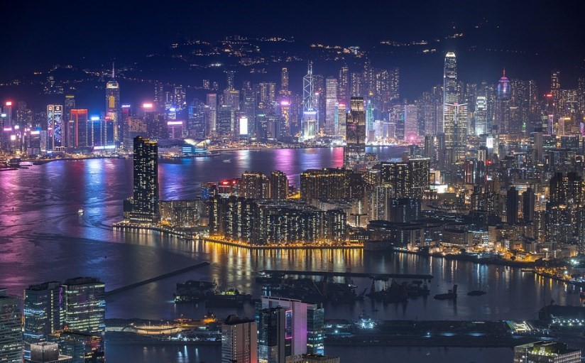
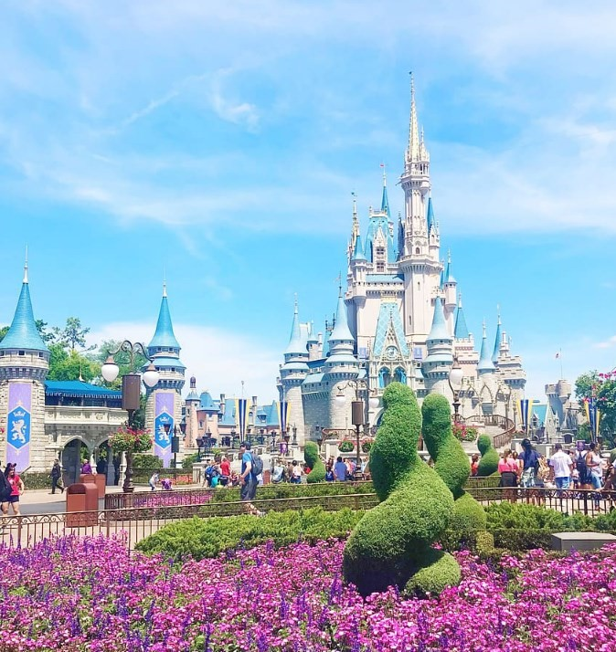

# 🏯 Hong Kong

Hong Kong is one of the cities in China that is not indifferent to anyone, its vertiginous skyscrapers, all those neon lights, its street food, its amusement parks, traditional houses, urban tribes, among many other things, make of this city an incredible place to know and visit. We will give you a list of the places that we consider to be the most important to see in Hong Kong.

## Avenue of stars

The Avenue of Stars is like being on the Walk of Fame in Hollywood, but of course, this street pays homage to the great Chinese artists, you can see the footprints of Jackie Chan or take a photo next to the statue by Bruce Lee.

## Symphony of light

Symphony of the light is a light and sound show that takes place every night at 8 pm and lasts approximately 10 minutes, in which the entire city participates, you will be pleasantly impressed by this display of music and lights.

## Nathan Road

Nathan Road is the main commercial artery of Kowloon and it is an area that never sleeps, the recommendation is to walk along this street and observe everything that you find around it.

## Lai Kwai Fong

The Lai Kwai Fong area is perfect for a cocktail or beer before or after dinner.

## Eat dim sum

It is impossible to go to Hong Kong and not eat one of its specialties, "dim sum", you can try them all over the city, however, some of the best places to eat them are at One Dim Sum Chinese.

## Kowloon Park

It is likely that at some point during your visit to this city you prefer something to relax and the best place to unwind than Kowloon Park, where you can walk through this great lung of Hong Kong and watch the old people practice tai chi or perhaps have a bath to cool off in its public pool. As a curiosity we tell you that until 1987 the old neighborhood of Kowloon was in this area, at that time it was one of the most dangerous places on the planet, where not even the police dared to enter, but today it is the opposite and far from worrying about passing through this area, you will be filled with a lot of tranquility.

## Hong Kong Beaches

If you want to go to the beach, of course there are several to visit since you are on an island, the most recommended are Stanley Beach or South Bay, however, we do not believe that it is one of the essential activities to do in Hong Kong.

## Eat at Tim Ho Wan

This city has a very interesting food scene and trying some of its dishes like the pork and prawn dumplings or maybe its bbq pork stuffed buns at a restaurant called Tim Ho Wan is one of the best things you can do in this city town. To give you an idea, this is one of the cheapest restaurants in the world and it has a Michelin star, a generous dinner for two costs less than €20, and its food is truly spectacular.

## Hong Kong temples

If you are a lover of Chinese temples, you cannot miss the Wong Tai Sin Temple, which is definitely one of the most important in Hong Kong.

Photo taken by Daniel Lee

The other recommendation is to visit the Man Mo Temple, as it is one of the oldest in the city.

## Climb Victoria Peak

You can see the sunset from the top of Victoria Peak in front of thousands of high skyscrapers, to get there you just have to take the funicular that will take you to the top of this mountain.

## Choi Hung Estate

A few years ago this building was quite unknown, but thanks to someone who believed that this colorful building would look great in his gallery and on instagram, today it is one of the most photographed and visited places in the city.

## Monster Building

The same situation that we described in the previous item happened to the Yik Cheong Building (Monster Building), it is a building absolutely full of small apartments that became famous when it appeared in the movie Ghost in the Shell, it is worth taking a picture in this building that is so popular today.

## Ladies Market

Ladies Market is currently the most frequented market in Hong Kong and there you can find exactly everything you can imagine, from fish soups to designer bags, do not forget to haggle.

## Temple Street Market

Temple Street is the other highly recommended market, although it is true that it is usually very crowded, it is also full of character.

## Victoria Bay Cruise

A cruise through Victoria Bay is one of the best activities you can do towards sunset, it is the moment when the lights of the city are reflected in the water with its thousands of colors.

## Longest escalator in the world

The longest escalator on the planet is located in Hong Kong, it measures approximately 800 meters, it is located between the Mid Levels and Central. Although it is true that it is not a single staircase, since it is rather a stretch of different stairs, it is still worth traveling this route that lasts about 20 minutes.

## Double-decker trams

One of the most original ways to visit Hong Kong is on one of its 2-story trams. The recommendation is to go upstairs, specifically in the first row to get the best views.

## Nan Lian Garden

The Nan Lian Garden is one of the most beautiful and peaceful places in the city, where there is also a group of Buddhist temples in the Chi Lin Monastery, which will abstract you from the traffic and hustle and bustle of the city.

## The Soho neighborhood

Although this neighborhood is full of stairs and slopes, visiting it is really charming. It is full of restaurants and bars, within a cosmopolitan and very interesting atmosphere.

## Mong Kok neighborhood

The Mong Kok neighborhood is another recommendation to visit, being the most commercial part of Hong Kong, you will be surrounded by shopping malls, neon lights and many people.

## Big Tian Tian Buddha

The Tian Tian Big Buddha is located on Lantau Island and you can reach it via the Ngong Ping 360 cable car where you will get a lot of sublime views. In addition to the option of taking a normal cable car, you can also opt for one with a glass floor.

## Disneyland Hong Kong

If you're on the island you can't miss Disneyland Hong Kong

## Macau Island Tour

You can take an excursion to visit the island of Macao or as many call it "the casino island". It is a very strange and curious place since it is a mixture between Portugal, China and Las Vegas, this strange place seems to us to be a very interesting place to visit.
Hong Kong is an island with many tourist activities to do and impressive sites that are worth visiting.

## About the Author

Idais, Graduated in Mechanical Engineering, and a master’s degree in teaching component, she gave classes in several institutes of mathematics and physics, but she also dedicated several years of my life as a television producer, she did the scripts for mikes, the camera direction, editing of video and even the location. Later she was dedicated to SEO writing for a couple of years. she like poetry, chess and dominoes.
