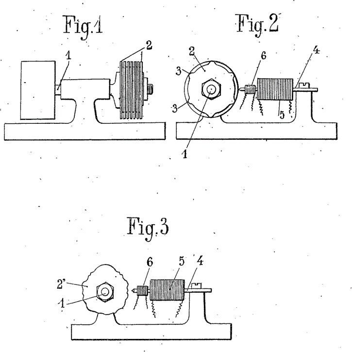

# ♪ Hugoniot Organ

French researcher (died; France, 1927 ) into electronic sound systems and inventor of an early electronic organ, the photoelectric Hugoniot organ. From the end of World War I Hugoniot systematically explored and improved on all the electronic sound-generating and -recording methods known at the time, starting in 1919 with the rotating electromagnetic tone-wheels pioneered in the Telharmonium and known in France from Cahill’s patents, and continuing with electromagnetic steel discs. He also tried out audio and beat-frequency oscillators. The only instrument that he appears to have completed was a photoelectric organ (1921), in which rotating tone-wheels with concentric rings of radial slits interrupted beams of light (there were presumably 12 discs, each producing all the octave registers of a single note); behind the wheels were shaped timbre masks that modified the light beams before they reached photoelectric cells.

"With this scheme the various types of wave forms for different timbres may be placed in radial sectors on a disk; another disk carrying the scanning slits in circular tracks rotates before this wave-form disk. A source of light and photocell complete the translating arrangements. Each slit track scans its corresponding wave cycle at a speed corresponding to one pitch of an
approximate tempered scale. Thus, one wave and one slit track serve for each tone frequency of the tempered scale. Naturally the lowest pitch tracks are nearest the center and the highest are nearest the circumference of the scanning disk.

[A diagram from Hugoniot’s patent for a tone-wheel sound generator December 1919]

Another interesting arrangement is that used by Lesti and Sammis in the Polytone. Here, instead of using a series of similar wave-form cycles on a continuous track, with a single scanning device, only one complete such cycle is used with periodic scanning by a series of
similar scanning slits, equispaced on a continuous track.

The slit spacing is precisely equal to the wave-form lengths,
so that this wave form is repeated at the scanning frequency; i.e., the number of slits passing it per second. The same method was disclosed as early as 1921 by the French inventor Hugoniot, who described an electrical musical instrument of this type in his patent’"

[A description of Hugoniot’s photo-electrical sound generation method from ‘Electronic Music and Instruments’ Institute of Radio Engineers, 1936]

Hugoniot’s died in 1927 before he could develop his ideas any further than prototypes yet he left behind a legacy of innovation that influenced a new generation of French pioneering instrument designers including Pierre Toulon and Givelet & Coupleaux.

Next topic: Theremin 

## Sources
- Wikipedia / 120years.net / Oxfordmusiconline.com

## About the author

"Guido F. Matis (a.k.a. widosub), a seasoned producer-composer authority with an unquenchable compassion towards the musical expression, and many years of experience in the fields of event organizing, movie post-production, and recording with professional musicians. His devotion to movie sounds shows in his art - widosub's music is filled with landscapes of emotions, dramatic twists and melancholic moods. He's one of the hosts of Tilos Rádió's MustBeat show, in which he's is focusing on drum'n'bass and chillout music. He's also one half of the duo Empty Universe."

