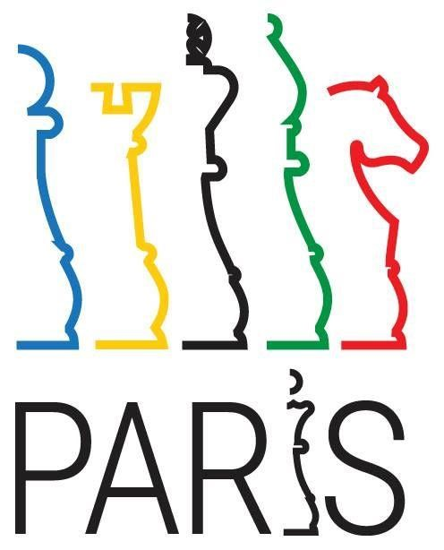

# 🏆 Inclusion of Chess in Olympics

Chess is oldest game known to mankind and played since ancient times. A
single game of chess to play requires different qualities and skills
like calculation of complex positions, concentration, decision making,
pattern recognition, etc. which requires serios mental strength. In a
classical game of chess which normally goes on for 5 to 7 hours drains
the energy of the players. Also, chess is considered as most
intellectual game. It is most played game across the globe still it is
still not included in Olympics despite of the attempts made by FIDE.

One of the main reasons for non-inclusion of chess in Olympics is Chess
is not recognized as sport by International Olympic Committee (IOC)
before 1920 while governing body of chess which is FIDE is recognized by
IOC. Chess today is recognized as sport and almost every country in the
World has Chess athletes. In chess Olympiad which is totally different
event from Olympics around 170 nations participate. But, after so much
struggle still chess is yet to be featured in Olympics.

FIDE and different nations committee are running campaigns for inclusion
of chess in 2024 Paris Olympics. Chess fans across the world are hoping
that after the chess boom in 2020 the Paris Olympics can be the perfect
timing of witnessing chess in Olympics. France also has good culture of
chess now the decision is in the court of France that shall France be
the first country to include chess.

The official notice of FIDE on Facebook posted \"Chess becomes a
candidate to join Paris 2024 Olympic Games. The official launch of the
campaign took place on the 12th of February in Paris. FIDE President
Arkady Dvorkovich and French Chess Federation President Bachar Kouatly
met with the French press to promote the vision of chess as a sport.
Rapid and blitz are the formats of play considered for the Paris 2024
competitions. Chess is played by millions of people every day and is
also growing in France, where 67% of the members of the French Chess
Federation are aged under 18 years old. FIDE was created in Paris in 1924. Inclusion of chess in the Olympic program of Paris-2024 would be
an outstanding symbolic gift for FIDE's 100th anniversary.\"

> Chess at the Paris Olympic Games 2024? \| Photo: FIDE Facebook page

After all this struggle we can assume that it is not far that we will
witness chess action in Olympics. If countries with large number of
chess enthusiast and serious chess environment get the chance to host
Olympics in future that country can surely flex about its achievement of
pushing and finally including chess in Olympics.

# About the Author

Jashwaneel Patil is a student pursuing Bachelor of Engineering in
Electrical and a young mind who likes to explore and research in
different areas. His vision lies in making Earth to make a better place
to live with taking small steps towards sustainability and making best
use of technology available to make easier life for mankind.
