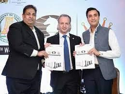

# 🏰 India wins bid for hosting Chess Olympiad, all set to host most awaited chess event

The 44th FIDE Chess Olympiad will be held in Chennai, Tamil Nadu, India. This news was announced at a press conference in Chennai on Wednesday, after the FIDE Council had announced that India won bid the night before. The event was originally to be held in Russia but the war in Ukraine made it impossible. The Olympiad will take place in July/August, \"not very far off from the dates originally planned,\" FIDE said. The original dates were 26 July-August 8, 2022.

 It will be the first time ever that India will host Chess Olympiad. Bharat Singh Chauhan, the secretary of the All Indian Chess Federation(AICF) and the tournament director, called it a \"historic press conference\" and \"big moment for all of us.\" He talked about how fast everything happened, from the moment FIDE decided to cancel Moscow until Chennai won the bid. \"It was very quick. We met the Tamil Nadu's CM, M. K. Stalin, and within five minutes he agreed.\" The official approval letter was sent in a few hours later, and on the very same day, 1,200 rooms were booked in hotels in Mamallapuram. \"Now we have booked nearly 3,000 rooms, so things are moving very quickly,\" Bharat Singh exclaimed. The venue will be the Four Points by Sheraton Mahabalipuram Resort & Convention Center, 60 kilometers south from central Chennai. It is located in Mamallapuram, one of the famous tourist sites in India and a UNESCO World Heritage Site of seventh- and eighth-century Hindu monuments.

 Dr. Sanjay Kapoor, the president of the All India Chess Federation and the president of the organizing committee, called Chennai \"the Mecca of chess in India\" and said it was a \"matter of pride\" for Chennai and Tamil Nadu and overall India to have the Olympiad. Located in the south eastern Indian state of Tamil Nadu, Chennai has the legendary 15th world champion, Vishy Anand, among its seven million inhabitants, as well as the talented GM Pragganananda R.

 

India for FIDE chess Olympiad 2022

 The chess tradition of Chennai goes even further back, as the first Indian chess player to ever achieve the international master title, Manuel Aaron, also was from city of Chennai. It will be the first time ever that an Olympiad is held in India and the biggest chess event India has ever hosted, after the 2013 world championship between GM Vishwanathan Anand and GM Magnus Carlsen.

 The last Olympiad, the 43rd edition, was held in Batumi, Georgia in 2018. The 2020 Olympiad was originally awarded to Minsk, but the city withdrew its candidacy following the political issues in Belarus. Online Olympiads were held in 2020 and 2021 during the Covid pandemic, while the new OTB Olympiad was postponed and was set to happen in Moscow, Russia. The war in Ukraine forced FIDE to take action and move the event another time. The Indians have set the major task of pulling off a historic task: preparing an Olympiad in just four months. Bharat Singh: \"The experience with Delhi Chess Open, the largest event of its kind in the world, will be a big help, as we have already dealt with large numbers. But Olympiad is a big game. I am sure we will make it the best.\"

## About the Author

Jashwaneel Patil is a student pursuing Bachelor of Engineering in Electrical and a young mind who likes to explore and research in different areas. His vision lies in making Earth to make a better place to live with taking small steps towards sustainability and making best use of technology available to make easier life for mankind.
