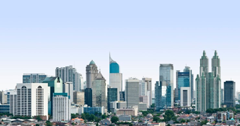
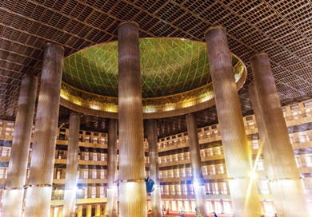
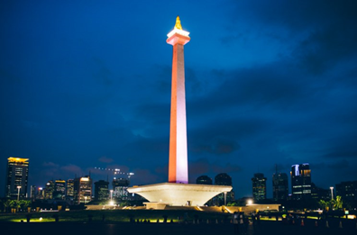

# 🇮🇩 Jakarta

Jakarta is the capital of Indonesia and its most populous city, it is located on the island of Java, Jabodetabek being the metropolitan area where the industrial, political and financial center of the country is concentrated, Named for the mixture of names Jakarta, Bogor, Depok, Tangerang and Bekasi.

Jakarta attracts a large number of foreign tourists as the economic and political capital of Indonesia, as well as being the fourth most populous city in the world. It is a very cosmopolitan city with a diversity of cultures, since a large part of the city's immigrants come from different parts of the island of Java and this leads to a mixture of dialects between the Sundanese and Javanese languages, in addition to their own types of food and typical customs. 86% of the inhabitants are Muslims almost all of the Sunni side and practice a particular form of Islam called Abangan.

In Jakarta there is no way to get bored and we are going to show you the most emblematic places in the city that you cannot miss.

## Kota Kua

Kota Kua is the old part of the city where the Dutch settlers were the ones who settled in the area, so you can find a lot of colonial-style buildings. The History Museum is a perfect example of this type of architecture, it used to be the Dutch East India Company and Jakarta City Hall. It is located in Fatahillah Square, which is one of the places with the most atmosphere in the city, it has bicycles for rent and in this way you can take a walk around the area.

## Batavian Coffee

This cafeteria was built at the beginning of the 19th century and is one of the icons of the city. There you will feel that you are in the middle of the colonial era since it preserves its original style and although it is one of the most touristic places, its prices are quite affordable and you will be able to enjoy a delicious and fresh Bintang, which is the local beer.

## The Great Istiqlal Mosque

Indonesia is known for being the country with the largest number of Muslims in the world, so it is likely that on your trip, more than one night you will be woken up by the sound of a nearby mosque with its call to prayer. One of the most important temples in the world for Muslims is the Great Istiqlal Mosque and of course, it is the most important mosque in the country, being visited by approximately 120,000 people each year and where it is filled with faithful to pray when the day ends Ramadan.

If you do not practice religion, you can access the second floor in order to see the faithful, without interfering with the prayer.

## Jakarta Cathedral

Leaving the Istiqlal Grand Mosque you can find yourself right in front of the Jakarta cathedral and this is precisely a reflection that despite being in a country that is mainly Muslim, several religions also coexist. As you move to the east of the country, there will be more Catholics, for example on the island of Flores, while in Bali you will see that the majority of the population practices Balinese Hinduism. Jakarta Cathedral was built during Dutch rule.

## The Indonesian National Monument

The Indonesian National Monument also called Monas was created to celebrate the independence of the country. It is located in the center of a huge square and is a pillar that is 132 meters high, in this tower you can climb to its viewpoint to contemplate the best views of the city and in front of the Monas, is the National Museum of Indonesia that It is the most important in the capital.

## The Sky Bar

In the BCA Tower, specifically on the 56th floor, is the Skye Bar and although it is true that consuming something in this place is much more expensive than in any other establishment, the view that it offers is worth it. It is advisable to go up at night to see the city illuminated and the immense number of skyscrapers, they are quite a spectacle.

## Anloc a beach to watch the sunset

Although Anloc is not a recommended beach to take a bath, it is to enjoy a beautiful sunset. It is located in an area where there are several restaurants, cafes and an excellent leisure environment that is formed especially for sunset. On the other hand, there is a quite complete amusement park whose name is Ancol Dream Park where you can spend a pleasant and entertaining time.

## Go to a shopping center

Shopping malls abound in any city in Southeast Asia and Jakarta is no exception. In addition, the city is not exactly made for walking, since the distances are very long and the traffic is abundant. So shopping malls are designed for eating, walking, hanging out with friends, having a drink or going to the movies. The most famous mall in the city is the Grand Indonesia Mall, but if you are interested in a luxury mall you can head to The Park Plaza. Both these shopping centers and others are perfect in case it is very hot and you can entertain yourself with endless activities, since these shopping centers really have everything!

## Chinatown

Jakarta not only has a Chinatown like any big city worth its salt, but it has several and they are all located to the north of the city. There you will find food markets, Buddhist temples, medicines and a large number of characteristic Chinese products. The most popular Chinatown is the Glodok which is near Kota Tua.

## Gastronomy in Indonesia

For lovers of gastronomy, Jakarta offers you a whole range of traditional dishes, among which are: fried noodles (mie goreng), fried rice (nasi goreng), pichitos that are known as satay and chicken soup (soto ayam). In order to find this type of traditional food, you must go to a warung, which is a typical local food restaurant. Prices range between one and two euros, the portions being quite abundant and depending on the island you are on, both the dishes and the ingredients will vary. For example, on those islands where the majority of the population is Muslim, as in this case, it is very difficult to find dishes that include pork. But if you head to Bali or Flores (where most of the people are Catholic), you will be able to find a delicious pork dish more often.

Jakarta is an excellent option to get to know a different culture and offers you a wide range of interesting places to visit.

## About the Author

Idais, Graduated in Mechanical Engineering, and a master’s degree in teaching component, she gave classes in several institutes of mathematics and physics, but she also dedicated several years of my life as a television producer, she did the scripts for mikes, the camera direction, editing of video and even the location. Later she was dedicated to SEO writing for a couple of years. She likes poetry, chess and dominoes.
