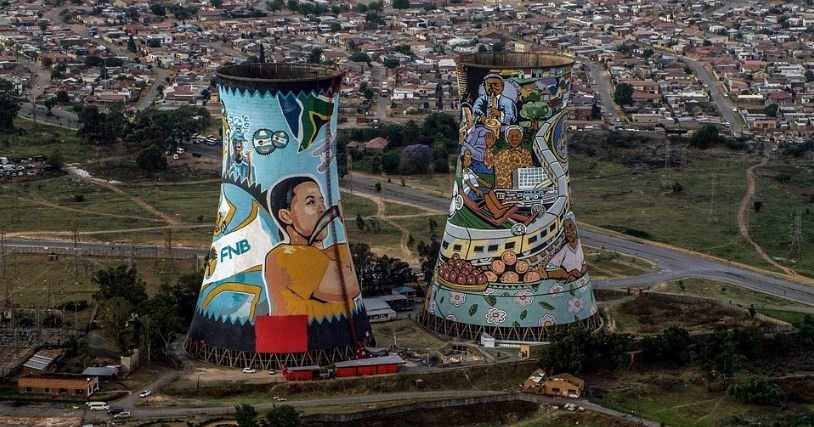

# ⛪ Johannesburg

Johannesburg is the largest and most populous city in the country with just under 8 million inhabitants, being one of the regions with the highest purchasing power in Africa. Its development began at the end of the 19th century with the discovery of gold in the area and many people came looking for work in the mines. This city is very important for the politics, history and culture of the country, since Nelson Mandela fought part of his struggle and lived in Johannesburg for many years.

We will leave you a list with those essential places to visit in Johannesburg

## Constitution Hill

For those who do not know, Gandhi lived in South Africa and was also imprisoned in the same prison where Nelson Mandela was imprisoned years later, it is currently the Constitutional Court of South Africa and can be visited. There you can first see Old Ford, which is where the prison buildings, its rooms, the patio, the bathrooms and several exhibition rooms are located, in one of them the history of both icons that were there in the 20th century is shown. . Later you will be able to see the Court, where you will realize that curiously it was built with the bricks of the old prison, its structure was incredibly well thought out, to the point that so that the politicians cannot be higher than the town, the room is located in the basement.
The Court was inaugurated in 2004 and it is incredible to think what happened within those same walls compared to what it is today, a symbol of the struggle waged in South Africa against its cruel and recent past.

## Go up to the Carlton Center

The Carlton Center is the tallest building in all of Africa, it was inaugurated in the 70s and from the top of the building (on its 50th floor) you can enjoy fabulous panoramic views of the entire city.

## Apartheid Museum

The Apartheid Museum has a very interesting theme and is one of the best organized and most complete museums that exist. From the beginning you will be able to realize how special this museum is, when you enter they give you a random ticket that can say "white" or "black", depending on the one you get you will enter through a different door, each one with different corridors that meet again, the objective is to represent the difference that existed between human beings depending on their skin color during Apartheid.
Once inside you will be able to see information panels, objects of the time, reproductions of places, testimonies and a lot of audiovisual material, which can move you when you observe so much barbarism, in addition to thinking that these circumstances officially ended in 1994, that is, atrocities that lasted too long until just a few years ago.
There is also a shop with a fairly good selection of books and a restaurant if you want to eat something during your visit.

## Soccer City Stadium

Soccer City Stadium also known as FNB Stadium was opened in 1989 and is the most famous in Africa. The national soccer and rugby teams and the Soweto team play there. It was remodeled to celebrate the 2010 World Cup and we all remember the final match between Spain and the Netherlands with Iniesta's goal, which was simply heart-stopping. This stadium was where Nelson Mandela gave his first rally, once he was released in 1990, and also where his funeral was held in December 2013.

## Visit Soweto

Soweto is an acronym for the “South Western Townships” which was separate from Johannesburg from the 1970s to 1994, as blacks could not live in the city during Apartheid. The township of Soweto was the place that housed both Nelson Mandela and his friend Desmond Tutu (Nobel Prize). You can even visit the homes where they both lived, they are very close to each other and the inhabitants of Soweto are proud, for having the street that has the most Nobel prizes in the world.

In this area there is also the Regina Mundi Catholic Church, which was always the meeting place during Apartheid for the people of the neighborhood. It was there where there were several clashes between police and protesters, you can still see the bullet marks that are on the walls of the temple. You can also see incredible stained glass windows that tell the history of the country, Regina Mundi remains today the heart of cultural and social life in Soweto, the Church has a capacity for just over 5000 people.

There is another museum named Héctor Pieterson that was specially dedicated to commemorating the role of students during Apartheid. It tells the story of the shots fired by the police at Héctor and his companions (all minors) during the riots of 1976.

Another of the places you can visit in Sweto are the Orlando Towers, an old power station that is currently completely decorated with graffiti and if you like extreme sports, you can also do bungee jumping.

## Liliesleaf farm

This farm on the outskirts of the city was converted into the Liliesleaf Farm Museum, as it was the hideout for Mandela's party called the African National Congress (ANC) during Apartheid. It is a very interesting museum where you will find audiovisual content, information panels and its rooms are practically the same since that time. Although it is true that this farm is located in the Rivonia neighborhood about 20 minutes from Sandton (the financial area of the city), it is really worth visiting.

Sandton is located on the outskirts of Johannesburg and is where the best hotels are located, a very popular area for tourists. There is also Nelson Mandela Square where you will find a large statue of the South African leader over 6 meters, as well as the Sandton City shopping center which is one of the largest shopping places in the southern hemisphere. There you will find endless shops, luxury restaurants and five-star hotels.

Johannesburg is a city full of history and where all human rights were violated, it is important to visit it to learn about the events that must not be repeated.

## About the Author

Idais, Graduated in Mechanical Engineering, and a master’s degree in teaching component, she gave classes in several institutes of mathematics and physics, but she also dedicated several years of my life as a television producer, she did the scripts for mikes, the camera direction, editing of video and even the location. Later she was dedicated to SEO writing for a couple of years. She likes poetry, chess and dominoes.
