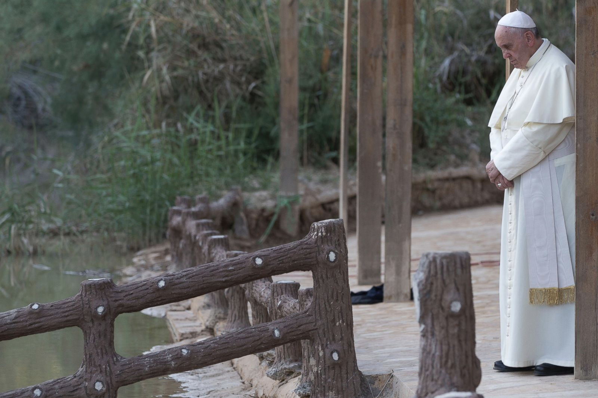
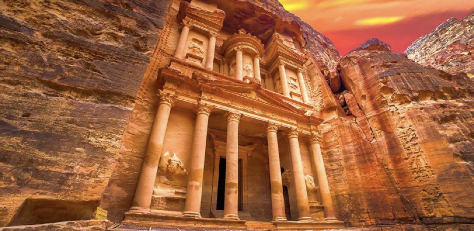
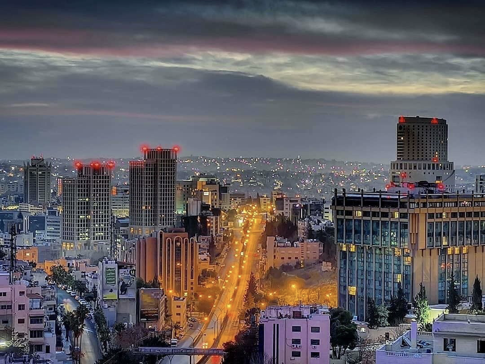

# 🇯🇴 Kingdom of Jordan - Tourism

An ancient kingdom located in the middle of the middle east; south of Syria,
North of Saudi Arabia.

Although its location is always surrounded by wars and conflicts, it’s a
peaceful modern country itself filled with sights and sounds as old as time,
from Um Qais in the north to Aqaba in the south, you can’t set foot on any city
in Jordan without having the opportunity to tour an ancient historical monument.

In Jordan, you can step in the very place where Jesus was baptized and taste the
wine made by the harvested grapes by Jordan River.

And wander one of the world’s great wonders “Petra”. Also, you can float in the
dead sea on your back while sipping your cold beer, then you travel under one
hundred miles south to the wonderful Wadi Rum “where plenty of movies were shot
such as: Lawrence of Arabia, Red Planet, Passion in the Desert, Prometheus, The
Last Days on Mars, Transformers Revenge of the Fallen, The Martian and Theeb”
it’s known for its exotic landscape and magical ambient atmosphere where desert
collide with pink mountains leading you to Petra.

In Wadi Rum, the party starts!

You get there, you get some rest for a bit in the bubble camp, then you head off
to one of the many DJ parties where you are going to have a blast with your
friends!

Hospitality is a legendary and very unique tradition in Jordan, it’s been called
“The Switzerland of the Middle East”, don’t expect to pay for everything here!
Specially for lunch, since it’s customary for Jordanians to invite people no
matter who they are and where they’re from to lunch and you will leave with a
full stomach!

As for the history of this small-sized old country, it was inhabited by humans
since the paleolithic period, many kingdoms emerged at the end of the bronze
age: Ammon, Moab and Edom and later rulers: Nabataean kingdom, Persian Empire,
Roman Empire, the Rashidun, Umayyad and Abbasi Caliphates and Finally, the
Ottomans who were kicked out in 1916 and after a few years, The Emirate of
Transjordan was established and lastly, Jordan declared independence from the
British in 1946.

Amman, which is the capital of Jordan is your destination for night life,
countless number of bars and nightclubs you can check out any time and party all
night long while getting hammered “pre-covid”.

And don’t get me started on adventure in Jordan!

Walking the Jordanian trail, it’s a 40 days hiking adventure where you get to
hike through 75 villages and cities on more than a 420 Miles walk. Going through
The King’s road, you get to experience the most authentic and most beautiful
nature in Jordan, from Madaba to Karak and Tafilah, then to Ma'an and finally
Aqaba, getting lost in the scenery is guaranteed to anyone taking this road!

It’s hot in summer, cold in winter and wonderful in the spring, you really don’t
want to miss out on visiting this wonderful country!

Peace.
