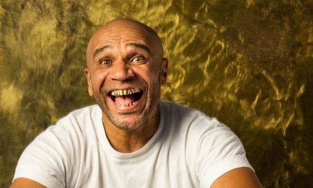

# 🎼 Jungle Drum Bass

Drum and bass (also written as Drum&Bass or drum'n'bass and commonly abbreviated as D&B, DnB, or D'n'B) is a genre of electronic music characterized by fast breakbeats (typically 165-185 beats per minute) with heavy bass and sub-bass lines, samples, and synthesizers. The genre grew out of the UK's jungle scene in the early 1990s.

When the party heroes of ’89, Grooverider and Fabio, sometime in the early 1990s, moving away from hardcore in clubs in South London (Brixton, Elephant & Castle - most often in Rage), they enriched their music with completely unusual rhythm patterns - and they drove the audience crazy - they had no idea that the mainstream music of Britain’s ’97 grew out of these thoughts.

Of course, jungle didn't come out of nowhere: it roots in dub (rhythm world, sub-basses), hip hop (also featuring rhythm formulas, and MCs) and techno (studio process).

Sampling from the drums of former jazz (sometimes swing, or bossa nova) music, then accelerated to 160-180 bpm, a simplistic, almost trivial, but powerful reggae bass beat: this is pretty much the jungle base, from this point on, the most prolific and inventive musical style of the late 1990s branches off into a number of sub-genres. For example, a ragga muffin with up vocals, dub bass lines, reggae sound patterns, a fun-sounding jump up, or a reggae jungle (e.g. Mickey Finn, Aphrodite). Or drum & bass (e.g. Guy Called Gerald, Goldie, Photek, Doc Scott, Alex Reece), who no longer sampled rhythm guitars, but programmed the sound very finely, developing the sound to the finals: at first hearing inhuman and hyper-fast breakbeats are dissolved by the jazz and soul elements, ambient pads, vocals flowing on them.

Drum and bass is dominated by a relatively small group of record labels. Major international music labels had shown very little interest in the drum and bass scene until BMG Rights Management acquired RAM in February 2016. Since then, the genre has seen a significant growth in exposure. The origin and home of drum and bass music is in the UK, with other prominent fanbases located in Australia, Canada, New Zealand, United States, and South Africa. There's also a modest following in countries like Austria, Russia, Estonia, Czech Republic, Belgium, the Netherlands, and more.

You can find more details about its formation and development on Ishkur's Guide to Electronic Music, and you can listen to ragga jungle and drum and bass music right away.

<http://music.ishkur.com/?query=RaggaJungle>

The Every Noise at Once platform provides an opportunity for people to get to know better the names of the creators who have ever been in the genre and thus the peculiarities of it.

<https://everynoise.com/everynoise1d.cgi?root=drum%20and%20bass&scope=all>

## Sources

- MENNYEK KAPUI - Az elektroniks zene évtizede (The decade of electronic music)
- Wikipedia
- Ishkur's Guide to Electronic Music
- Every Noise at Once

## About the Author

Guido F. Matis (a.k.a. widosub), a seasoned producer-composer authority with an unquenchable compassion towards the musical expression, and many years of experience in the fields of event organizing, movie post-production, and recording with professional musicians. His devotion to movie sounds shows in his art - widosub's music is filled with landscapes of emotions, dramatic twists and melancholic moods. He's one of the hosts of Tilos Rádió's MustBeat show, in which he's is focusing on drum'n'bass and chillout music. He's also one half of the duo Empty Universe.
