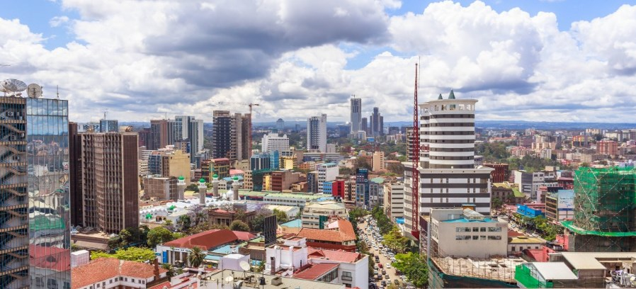
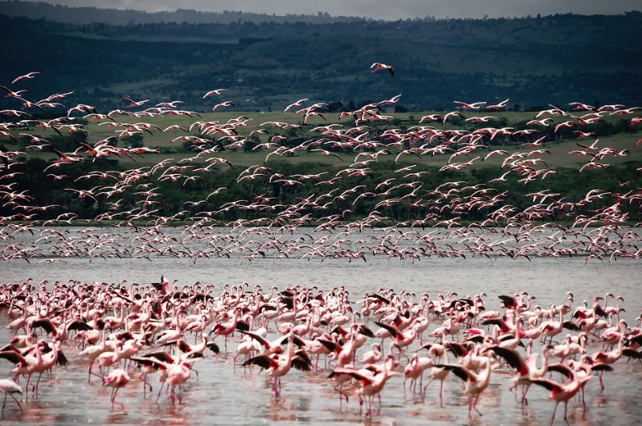
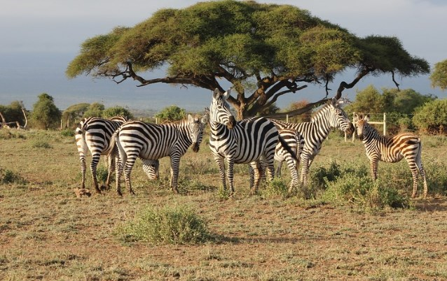

# 🇰🇪 Kenya

Kenya is a country that makes you fall in love with its national parks
and you will be able to do the best safaris in Africa, with paradisiacal
beaches bathed by the Indian Ocean and exotic ethnic groups.

Although it is true that you can rent a 4×4 truck in Nairobi, it is
advisable to hire a safari with a local company not only for safety, but
also to observe as many animals as possible and the best time to travel
to that country is between months from July to October, since it is at
that time when the Great Migration occurs, where thousands of species
cross the Mara River. Another good time are the months between January
and March, since it is the dry season and a greater number of animals
can be seen.

In this article, we will recommend the most essential places when
visiting Kenya, so that you do not waste time in less important places.

## Nairobi

Although it is true that Nairobi is not exactly the most beautiful city
in the world, it does have some points of interest that are worth
visiting. Among the most recommended places to visit are the National
Museum, the House Museum of Karen Blixen who was the Danish writer of
the famous book \"Out of Africa\" ​​and visit the Maasai Market. You can
also have dinner at "The Carnivore" which is a restaurant where you can
taste all kinds of exotic grilled meats.

It is important to emphasize that before traveling around the city, you
should check with your place of accommodation which are the safe areas
to visit and what precautions you should take.

## Lake Naivasha

Northwest of Nairobi is the Great Rift Valley where there are several
beautiful lakes such as Nakuru and Naivasha. The latter is located in
the highest part of the valley at 884 m high and you can go on a boat
safari, where you will find bird species such as ospreys and pelicans,
as well as observe hippos up close.

On the other hand, in the middle of the lake is Crescent Island, which
is a true wild paradise, there you can walk among zebras, giraffes or
other harmless mammals and without any danger of being attacked by a
predator.

## Lake Nakuru

If you are a bird lover, one of the best places to observe them, not
only in Kenya but in all of Africa, is Lake Nakuru National Park.
Although it is true that it is located approximately 150 km from
Nairobi, it is impressive to see thousands of flamingos in this alkaline
lake that is located in the southern part of the Great Rift Valley. But
it is also one of the places where you can see black and white rhinos,
the latter being in danger of extinction. On the road between Lake
Naivasha and Lake Nakuru you can see hippos, impalas, warthogs,
different species of birds, gazelles, baduinos, giraffes and zebras.

## Maasai Mara

A safari for two or three days in the Masai Mara National Reserve is one
of the most acclaimed activities by tourists in all of Africa. You will
be able to see from a van fantastic landscapes of endless plains with
lions, leopards, elephants, black rhinos, wildebeests, cape buffalo,
zebras and crocodiles that you can find at the Mara River crossing.

Later you can go to a Masai village to observe the traditional life of
this tribe and see their lively dances.

## Aberdares National Park

In the highlands of Kenya at almost 4000 meters of altitude is the
Aberdares National Park, with green hills, valleys with forests, tea
plantations and two famous forest hotels The Treetops or The Ark. These
hotels offer you, in addition to accommodation, visits to ponds where
you will see herds of buffalo and elephants. The park also has
impressive waterfalls such as the 270-meter Keruru Kahuru, 300-meter
Gura, Chania Falls and Thomson Falls, which are of unparalleled beauty.

## Mount Kenya

Mount Kenya is 5,199 meters high, making it the second highest in Africa
after Kilimanjaro. If you have experience in climbing you can climb to
its highest peak the \"Batián\" and if you do not know how to climb but
you are in good physical shape, you can climb the peak \"Lenana\" which
is at 4985 meters. But if you just want to observe, it will be more than
magnificent to see its glaciers, snow-capped peaks, its forests and the
wildlife of leopards, elephants, antelopes and black rhinos.

## Amboseli National Park

Near the border with Tanzania is the Amboseli National Park which was
declared a Biosphere Reserve. This park is famous for having large herds
of elephants and other animals such as rhinos, lions, and leopards.
Amboseli offers you landscapes of great desert plains, lakes where
flamingos live, acacia forests, as well as the Oldoinyo Orok peak and
traditional Masai villages.

## Tsavo National Park

The Tsawo National Park is the largest in Kenya with approximately
21,000 km² and is divided into two zones, Tsavo East and Tsavo West.
Although it is true that Tsavo West offers you a greater diversity of
landscapes, it is much more difficult to observe animals due to its
large amount of vegetation, while in Tsavo East it is easier to see
them.

There are several must-see sites between the two parks such as the Mzima
Springs, Chaimu Crater, Roaring Rocks Lookout, Lugards Falls, Ngulia
Rhino Reserve, the views from Mudanda Rock and Crocodile Point.

## Samburu National Reserve

Taking a safari through the Samburu National Reserve is another great
idea, located on both sides of the Uaso Nyivo River. The abundance of
water that exists on the banks of the river not only offers you a
beautiful natural landscape, but also attracts thousands of felines such
as leopards and lions, as well as endemic species such as reticulated
giraffes, oryx, gerenucs and grevy zebras.

## Lake Turkana

This lake, also called the Jade Sea due to its characteristic color
coming from the algae, is definitely a spectacle. In addition to being
able to observe cheetahs, many species of birds and lions, it is also
famous for its paleontological excavations where hominid remains from
different periods have been found.

## Visit Lamu

Lamu is an archipelago made up of three islands (Lamu, Pate and Manda)
where you can enjoy its paradisiacal beaches with crystal clear waters.
In addition to touring the streets of ancient villages in Lamu, where
you will see an Arab-style architecture with houses made of mangrove
wood, coral stone and thatched roofs.

Between Lamu and Mombasa there are fantastic and transparent beaches
where you can practice water sports, taste delicious fish dishes and
watch incredible sunsets. The most paradisiacal beaches are Watamu,
Diani, Silversands, Kilifi and Tiwi.

It offers you beautiful natural landscapes, wild fauna and spectacular
beaches.

## About the Author

Idais, Graduated in Mechanical Engineering, and a master’s degree in teaching component, she gave classes in several institutes of mathematics and physics, but she also dedicated several years of my life as a television producer, she did the scripts for mikes, the camera direction, editing of video and even the location. Later she was dedicated to SEO writing for a couple of years. she like poetry, chess and dominoes.
