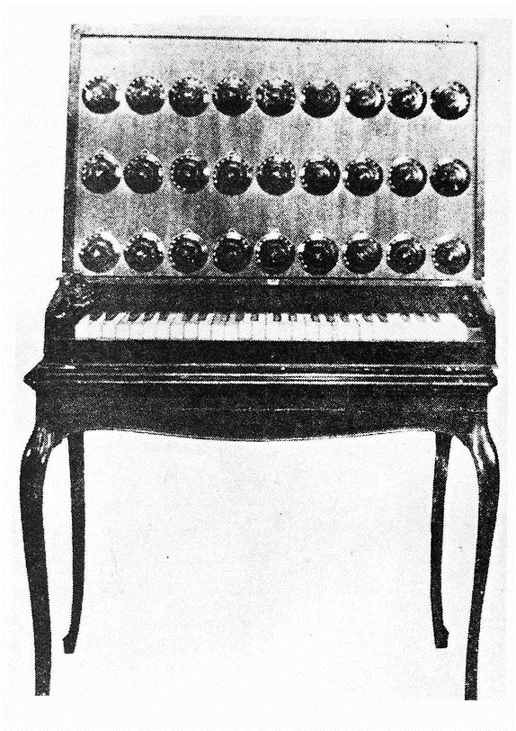

# 🎹 Keyboard Electric Harmonium

Leon Theremin (born Lev Sergeyevich Termen; 27 August [O.S. 15 August] 1896 – 3 November 1993) was a Russian and Soviet inventor, most famous for his invention of the theremin, one of the first electronic musical instruments and the first to be mass-produced. He also worked on early television research. His listening device, "The Thing", hung for seven years in plain view in the United States Ambassador's Moscow office and enabled Soviet agents to eavesdrop on secret conversations.

Lev Sergeyevich Termen most famous for creating
the ‘Theremin’ also invented many other electronic instruments based on the heterodyning vacuum tube technology of the day – including the Keyboard Theremin, Theremin Cello, Terpsitone, Rhythmicon and the ‘Electric Harmonium’ or ‘Theremin Harmonium’.

[Theremin Harmonium]

Termen’s Harmonium was an early vacuum tube based polyphonic instrument designed to accompany vocal performances.
The instrument had a three octave keyboard with a variable tuning that allowed 1,200 micro-tonal divisions per octave. The timbre and volume of the sound could be varied using twelve dials fixed to the front of the instrument.

[Early version of the Theremin Harmonium]

[Theremin’s later version of the Harmonium]

Next topic: Kurbelsphärophon

## Sources

- Wikipedia / 120years.net

## About the Author

"Guido F. Matis (a.k.a. widosub), a seasoned producer-composer authority with an unquenchable compassion towards the musical expression, and many years of experience in the fields of event organizing, movie post-production, and recording with professional musicians. His devotion to movie sounds shows in his art - widosub's music is filled with landscapes of emotions, dramatic twists and melancholic moods. He's one of the hosts of Tilos Rádió's MustBeat show, in which he's is focusing on drum'n'bass and chillout music. He's also one half of the duo Empty Universe."
