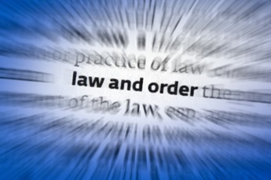

# ⚖ Law and order Special Victims Unit

Law & Order was a series created in the 1980s by Dick Wolf and co-produced with Machael Mann. It was so successful, that they never imagined that the series would continue to this day, the series begins when the rookie Olivia Benson begins to work in a police force called the "Special Victims Unit" that is dedicated to investigating sexual crimes in the city of New York.

Since its inception, the series has dealt with complex cases that were rarely seen on television, such as: domestic violence, rape, serial murder, abuse, hate crimes, among others. Of course, in most cases, the victims of this type of abuse are usually women and in the background also homosexuals, lesbians and children.

The investigations are based on real news that have managed to impact society and it is possible that the great success of the series comes from there. The universality and topicality of its themes immediately catch everyone's attention, since physical or psychological aggression never ceases to move the television audience. Actress Mariska Hargitay has earned the respect of viewers over the years, although it is true that her character began as secondary and supporting detectives Elliot Stabler starring Chistopher Meloni and detective John Munch (Richard Belzer) . Olivia Benson was violent and impulsive, but gradually changed as the series progressed and became the most intelligent and mature person in the cast, probably because of the closeness with which the actress treated the cases and in some way, this interpreter It was becoming a symbol of the fight for equality, to the point that he received letters from people in gratitude for making them aware of their reality and that in many cases they did not want to acknowledge. Thanks to the messages received from her fans, the concern of helping in a real way was generated in the actress and that is why she created an association to support victims of sexual crimes in her country.

This American television series premiered on September 20, 1999, is produced and set in New York City where a whole range of police, procedural, legal and criminal drama is reflected. The media have contributed their headlines to the script of the series, since the most notorious sexual crimes have been taken into account for the realization of the scripts of Law & Order.

To shoot the interiors of Law & Order, the producers realized that there were no suitable locations available in New York. During the incessant search, they found an NBC building where it centralized its archives that was located in North Bergen in New Jersey, which had recently become empty, measured 4900 m², but also had air conditioning and sufficient parking to the required one. This building was used for the realization of the scenery of the police station and the courtroom.

On the other hand, this series has garnered countless accolades, including Mariska Hargitay's Emmy for Outstanding Lead Actress in a Drama Series, but she received not only the first but the only Emmy to date that has been received regularly for any other TV franchise. the Law & Order series. It is broadcast during prime time in the United States and is considered the oldest non-animated series on American television.

Originally the series focused almost exclusively on the actions of the detectives who made up the special victims unit of the 16th district of New York City, but as the series progressed, additional secondary characters were added, who helped the detectives. Detectives in the Manhattan District Attorney's Office, such as Sex Crimes Bureau Assessors, and medical examiners were also included.

The personal life of the detectives comes to light in several episodes and their dissociation or not with certain crimes that are dealt with during the program. There are episodes where the detectives develop their own personal dramas and follow them for several chapters as they investigate and prosecute sexual crimes, child abuse, crimes against the elderly, etc. Detective Elliot Stabler accompanies Olivia Benson in her first 12 seasons, but Christopher Meloni decides to leave the series and an agreement could not be reached regarding his contract.

Law & Order has had very famous actors who appear in some of its chapters such as: Bradley Cooper, Robin Williams, Amanda Seyfried, Lea Thompson, Sharon Stone and Jeremy Irons, among others. Emblematic moments such as the Manson family murders, the confrontation between Woody Allen and Mía Farrow, the student massacres, etc. have been portrayed in the series.

The idea of creating the series originated in 1986, due to the shocking case of Robert Chambers who strangled a woman with whom he was dating Jennifer Levin, after murdering her he alleged "hard and consensual sex", this terrible crime inspired Dick Wolf to create the episode "Kiss Them and Kill Them" which was the story told in the first season episode. However, after writing this episode, Dick Wolf was still tormented by the harsh reality of cases taken from real life and decided to delve into psychology where sexuality plays an important role in the crimes committed.

From that moment to the present day, this series has made us reflect on the large number of injustices, murders, rapes and other aberrations that may exist in the minds of certain individuals psychologically marked by the social and family environment, for which they are capable of commit such atrocities.

## About the Author

Harley Armentrout is a happy husband and father, former silversmith, aerospace electronics prototype assembler, test, calibration & repair technician, also writing test procedures at BallAerospace. Then 21 years in the gaming industry, in a range of positions, culminated as a Gaming Inspector, observing and reporting on rules violations, safety issues and criminal activities for the Yavapai Prescott Indian Tribe. After “retiring” Harley taught himself a few graphic design skills, and he works as a freelance designer.
