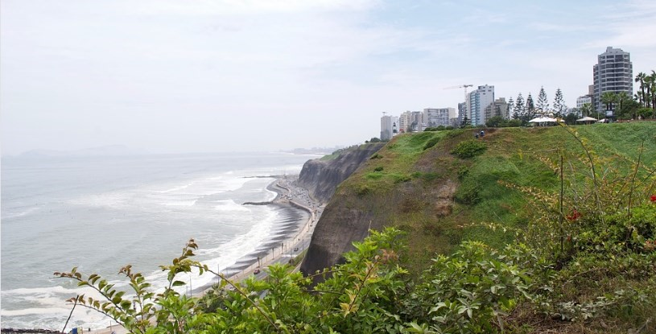

# 🌇 Lima

Lima is the capital of Peru and is located in a privileged position towards the shores of the Pacific Ocean. In this city, colonial architecture is mixed with the most modern buildings and Peruvian cuisine is among the best in the world. We will give you a guide with the most iconic sites that the Peruvian capital has.

## Main Square

The Square Weapons is located in the heart of the historic center and it was there that Francisco Pizarro founded the city in 1535, it is surrounded by important buildings such as the Cathedral, the Archbishop's Palace, the Government Palace and the Sagrario Church. This spacious square is a meeting point for locals and tourists who gather around a beautiful fountain. In the surroundings you can find endless restaurants where you can try a delicious ceviche (fresh fish marinated in lemon juice), perhaps a seafood soup called Parihuela or other dishes based on fish and shellfish, which are the main base of Peruvian cuisine.

## Love Park

The Parque del Amor is located in the neighborhood of Miraflores, it was inaugurated in 1993 on Valentine's Day in honor of lovers. In a perfect place to walk and you will be able to observe its benches made with colored mosaics, which in some way evoke Park Güell in Barcelona. You can also read different phrases written by famous poets dedicated to love, see the sculpture "El beso" by the famous Peruvian Victor Delfin and a heart-shaped garden made with flowers.

## Huaca Pullcana

Huaca Pullcana is an archaeological zone where a pre-Inca civilization existed between 200 and 700 AD, it was abandoned for centuries and was not recovered until 1967, after years of restoration it is currently one of the city's greatest tourist attractions.

This archaeological complex has a pyramid shape and reaches a height of 25 meters, it is made up of a set of patios, squares and structures that belonged to this culture. The recommendation is to go up to the highest part of the pyramid on the seventh floor, from where you can see curious views of the ruins with modern buildings around them.

## Barranco neighborhood

Barranco neighborhood is an old fishing village that is currently the bohemian neighborhood of the city, it is worth walking along San Martín avenue with its residential buildings, hotels, art galleries and the beautiful Barranco square, you will also see a series of murals that they are a reflection of his urban art. The other recommendation is to go to the boardwalk to have fantastic views of the sea.

## Cathedral Basilica of Lima

On one of the sides of the Plaza de Armas is the Basilica Cathedral of Lima and it is the most important temple in the country. On the outside you can see several intermingled styles, since its facade with its plateresque details is Renaissance, its towers are neoclassical, while inside you can see the ceiling recreated from a starry sky with baroque, neoclassical and Renaissance styles in its decoration, you can also see 13 beautiful chapels full of details, the beautiful Choir Stairs and the Crypt of the founder of Lima Francisco Pizarro.

## Miraflores

Bordering the Miraflores boardwalk is a 5-kilometer promenade that sits on a cliff above the famous Costa Verde, with excellent views of the Pacific Ocean. In the northern section of the pier you can see a lighthouse and a marina, where you can get the best perspectives, and then continue along the walk stopping at its beautiful parks until you reach the most famous shopping center in the city called Larcomar. Some locals in the surrounding area offer you a paragliding flight to skirt the coast of Lima and also a bike tour that includes a guide in Spanish.

## Saint Francis Monastery

Located near the Plaza de Armas is the San Francisco Monastery, famous for its incredible library, where you can see thousands of ancient texts including some that are from the time of the Spanish conquest. The monastery has a basilica and a high altar in the neoclassical style, a beautiful sacristy, a cloister and a chapter house. It is also well known for its immense catacombs, where approximately 70,000 corpses rest.

## Magical Water Circuit

The Magic Water Circuit also called Reserve Park is located in the southern part of the old town and has 13 fountains whose water jets are completely synchronized with lights of different colors, for obvious reasons, the recommendation is to go at night to enjoy the beautiful show.

## San Martin Square

As you walk through the old town, you will surely at some point pass through San Martín Square, which is definitely one of the most atmospheric places in the city. Several historic buildings are concentrated in this square, such as the Gran Hotel Bolívar, the Giacoletti building, the Colón Theater and in the center of the square there is a statue erected in honor of General San Martín, who was the manager of the independence of Peru. Nearby is also Jirón de la Unión street that leaves the Plaza de Armas, this is considered one of the most commercial streets in the city, where you can find a whole range of items to buy. In the surroundings of the square you can have a few drinks and taste Peruvian cuisine until the wee hours of the morning.

Lima is one of the most beautiful capitals in South America, full of history and interesting places to show.

## About the Author

Idais, Graduated in Mechanical Engineering, and a master’s degree in teaching component, she gave classes in several institutes of mathematics and physics, but she also dedicated several years of my life as a television producer, she did the scripts for mikes, the camera direction, editing of video and even the location. Later she was dedicated to SEO writing for a couple of years. she like poetry, chess and dominoes.
