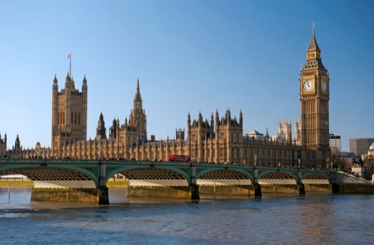
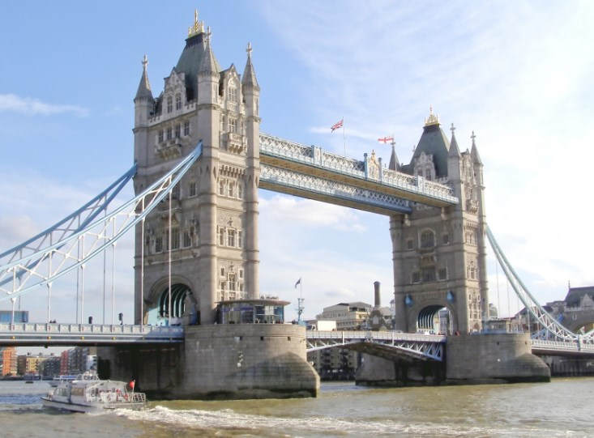
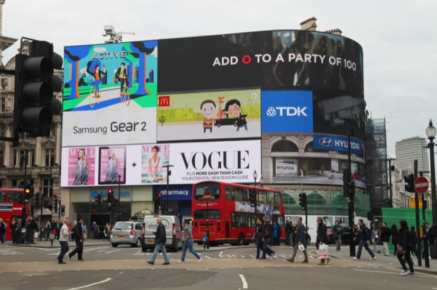

# 🇬🇧 London

London is a city with an excellent cultural offer, with museums with
incalculable collections, impeccable green spaces, street markets to get
lost in, charming neighborhoods and endless activities that you will not
have the opportunity to get bored at any time. In addition to all its
tourist attractions, you can go shopping in some of its commercial
streets and enjoy the gastronomy of every part of the world.

 You can spend an entertaining morning in Cadem Town where you will find
the largest market in the city, with more than 1000 stalls and shops to
go shopping or eat at any of its street stalls, you can also listen to
live music.

 In the Palace of Webminster you can find both the British Parliament and
Big Ben, which is one of the icons par excellence in London. This tower,
built in 1858 in the Gothic style and which is over 100 m high, stands
out because one of its four clocks is on each of its faces. While it is
true that when we talk about Big Ben, everyone usually refers to the
Clock Tower, it is actually a gigantic bell weighing 14 tons that you
find inside the tower and next to Webminter\'s Palace (with its gothic
style). Victorian) located on the banks of the Thames and are considered
a World Heritage Site.

 

 The most famous bridge in London is the Tower Bridge built over the
River Thames in 1894. It is a stone drawbridge and a steam engine is
responsible for raising it, you can see the mechanism and climb to the
top to find the glass walkway, where you can enjoy the spectacular views
of the city, the recommendation is to approach the bridge both day and
night and view it from both banks.

 

 Walking through the parks of London is one of the best activities you
can do for free. The most famous and largest park in the city is Hyde
Park where you can find several monuments, a huge lake, a rose garden
and Kensington Palace. However, there are other very beautiful parks
within London, the most important to visit being: St James\'s Park,
Regent\'s Park, Kew Gardens and Primrose Hill.

 Another of the most relevant attractions is the oldest religious temple
in London, which is Westminster Abbey. It is there that almost all the
coronations of kings, monarchs, princes\' weddings and their funerals
have been held since the year 1066. The Abbey has a beautiful
Gothic-style interior and you can find the tombs of illustrious people
and kings such as Charles Darwin, Charles Dickens, Isaac Newton and
Laurence Olivier.

 On the other hand, the most popular meeting point between locals and
tourists is a small square called Piccadilly Circus, where you can see
neon advertising signs, giant video screens, a famous fountain that
contains the sculpture of Eros and you can enjoy performances live,
street musicians and a lively atmosphere.

 

 One of the best places to visit in the city is the British Museum, which
is one of the most important in the world. Inaugurated in 1759, it has
an extensive collection of important works such as the Rosetta Stone, a
Moai from Easter Island and the marbles from the Parthenon in Athens,
among many other pieces.

 The favorite neighborhood for most tourists is Notting Hill, which
stands out for its beautiful colored houses and the famous Portobello
market. The best day to visit is Saturday morning, since that is when
the market reaches its greatest splendor. There is also one of the best
restaurants called Duke of Wellington, where you can try traditional
food.

 There are also other neighborhoods that offer you the most authentic
atmosphere in the city such as Soho, Chinatown, Covent Garden which is
where the theaters where the great musicals are performed, Marylebone
with beautiful Victorian architecture and the exclusive neighborhood of
Mayfair, in where the wealthy people live with their expensive
restaurants and luxury shops.

 The Tower of London is a castle built in the year 1078 that is a place
worth visiting and once you cross the walls that surround the castle you
can visit the Medieval Palace, the White Tower, the Royal Chapel and the
site where they are located. the Crown Jewels, considered one of the
most valuable treasures in the world.

 You cannot miss Buckingham Palace, which is the residence of Queen
Elizabeth II and where a large part of the historical moments of the
United Kingdom have occurred, it is important to observe the changing of
the guard that takes place in front of the palace, since it is
everything a show.

 

 It is impressive to be able to see the immense dome of Saint Paul\'s
Cathedral and the second largest cathedral on the planet and inside you
can see beautiful works of art. Going up to the dome guarantees great
views of central London or you can go down to the crypt where the
remains of the Duke of Wellington and Nelson are kept.

 One of the most famous squares is Trafalgar Square, where Nelson\'s
column stands out with its 50 meters high and on one of its sides is the
National Gallery where one of the most important art collections in the
world is found. However, this city has other impressive museums such as
Madame Tussauds, which is the most important wax museum in the world,
the Science Museum that houses the Foucault pendulum, the Earl of Rosse
telescope, the Apollo X module, among other important inventions. In the
Natural History Museum you can see the blue whale skeleton and
reproductions of dinosaurs that will leave you in awe. Finally, the
National Gallery that contains an immense collection of paintings by
artists such as Rembrandt, Michelangelo, Van Gogh, Goya, Velázquez and
other great geniuses.

 The best viewpoints in the city are The Shars building with more than
300 meters high, the London Eye where you can see the city from huge
glass cabins or the Sky Garden, which in addition to being an excellent
viewpoint has a beautiful botanical garden in its interior.

 For lovers of local cuisine, we recommend the best markets in the city,
where you can buy all kinds of items and taste the food of Londoners,
among the most important are Brick Lane, Ladenhall, Borough, Maltby
Street and Broadway.

 London is full of wonders to discover, it is a city full of history,
technological advances, cultural and artistic elements, which will make
your visit an unforgettable experience.

## About the Author

Idais, Graduated in Mechanical Engineering, and a master’s degree in teaching component, she gave classes in several institutes of mathematics and physics, but she also dedicated several years of my life as a television producer, she did the scripts for mikes, the camera direction, editing of video and even the location. Later she was dedicated to SEO writing for a couple of years. she like poetry, chess and dominoes.
