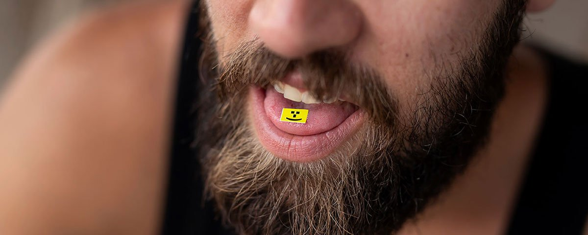

# 💊 LSD - POV

“I felt one with the entire city. I could feel every building. I was tripping in a very strange way.”
Hello and welcome to a point of view of someone tripped on LSD, for you to read and feel, I recommend blasting Shpongle Music while reading the below 😊

It was our friend's birthday... and then the six of us decided to use LSD at his birthday party. We swallowed the LSD in the evening...and about two hours later we all started tripping really hard.

I hardly felt anything at first.

At a certain point we had to leave the house because it was too crowded.

It started when I stood up. I felt very small.
Literally small.

The strange thing was that I didn't have any visuals. My vision was normal.

With the five people who took LSD we went to the city.
When we were in the city we had to turn a corner and after we did that...

I noticed that five or six men were closing in on us.
The others didn't notice this because they were under the influence of LSD.

I saw a few people with their hands in their pockets, ready to grab something.

And someone else had his fist ready, so I thought: We're about to get mugged.

I called out to my girlfriend, but she didn't hear me.
The others didn't hear me shout either, but they kept on closing in on us.

A friend turned around and recognized one of the guys closing in on us.

He said: 'Yo, man. How's it going?'

At that point, the other people surrounding us quickly ran away.

At that moment I started to cry.

At some point the LSD kicked in, but still without visuals.
I felt one with the entire city.

I could feel every building. I could feel all my friends walking.

I was tripping in a very strange way.

It was unpleasant but I also thought:

This is a new experience, so in that sense it was interesting.

My friends asked: 'Yo, why are you crying?' I said: Didn't you notice?

They asked: 'What are you on about? I said: We were about to get mugged.

I told my friend that he saved our lives.

When we were back home I finally started to calm down.

That trip scared me so much that I'm afraid to do LSD again.

Understandable. When I tried LSD it was in the woods with a safe group.

But when we were back at the car a group of strangers came along.

And somehow, it didn't feel right to be around strangers.
And I can imagine that in your case...

That you can feel really anxious after you've almost been mugged.

It might've been pleasant to calm me down a bit.

We were prepared. We picked up the LSD two days in advance.

We stored it in the refrigerator.

It was my second time doing LSD...

So I figured that it would be the same as the first time.
I had a full stomach. I read a lot online.
That's always good. We also have the do's and don'ts.
I felt good. I was really looking forward to it.
The location is also important. You were supposed to stay home...
But this proves that with psychedelics the situation can always change.

<https://www.youtube.com/watch?v=naoknj1ebqI>

## About the Author

Mujahid Al-Majali, a 29-year-old former air force soldier and an economic development and business specialist, also does translation and copywriting. Loves long drives, chill music and old school movies. A nicotine addict and a huge fan of Jack Daniel’s whiskey. Owned multiple businesses in Amman and southern of Jordan PRE-COVID and now focusing on translation and copywriting part of my experience through Upwork.
