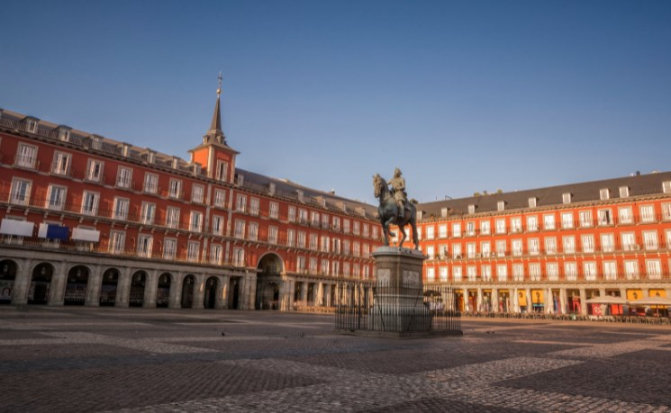
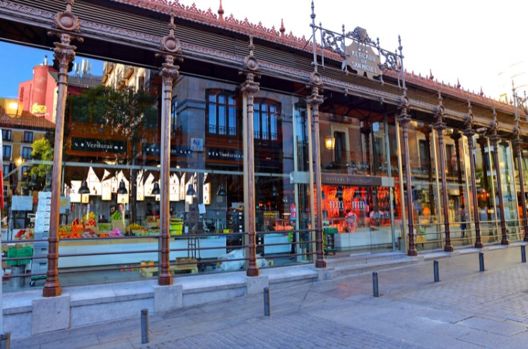

# 🇪🇸 Madrid

Madrid is a fascinating city, it is perfect for visiting museums,
shopping, tasting its excellent gastronomy and it stands out for being
the city that never sleeps, you can party in its liveliest neighborhoods
or try delicious dishes in its most Famous.

 Although it is true that the city offers endless experiences, we are
going to show you the most emblematic places so that you know the most
important things about this incredible city. So we have made a list of
what we consider to be those essential places that you must see in
Madrid.

## 1 - The Gate of the Sun

In this square you can find several points of interest such as the
symbol of Madrid, which is the statue of the Bear and the Strawberry
Tree, but perhaps the most emblematic place is the Casa de Correos where
you will find a small plaque that marks the kilometer zero of Spain,
also you will see the equestrian statue of Carlos III.

## 2 - Main Square

This square is surrounded by important buildings such as the Arco de
Cuchilleros, the Casa de la Panadería and in the Bar la Campana you can
eat its traditional squid sandwich.

 

## 3 - The San Miguel Market

This is the largest meeting point with gastronomy and one of the most
important markets in Madrid, it is characterized by its wonderful iron
architecture and has more than 30 places where you can enjoy typical
Spanish dishes.

 

## 4 - The Town Square

This square is one of the few places that still retains its medieval
appearance, its buildings evoke that time as the House and Tower of
Lujanes and the House of the Villa.

## 5 - Almudena Cathedral

This cathedral was built on an old mosque in the most important
religious building in Madrid, it stands out for its huge dome and its
stained glass windows that create a magical atmosphere. You can go up to
the dome that has a platform where you can get a wonderful view of the
surroundings.

## 6 - The Royal Palace

It was the residence of the kings of Spain being the largest palace in
Western Europe, it is currently used for tourist visits and certain
state ceremonies, from the Sabatini gardens you can take excellent
photos of the palace and once inside you can see the royal rooms , its
luxurious halls, the Royal Pharmacy and the impressive Royal Armory that
has one of the most important collections in the world.

 

## 7 - The Temple of Debod

This ancient Egyptian temple is more than 2200 years old, it is a
beautiful place that Egypt gave to Spain where you can contemplate the
best sunsets and from its viewpoint you can glimpse the Royal Palace,
the Casa de Campo and the Almudena Cathedral .

## 8 - The Plaza España

This square is loaded with monuments and historic buildings such as the
Casa Gallardo, the Cervantes monument, the Tower of Madrid with its 142
meters high, the building of the Asturian Mining Company and the
imposing Spain Building, on its roof there is the Hotel Riu Plaza España
and where you will have stunning 360° panoramic views of all of Madrid.

## 9 - The Great Way

It is the most famous street in Madrid where the largest shopping
centers are located, it is also famous for its theaters where you will
find the best musicals and works of the moment.

## 10 - Cibeles Square

There you will find the beautiful Cibeles fountain where the Real Madrid
titles are held, you can see the car pulled by the lions of the goddess
Cibeles, there are also the Buenavista Palace and the imposing Cibeles
Palace where the town hall is housed .

## About the Author

Idais, Graduated in Mechanical Engineering, and a master’s degree in teaching component, she gave classes in several institutes of mathematics and physics, but she also dedicated several years of my life as a television producer, she did the scripts for mikes, the camera direction, editing of video and even the location. Later she was dedicated to SEO writing for a couple of years. she like poetry, chess and dominoes.
