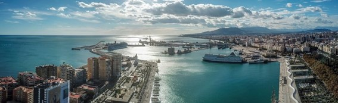
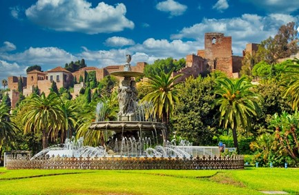
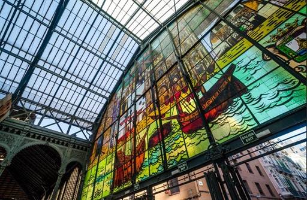

# 🏄 Malaga

Malaga is a city in Spain and is the capital of a province with the same name, it is bathed by the shores of the Mediterranean Sea and is surrounded by mountains that protect it from the cold. The sea acts as a thermal regulator and characterizes this city for its mild temperatures that range between 22.8 °C and 13 °C throughout the year.

Malaga has a great environmental wealth at the mouth of the Guadalhorce River, which has become a place of passage to house hundreds of migratory species with great ecological value. On the other hand, the Malaga Natural Park is the habitat of more than 160 vertebrate animals and 230 plant species.

This city was founded by the Phoenicians during the 8th century BC. C. on the Costa del Sol and in its historic center there is a great architectural and cultural heritage, interesting museums, hundreds of bars, restaurants and extensive beaches to enjoy to the fullest.

We are going to mention the essential places you must visit to get to know the best of this city.

## The Alcazaba of Malaga

The Alcazaba is the most popular tourist attraction in Malaga, this palace was built by the Arabs in the 11th century, with a fortress to protect the home of the Muslim rulers from the attacks carried out by the Catholics. Inside you can see beautiful patios, gardens and sumptuous fountains.

The sites that stand out the most are the Plaza de Armas, the Puerta de los Arcos, the Torre del Homenaje and the Cuartos de Granada where the kings lived, who are the jewel of the palace and you will fall in love with their meticulous Nasrid-style decoration that you can see in its royal rooms and patios.

The palace was built on a hill that offers you a beautiful view over the port and the sea. There is also a small archaeological museum where Moorish pottery and ceramics are exhibited.

## Larios Street

Calle Larios is the most famous in Malaga, it is one of the most luxurious and elegant shopping streets in all of Spain, it was opened in 1891 and financed by the wealthy Larios family from Malaga. It is a wide street surrounded by imposing buildings and packed with locals and tourists who love shopping or who prefer to have a drink in any of its many bars.

This street begins in the Plaza de la Constitución where you can see the Café Central (one of the emblematic sites of Malaga) and the beautiful Fuente de Génova.

## Malaga Cathedral

This cathedral is one of the impressive Renaissance architectural works of Andalusia, it is located in front of the Plaza del Obispo and its construction was carried out between 1525 and 1782, not only did it last for so many years but due to financing problems there are still several elements such as the roof, the second tower and the sacristy, which are unfinished. However, despite the setbacks, it is worth seeing its impressive baroque façade, the set of seats of the Pedro de Mena Choir and the High Altar, which in themselves are a masterpiece.

## Gibralfaro Castle

Gibralfaro Castle can be found by going up a path from Alcanzada or by taking the 35 bus from the Paseo del Parque. This monumental work is an Arab fortress built in the 14th century where you can tour its wall and its eight towers, among which is the Torre Mayor with its 17 meters high and from there you can enjoy one of the best views of the city. town.

## The Picasso Museum

The Picasso Museum is located in the Palacio de Buenavista and is the most important museum in Malaga, where you can see 285 works by this genius of painting in a 16th-century Renaissance building. Picasso is one of the great masters in the history of art and contributed cubism as a revolutionary technique.

If you are an art lover, the other two most important museums are the Thyssen in Malaga and the Pompidou Center, where important pictorial works by renowned Spanish artists are housed.

## The Roman Theater

This theater was built by order of Emperor Augustus in the 1st century and is the main monument in the city since Roman times. On the free visit you will be able to see several marble plaques found in the orchestra area, the beautiful pulpit and a large part of the original stands. After the visit you can take a walk through the streets near the theater to go to the Plaza de la Merced where the birthplace of Picasso is, a large stone obelisk and a sculpture of the painter.

If you are tempted to taste typical Malaga dishes, in the area you will find places that are cataloged as the best traditional food restaurants in the city, such as Casa Lola, El Pimpi and Cortijo de Pepe.

## Stroll through the Port

Strolling through the port at sunset is another of the best activities you can do in Malaga. You will be able to see cruise ships, fishing boats, luxurious yachts and approach the commercial part of Pier 1 where they offer you a wide range of shopping, restaurants and leisure. You can also walk through the area that reaches the Farola, so you can see the emblematic lighthouse of Malaga and if you do the tour during the day, you can finish with a dip in the famous Malagueta beach.

## Soho Neighborhood

It is the neighborhood of the arts where you will find impressive graffiti by renowned urban artists, the most important are around the CAC and in Casas de Campo, Barroso and Trinidad Grund streets. You can also enjoy cultural centers such as the Teatro del Soho, art galleries, the CAC Málaga, design venues and alternative shops.

## Malaga Park

In this park you can enjoy Baroque and Renaissance style gardens, tropical trees, beautiful fountains, tiled benches and sculptures of famous people. At the end of the walk you can go to the Puerta Oscura Gardens and the Pedro Luis Alonso Garden, both with stunning views of the Alcazaba.

## Atarazanas Market

The Atarazanas Market was a naval workshop of Nasrid origin and stands out for its large horseshoe arch and its iron structure, as well as stalls where they sell high-quality products and numerous places where you can enjoy traditional food. If you go for breakfast you can go to Casa Aranda to try their delicious churros with chocolate or if you prefer a stronger dish, you can eat at La Bella Julieta.

Atarazanas Market photo taken by David Pinter

Malaga a spectacular city to visit and enjoy in a big way!

## About The Author

 Idais, Graduated in Mechanical Engineering, and a master’s degree in teaching component, she gave classes in several institutes of mathematics and physics, but she also dedicated several years of my life as a television producer, she did the scripts for mikes, the camera direction, editing of video and even the location. Later she was dedicated to SEO writing for a couple of years. she like poetry, chess and dominoes.
