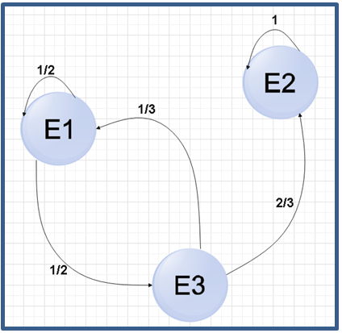
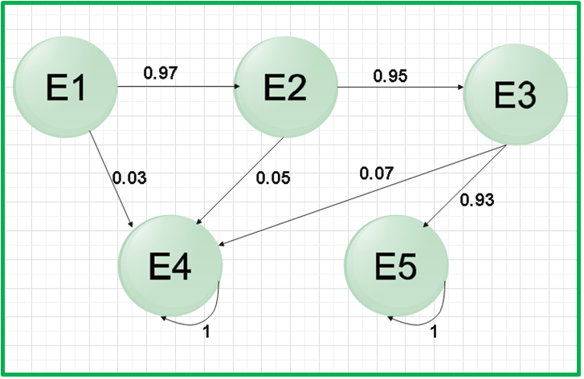
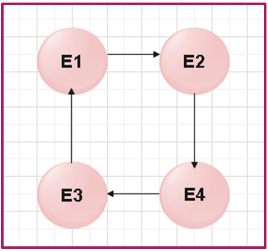
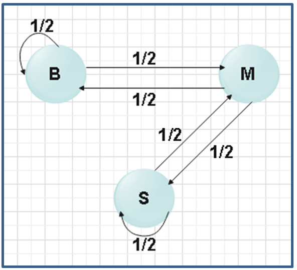
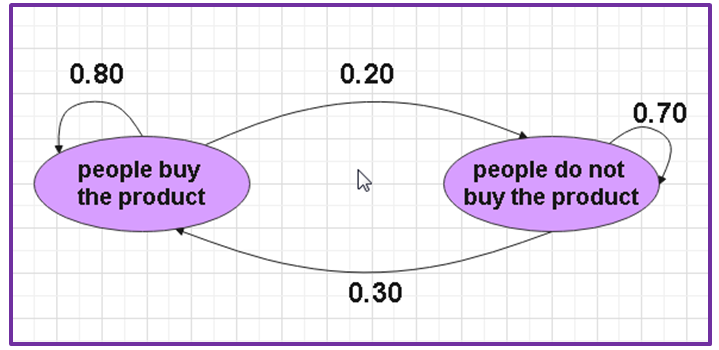

# Markov Chains

The number of people that make up a population is determined both by the number of births and the probability that individuals have of dying within this population. For this, it is important to know the ages of the people that make up the population under study, that is, how the individuals are divided according to their age and also to know their probabilities with respect to fertility, mortality and survival. Then it will be necessary to make what we call a life table where the number of females that can mate is reflected first, to know the fertility terms of that publication.

It is then when we must use a classical probabilistic model based on matrix algebra, such as Markov chains, we are now going to explain what these chains consist of.

We are going to suppose that we toss a coin and we will designate the event  If it comes up heads and  If it comes up tails, but it does not matter if we repeat this action t times, the probability of obtaining  will not depend on what has come up in the previous event, since both events are independent. But there are many other events that are represented by independent variables and in 1907 Marcov dedicated himself to studying these situations where an event will depend on the immediately preceding event and that is precisely what we will see in this article.

Suppose again that we have a sequence of “n” experiments or tests and in each of them we obtain a set of possible results, which we will consider finite and also designate by , , , …   Being between them, mutually exclusive. When we carry out an experiment and obtain the result , then we can say that the system is in the state E_i, but we will use  as the representation of the event  but after t amount of tests. Therefore its probability will be given by  After t experiences that the system is in state .

On the other hand, we will call  the probability of the system is in state  but this time when the test t is conditioned to a previous test t - 1 and it is what we will call a state , therefore:

However, when we have a succession of events  that are also mutually exclusive, that is when a Markov chain is constituted:

 for all i, j = 1,2,…, m

This means that the probability that the object in the test t is in the state , will only depend on the state , of the previous test t-1 and that it is also independent of the previous tests or experiments. Somehow it is as if the system lacks "memory".

The probability  is evident that it depends on 3 variables that are: the events ,  and the time “t”, therefore:

For the particular case where the probability   is independent of t, we can say that the Markov chain is stationary or homogeneous, in that case we can say that: . So from now on we will consider the homogeneous chains as  is a certain probability that meets:

1. 
2. 
3. 

## Stochastic matrices

Stochastic matrices or also called probability matrices, are those that meet the condition that each of their rows ends up being a probability vector. It is important to emphasize that stochastic matrices are a case of Minkowski matrices, which in turn are also a specific case of non-negative matrices.

Now, a stochastic or probability vector is the one that fulfills that all its components are particularly non-negative and also the sum of them is always equal to 1, that is, given the case that  is a probability vector, then:

1. 
2. 

Given these circumstances, stochastic matrices are a particular case of what we call Minkowski matrices, let's define the latter, Monkowski matrices are non-negative and square matrices, where the condition that the sum of their elements is either from each column or each row, are less than or equal to the unit, therefore, if  is a Minkowski matrix, then it must be satisfied that:

1. 
2. 

Non-negative matrices: As their name indicates, they are those matrices made up of non-negative elements, so that if  is a non-negative matrix, then it must be true that:

1. 

## State diagrams

We can represent the different relationships that exist between the states of a Markov chain through a diagram made up of nodes and arrows that are oriented by the transition probabilities and this type of diagram is known as state or transition diagrams.

Let's suppose that we have a stochastic matrix such as:

The corresponding state diagram would be:

Now let's go with an example: A pet store sells fish and has a guarantee, so if you buy a fish and it dies before three months, the store replaces the fish for free, yes, once the fish has been replaced once, the warranty is terminated.

We also have the following data:

1. During the first month 3% of the fish die
2. Between the first and second month, 5% of the fish die
3. Between the second and third month, 7% of the fish die

Let's represent the pet store situation using a Markov chain state diagram:
The nomenclature used will be the following:

1.  Fish
2. The months will be i = 1, 2, 3 of guarantee
3.  Fish that has been replaced and therefore no longer has the guarantee
4.  Fish without warra
5. nty for having been sold more than 3 months ago

We are going to make the state diagram

## Markov regular chains

Let us remember that until now we have considered a finite number of experiments, but it is not interesting to develop in a similar way for a long-term behavior, since the transition matrix solves the problem of finding the probability law. In the new proposed case, that is, to use the Markov chain but studying a long-term behavior, we must find the limit of the chain when time tends to infinity.

Being A^n\ the nth power of the transition matrix A, we can then say that:

If we have any two values i, j = {1, 2,…, m} using the induction method we have:

Let's now suppose that the theorem is true for n-1, we can say that:

Using the law of total probability we have that:

If we use the induction hypothesis:

In addition to the definition of the Markov Chain

We can say then that:

This corresponds to row i column j when we obtain the product of the matrices

Let's see graphically how to recognize if a Markov chain is regular or not:

This Markov chain is not regular because it only has one cycle

This Markov chain is also not regular because both state E1 and state E3 do not have access from any other state

This Markov Chain is regular, since all its states are accessible.

Let's go with an example: suppose a company has three trucking centers that are located in Brisbane, Sydney and Melbourne. Every month, half of the trucks in Brisbane and Sydney go to Melbourne, while the other half stay at the same site. However, the trucks found in Melbourne are divided equally between Brisbane and Sydney. If initially the company had 100 trucks in Brisbane, 300 in Sydney and 200 in Melbourne, we want to know the distribution of trucks after the first month and after two months in each of the cities.

The first thing we must do is make the state diagram:

The nomenclature will be as follows:

 Number of trucks in Brisbane,  number of trucks in Sydney and  number of trucks in Melbourne after k months.

For the first month we have to:

 + 50 + 100 = 150

 + 50 + 150=200

 + 150 + 100 = 250

For the second month the distribution of trucks will be:

 + 75+100=175

 + 75+125=200

 + 125+100=225

We can perform these same calculations in a more convenient way, using matrix notation. We are going to call  the vector that represents the probabilities in month K, then the denotation would be:

The calculation for the first month can be represented in a matrix as follows:

  

Then yes:

We can express the above equation as: 

So as:

Therefore:

  

  

To generalize, we can express the equation as follows:

We can conclude that a Markov chain is finite and comes from an evolutionary process of a finite number of states, which we can denote as:
State 1, State 2, State 3,…, State n. For each point in time, the process will be in one of the states and already changing state by means of fixed probabilities, which are what we call transition probabilities.

Therefore, there is a vector  for each time k and represents the probability of being in the different states for a time K, that is:

Let's go to an illustrative example:

The department in charge of market research for a certain factory has estimated that 20% of the people who buy the manufactured product one month will not buy it the next month. They have also determined that those people who do not buy the product one month will buy it the next month. If out of a population of 1000 people, 100 of them buy the product the first month, how many people will buy the product next month? How many people will buy it two months later?

Of the 100% of people who buy the product in one month, 20% will not buy it the following month, that is, 80% will continue to buy it the following month and in the same way 100% of people who do not buy it in one month, only 30% will buy it the following month, so 70% will not buy the product.

As always, we will make the state diagram

| | People buy the product |People do not buy the product|
| ----------- | ----------- | ----------- |
| People buy the product|0.8|0.30|
| People do not buy the product|0.20|0.70|

Our transition matrix will then be:

In the initial state we know that out of 1000 people, 100 bought the product, so that 900 people did not buy the product, our initial vector will be:

 

For the first month 350 customers will buy the product, while 650 customers will not buy it.

  

 

These calculations indicate that for the second month 475 customers will buy the product and 525 will not buy it.

Another example:

A student is taking math and physics courses this semester. The student decides to follow the following patterns when studying these subjects:

If one day she studies math, the next day she will spend 1/2 of her time studying math and the other 1/2 time studying physics.

If you study physics one day, the next day you will spend 2/3 of your time studying mathematics and the other 1/3 of your time studying physics.

If the student spends the Monday of a week studying physics, how likely is the student to spend his time on Thursday of the same week studying mathematics?

We are going to make the state diagram:

In a Markov chain the important thing is to find:
1. The transition matrix
2. The initial state to find the transition matrix it is advisable to make a table

| | Math |Physics|
| ----------- | ----------- | ----------- |
| Math|1/2|2/3|
| Physics|1/2|1/3|

So from there we can write the transition matrix:

We can then verify that this matrix is stochastic, since it is made up of probability vectors, we know that they are probability vectors because their elements are greater than or equal to zero and when adding their components, the result is unity. When I add 1/2 + 1/2 = 1 and in the same way 2/3 + 1/3 = 1.

We are now going to find the vector that represents the initial state, for this the established order is important, that is, in our table we place mathematics first and then physics. Now, the question we must answer in the problem begins with the statement "If one day he studies physics", so that is where our initial state begins. This implies that that day he studied physics and not mathematics, therefore our initial vector will be given by a null time dedicated to the study of mathematics and the total time studying physics, that is:

Once we have the transition matrix and the initial state, we can answer the question posed. As we know, our initial day is Monday and we assign a value of K = 0 to that day, therefore, for Tuesday K = 1, Wednesday K = 2 and we are specifically interested in Thursday when K = 3. Remembering the formula what interests us:

Therefore:

We already calculated the study probabilities for Thursday, but the question is how much study time he will dedicate to mathematics, as we know that subject is the first one we place in our vector, therefore, the probabilistic study time of mathematics for Thursday it will be 57.41% of your time.
