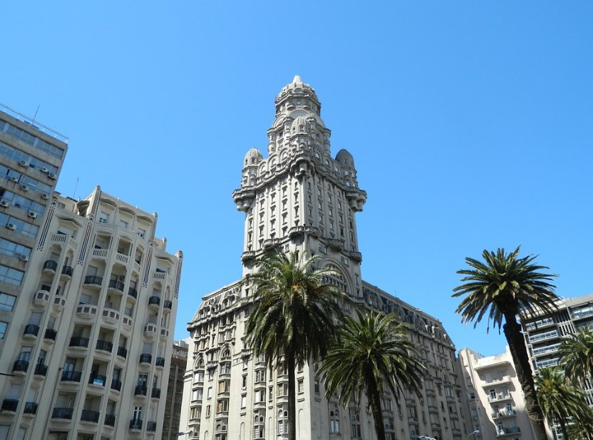

# 🇺🇾 Montevideo

Montevideo in the capital of Uruguay and is one of the most welcoming
and quiet cities in South America, there are almost no traffic jams and
you can walk calmly through the city, in addition to its bookstores and
markets that give it a very special touch.

Montevideo is a city that is very well located geographically, since it
is halfway to the main tourist attractions in Uruguay. If you decide to
get to know this city, we will guide you through its main tourist
attractions and the best things you can do and see in this beautiful
capital.

## Intendancy viewpoint

If you want to have a panoramic view of Montevideo, one of the best
places for it is the Mirador de la Intendencia, since not only is there
a 22nd floor but it is also totally free.

## July 18 Avenue

It is the main avenue of the city and the best places to visit are near
Avenida 18 de Julio. Although it is true that this road is somewhat
gray, you can find many restaurants and shops.

## Independence Square

Around this square are most of the tourist sites of Montevideo and
separates Avenida 18 de Julio from the historic center of the city. In
the center there is a statue of the liberator of Uruguay José Gervasio
Artigas and below the monument is the mausoleum built in his honor.

## Palace Saved

This palace is the emblem of Montevideo and is one of the best visits
you can make in this capital. Although it is true that it was designed
to be a hotel, this business could never materialize and currently they
are spectacular apartments where you can stay.

## Rambla of Montevideo

La Rambla de Montevideo is a maritime promenade of approximately 20 km
long, which borders the coast that goes from Ciudad Vieja to Carrasco.
It is a quite pleasant walk where you can glimpse several beaches and
parks, among which is the Parque Rodó.

## Beaches in Montevideo

The busiest beaches in Montevideo are between Ciudad Vieja and Carrasco,
the main ones are: Playa Ramírez, Playa de los Pocitos, Playa Buceo,
Playa Brava, Playa Malvin, Playa Honda, Playa Verde, Playa de los
Ingleses, Playa Carrasco and Playa the mulatto Although it is true that
these beaches have a brown color, it does not mean that they are
polluted, but rather that Montevideo is very close to where the Río de
la Plata empties and drags some land.

## Parque Rodó and the Summer Theater

Parque Rodó is on the Rambla very close to Playa Ramírez and is a fairly
large park where you will find a pond, as well as the Summer Theater. If
you travel to Montevideo between the months of December and February,
the recommendation is to find out if there is any performance in this
theater, since it is one of the best things to see in the city.

## Legislative Palace

The Parliament of Uruguay has its headquarters in the Legislative Palace
and the recommendation is to visit it at 7:00 p.m. since that is when
the flag is lowered, you will be able to see a group of soldiers in a
ceremonial act where they take the flag, fold it and they take it away
If you have the opportunity to take a guided tour, it is the best way to
get the historical details of each of the rooms of the Palace. Then you
can visit the Montevideo Agricultural Market which is located about 10
minutes from the Legislative Palace.

## Dr. Tristán Navaja Market

This is one of the most famous markets in Montevideo and takes place
every Sunday on Dr. Tristán Navaja street in the Cordón neighborhood.
There you can find everything you can\'t imagine, from vegetables to
books, through furniture, antiques, animals, music, clothes and more.

## Where to eat in Montevideo

Uruguayans are specialists in good food and drink, they have the most
refined culinary taste. To have a Madrid sandwich and some delicious
churros with chocolate for breakfast, the most recommended is the Facal
cafeteria on Avenida 18 de Julio or have breakfast at a well-known hotel
chain called La Pasiva, where you can find very complete breakfasts at a
very low price. .

We advise you to try the authentic Uruguayan asado in the Mercado del
Puerto, which, although the prices are a little higher than average
because it is very tourist-oriented, is really worth it. You can also
have lunch or dinner at Mercado Ferrando, where there is an old
furniture factory that today is a gastronomic market. There you can eat
from Hawaiian food, through authentic Mexican tacos to taste Basque
pintxos.

In Ciudad Vieja in Plaza Constitución there is a restaurant called
Aperitivo en La Corte, which is an ideal place to enjoy a good Uruguayan
wine with a table of simply delicious cheeses and sausages.

In the Old City itself, we recommend you have a coffee at La Farmacia,
which although it is currently a cafeteria, it was a pharmacy between
1890 and 2007, but it still retains the aesthetics of a pharmacy in its
old days.

Bookstores that are also coffee shops are a peculiarity of Uruguay, so
specifically in the Escaramuza bookstore it is highly recommended to
have a coffee.

If you want to have a snack, the recommendation is to try the pastries
of a cafeteria located in the Carrasco neighborhood, which is a place
with a very pleasant, cozy garden and sweets from another world.

## The places to visit in Montevideo at night

Although it is true that this city does not have an impressive
nightlife, you can have some spectacular craft beers at the Mercado
Agrícola de Montevideo or at Mala Fama. You can also have dinner at
Chivipizza, which is an artistic, modern and cozy space in the Carrasco
neighborhood, which is characterized as the most luxurious neighborhood
in the city.

The other recommended place is to have dinner at La Pulpería where you
can enjoy a delicious Uruguayan barbecue in this small tavern, far from
the tourist crowd.

Remember that one of the best recommendations for going out at night is
to see a show at the fabulous Summer Theater.

Uruguay is a city to live and enjoy, its pleasant atmosphere, dishes are
delicious and Uruguayans are wonderful people.

## About the Author

Idais, Graduated in Mechanical Engineering, and a master’s degree in teaching component, she gave classes in several institutes of mathematics and physics, but she also dedicated several years of my life as a television producer, she did the scripts for mikes, the camera direction, editing of video and even the location. Later she was dedicated to SEO writing for a couple of years. She likes poetry, chess and dominoes.
