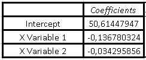
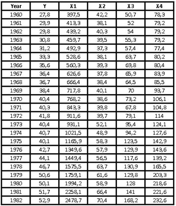
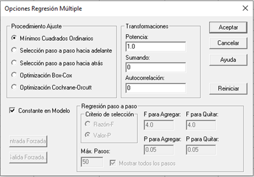
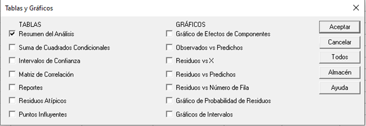

# 📈 Multivariate Statistics

Multivariate or multivariate statistics is an area of statistics that is based on the simultaneous analysis and observation of several variables, in addition to understanding how the different variables are related to each other.

Multivariate statistics at the time of its practical application has determined many problems in particular, it can take into account several types of multivariate analysis to achieve an understanding of the relationship between the variables and the relevance of their relationships, specifically in the problem at hand. doing research.

Multivariate statistics, in turn, are based on multivariate probability distributions and their usefulness in representing the distributions of the observed data, but also how we can arrive at the inference of different quantities, when they are of interest to us for the same analysis.

The applications of this type of multivariate statistics are found in different branches of science, but also in market research, in order to determine the characteristics of the individuals who buy a certain product.

It can be studied the resistance of crops to damage caused by droughts and pests in agriculture, while in psychology, it can be used to study the relationship between the attitudes of parents and the behavior of their adolescent children. In finance, they can help you to know the economic development of a certain territory in relation to other areas, as well as in sport, multivariate statistics can be used to obtain the best results, based on the knowledge of anthropometric measurements. In short, multivariate statistics have endless applications, in different areas of our daily lives.

When several characteristics of interest are measured for the same individual, that is when the multivariate data appear. Let us remember that an individual is any object worthy of study and is what we call experimental units, for example: land, people, countries, animals, companies, etc.

The main objectives of using multivariate techniques are:

1. Simplification: The set of techniques that allow us to visualize and interpret large amounts of data, whether of individuals or variables, is what we call multivariate methods and we can understand them at a glance, thanks to the fact that they help us to reduce or simplify these data.

2. The relationship between variables: find the possible relationships that exist between individuals among themselves, the characteristics and between both.

2.1.- Relationship between characteristics: It is possible to relate these variables when they have common characteristics, for example: we are going to suppose that mathematics, physics and chemistry tests are carried out on a certain group of high school students. If each student that makes up the sample obtains high marks, measures and low marks in the three tests, then we can conclude that there is a relationship between the tests of these three subjects. The characteristic that they could have in common is the measure of intelligence of the individual in general, for the beginning of a certain university career.

2.2.- Relationship between individuals: The relationship between individuals exists if they are similar to each other, for example: Let's suppose that we are evaluating different types of beers with respect to the level of acceptance they have. Then we measure the consumption of each of them for different age groups. You can try to measure the relationship that exists between light and dark beers, or if on the contrary, they do not keep any type of relationship between the different evaluations.

Although it is true that we start from the assumption that the variables are related when we refer to studies with respect to individuals, we realize that they can also be independent. Furthermore, we start from the assumption that the set of variables involved in the analysis have a multivariate normal distribution. However, this assumption is capable of allowing a multivariate analysis, but which in turn develops in parallel to the univariate analysis that is based on a normal distribution.

Classification of multivariate methods:

1. Those motivated or directed by the variables: These methods are focused on the relationships between the variables, such as factor analysis, correlation matrices, principal component analysis, and regression analysis.

2. Those motivated or directed to individuals: These methods focus on the relationships that exist between different individuals, for example: multivariate analysis of variance, discriminant analysis and cluster analysis.
   Multivariate exploratory analysis

Descriptive and multivariate statistics describe the behavior of a group or set of data, where the most important are:

- The sample variance

- The sample mean

- The sample correlation

- The scatter diagram

- The main components

We call statistical inference to the approximation of certain population characteristics, which are called parameters, and statistics are in charge of summarizing the information found in the sample of a population.

Now, remembering a little what the point estimate is, it is one that consists of supplying a value where the parameter of our interest approximates. We have point estimation methods such as the maximum likelihood method and the moment method.

How to test a hypothesis?

When it comes to contrasting hypotheses in statistics, we must do tests that measure two hypotheses, to know which of them is correct and the decision is based on the information provided by the sample.

When we refer to the most important hypothesis test in multivariate data, we must simply test whether the correlation between two variables is significantly different from zero.

Confidence intervals

When we make estimates by intervals, we must establish what is the confidence interval where the set of values that are closest to our parameter are found. In the same way as in hypothesis tests, the confidence interval with the greatest interest is the one where the greatest correlation between two variables is found.

We can use correlations when grouping variables, since when we have a large set of variables, it is most likely that there are relationships between some of these variables and the correlation coefficient between two variables allows us to group these variables, of so that the variables that are in the same group may have high correlations, while the variables that are in different groups will have low correlations with each other.

Let's explain a little the techniques used for multivariate analysis

1. Dependency Methods:

1.1.- The regression method allows us to investigate up to when the behavior of a variable can be predicted from
another variable, for example, what economic benefits in a film can be obtained depending on production expenses and marketing expenses.

1.2.- Canonical correlation analysis tries to analyze the possible relationships that exist between two groups of variables.

1.3.- When we carry out a discriminant analysis, we can obtain a discriminant function that we can use to differentiate between two or more groups and thus be able to make decisions based on it.

1.4.- There is an extension of the analysis of variance (ANOVA) for those cases where there are several dependent variables, this extension is what we call the multivariate analysis of variance (MANOVA).

1.5.- When the response or dependent variable is dichotomous, the logistic regression method allows us to develop a regression analysis that serves both to estimate and to test the influence that one variable has on another.

2. Methods of Interdependence:

2.1.- The first method of this type is the principal component analysis, which determines another smaller system of variables and which is capable of synthesizing the original system.

2.2.- Cluster analysis is responsible for classifying a sample of variables or individuals into small groups, so that the characteristics of a certain group are very similar to each other and, at the same time, very different from the rest. It is important to take into account that it disagrees with the discriminant analysis, in that the composition and number of these groups is unknown.

2.3.- The iconography of the correlations.

3. Structural Methods:

3.1.- Structural equation models are in charge of analyzing the relationships that exist between a set of variables that are symbolized by a system of simultaneous equations, where it is assumed that some of these equations that we will call "constructs" are they measure from other variables that are observable and which we will call "indicators", yes, the modeling always has a small error between the constructs and the indicators.

We are going to delve a little into each of the methods, how they are applied and we will include some solved exercises that help us better understand the method.

1. Multiple regression analysis: Regression is used in research to model the relationships that exist between those variables that are capable of directly influencing a phenomenon in our reality. For example, an economist might be interested in verifying the relationship that exists between the financial indices of a certain company and a possible scenario of economic instability or, on the contrary, of financial equilibrium.

In a much broader sense, regression is intended to model a set of data. In other words, the regression formula is used to approximate the relationship that exists between the variables, regression is used not only as a descriptive tool, but also as an inferential instrument.

The researcher must find the best linear equation that adapts to what he wants to predict and must also be able to control the set of factors that are present in the phenomenon, in order to evaluate it.

On the other hand, the researcher evaluates a sample of observations, in order to be able to make the necessary estimates of the population parameters and verify in this way, if there really is a linear relationship or not, between the dependent variable and the independent variable.

Let's go with the first example of multivariate regression:

In a gym, the weight and height measurements of some clients chosen at random are taken, to generate a function that allows us to predict, the same measurements in other clients just by knowing their age, the data obtained is as shown below:

To do multivariate linear regression using Excel, we need to install the Data Analysis Add-in. For this, it will be necessary to open a new Excel sheet and pour our data into it, then we go to the upper menu in "file" and in the drop-down menu we will choose "options", a box opens and in the menu on the left we click on "add-ons", where again the add-on options on the right side of the box are opened, there we must select "tools for VBA analysis"
and then go to the "go" button and press it.

Another small box opens where we must enable the boxes corresponding to: "tools for analysis" and "tools for VBA analysis" and then click on the "accept" button. Once this procedure is done, we already have the main tool to do our multivariate linear regression.

Now, we return to our Excel sheet and in the upper menu we choose "data", if we have installed the add-in correctly, the option "data analysis" should appear in the upper right, we open this option and a new one will open Box with the functions for analysis, among them is the "regression" function, which is precisely the one we must choose.

Once the "regression" option has been chosen, we click on the "accept" button and a new box will be displayed where we must position ourselves with the mouse over the "Input Y Range" option and that is when we select all the data that make up our first column (the age of our sample).

In the same way, we will position ourselves later on the option "Input X Range" and this time we will select the following two columns where the data corresponding to height and weight are found.

To obtain the regression analysis without deleting our data from the table, we must choose the option "output range" and position our mouse over the small box, where then we must choose a cell in our Excel sheet, which will be reflected in the box and that is where our analysis data will appear, then we only have to "accept".

The summary of our multiple regression will appear, where the values of interest will be the intercept coefficients of the variable X1 and the variable X2:

The function that represents the multivariate regression of this problem will be given by:

Y = Intercept + coefficient of variable X1 (Weight) + coefficient of variable X2 (Height)

Substituting the data we have that our function is:

Y = 50.6145 - 0.13678 (Weight) - 0.03429 (Height)

This exercise is only intended to show how the multivariate linear regression method works, but in the next exercise, we are going to elaborate a bit more on what the data we obtained in the summary of our multiple regression means.

Exercise 2:

Suppose we obtained the consumption data for chicken, beef, pork, and per capita income in dollars, between 1960 and 1982 for a certain population of our interest. We want to know how the price of beef, the price of pork, the price of chicken, and per capita income influence chicken consumption over all these years.
The nomenclature to be used will be the following:

Y = Chicken consumption per capita in pounds

X1 = Per capita income available in dollars ($)

X2 = Price of chicken in US cents per pound of weight

X3 = Price of pork in cents per pound of weight

X4 = Price of beef in cents per pound of weight

The data we obtained were the following:

As we already have the data analysis component added to our Excel, we will only have to go to our top menu and choose "data", to repeat the previous steps again, that is:

"Data analysis" → "Regression" → "OK"

Once the regression box appears, we must position ourselves in the input Y Range and choose all the data that we have in our “Y” column.

Subsequently we position ourselves in the input Range X and we choose with the mouse the rest of the data found in columns X1, X2, X3 and X4, we mark the round of Output Range and we position ourselves on the box, and then choose the initial cell where we want the summary of our multiple regression to be reflected.

In the summary obtained, the first data that we must take into account is the coefficient of R Square, which as we can see gives us a value of 0.9408.

This coefficient indicates that the model is capable of explaining the behavior of the variable that concerns us (in this case is the per capita consumption of chicken) at 94.08%.

On the other hand, the Adjusted R square gives us a value where it indicates that the variation in chicken consumption has a 92.77% chance of depending on the rest of the independent variables, that is, both on per capita income and the price of chicken. chicken, pork and beef prices.

Now, the analysis of variance helps us to accept or reject the null hypothesis, that is, if p ≥ 0.05 we can accept the null hypothesis, this p-value is given in the analysis of variance by “the critical value of F ”And we can then observe that: p ≅ 8.3792E-11, therefore, p is a value much less than 0.05, so we must reject the null hypothesis and then we can reach the conclusion that at least one of our independent variables affects our dependent variable, which is the per capita chicken consumption.

We are now going to make our model that will depend on the intercept coefficient and the coefficients of the variables X1, X2, X3 and X4:

Y = Intercept + variable X1 (Income) + variable X2 (Chicken price) + variable X3 (Pig price) + variable X4 (Beef price)

Substituting the values we have that our model for chicken consumption that will depend on the rest of the independent variables is:

Y = 36.971 + 0.005 (Income) - 0.6014 (Chicken Price) + 0.1937 (Pig Price) + 0.0710 (Beef Price)

As we can see, the sign of the coefficients has a lot to do with the result, when we talk about per capita income, the logical thing would be to think that the higher the income, the greater the consumption of chicken, that is why the model indicates a positive coefficient, for On the contrary, if the price of chicken increases, of course the consumption of chicken will decrease and therefore, in the model the coefficient of the variable X2 is negative.

In the same way that we reasoned the previous items, it is expected to think that if the price of pork and beef increases, the consumption of chicken will increase, since when the prices of the competition rise, people will prefer to buy chicken (which is cheaper).

Statgraphics a statistical program:

This is a program created to facilitate statistical analysis and that we are going to use from now on, to save time when using statistical methods and models. This program can analyze and interpret our data in a practically instantaneous way and you can find it at <http://www.statgraphics.com>, where you can get a free trial version for 30 days and if you can cancel a small fee, you will get the license .

Since I got the free trial, they don't offer it to me in the multilingual version, so I have it in Spanish and will try to translate your comments into English.

Once you have purchased the program that will help us, I will give you a short introduction on how to use it with the same data from exercise 2 that we saw previously, so that you realize that we obtain the same results. But in addition, from now on we will be able to analyze the data of any sample, with a greater statistical vision and with significant details, so that we can make decisions, with a greater number of analysis elements.

When opening Statgraphics we find the following environment:

Where we can extract the data from Excel to avoid copying it again. The way to do it is to go to File → Open → Open data source → External data file → Browse → We look for the place where we have saved our data from exercise 2 in Excel and open it, immediately the empty cells will be filled with the data that we obtained in the sample and we can visualize them as follows:

As you can see, the names of the columns are brought with them from Excel, but if we are going to enter the data one by one, we must position ourselves at the beginning of the column and double-click, where the following box will appear:

In this window where it says "Name" we can identify our variable, in "Comment" we can place the units of the variable and at the bottom, where it says "Type" we must choose the corresponding box, that is, if the variable is numeric, character (for non-numeric variables), date, etc.

A character type variable is, for example, gender or sex, which as we know is not a numeric variable, since it
would correspond to female, male or others.

Once we have entered all our data, it is advisable to save our file, for this we go to File → Save as → Save data as and a box opens where we can place the identifier name. It is important to take into account that by default, the program saves the file with an extension ".sgd", which comes from Statgraphics save data, but we can save it with other extensions, for example, as a text or Excel file.

We must take into account that if we save the file with a ".sgd" extension, we will not be able to open it with other programs.

Returning to the case that concerns us, remember that it is a multiple regression, so we go to the top and look for the display From "Relate", there we go to "R^2 Multiple Regression Models" and 3 options are displayed, where we will again choose "R^2 Multiple Regression Models", then a box will appear as follows:

There we will position ourselves on the box corresponding to the dependent variable and click on Y, while for the independent variables we will repeat the process, but this time choosing the rest of the variables, that is, X1, X2, X3 and X4, and then "To accept".

Again another box of "Multiple regression options" will appear, where by default it already has the boxes marked: Ordinary least squares, constant in model and the value of "Power" is 1, it is recommended for this case, to leave that same configuration and again "OK".

A new window opens where we will simply have to check the "Analysis summary" box and uncheck the rest of the boxes that are selected by default, to "Accept" again.

It is then that the summary of the multivariate analysis appears:

We can realize that the program not only offers us the interception and the coefficients of the variables X1, X2, X3 and X4 that we had previously obtained with Excel, it also directly gives us the linear regression formula and also perfectly explains the model, the meaning of the numbers obtained, the linear regression model and some recommendations to take into account.

For this specific case, the program gives us the following information:

R-squared = 94.086 percent

R-squared (adjusted for g.l.) = 92.7717 percent

Standard error of the est. = 1.98225

Mean absolute error = 1.53223

Durbin-Watson statistic = 1.02651 (P = 0.0006)

Autocorrelation of lagged residuals 1 = 0.401195

The StatAdvisor

The summary produced by the program shows the results of fitting a multiple linear regression model that describes the relationship between Y and the rest of the 4 independent variables. The fitted model equation is:

`Y = 36.9709 + 0.00502361 * X1 - 0.601445 * X2 + 0.193694 * X3 + 0.0710083 * X4`

Since the p-value is less than 0.05, there is a statistically significant relationship between the variables and also with a confidence level of 95.0%.

The R Square statistic indicates that the adjusted model explains 94.086% of the variability in Y with respect to the rest of the independent variables. The adjusted R Square statistic, which is more appropriate for comparing models with different numbers of independent variables and in this case is 92.7717% of fit. The standard error of the estimate shows that the standard deviation of the residuals is 1.98225. This value helps us to establish limits for new observations, if we select the Reports option in the text menu. The mean absolute error (MAE) of 1.

53223 is the mean value of the residuals. As we can see, the p-value is less than 0.05 and this indicates a possible correlation with a 95% confidence level.

To determine if the model can be simplified, note that the highest p-value of the independent variables is 0.3286, which corresponds to X1. Since the p-value is greater than or equal to 0.05, that term is not statistically significant, with a confidence level of 95.0% or greater. Consequently, consideration should be given to removing X1 from the model.

So far are the recommendations and analysis provided by the StatAdvisor of the Statgraphics program, but we can realize other important points to take into account, with the summary provided by the program.

Let's go back to looking at the multivariate linear regression:

`Y = 36.9709 + 0.00502361 * X1 - 0.601445 * X2 + 0.193694 * X3 + 0.0710083 * X4`

By interpreting a little the coefficients that accompany each of our independent variables, we can also observe that the smallest of the coefficients is effectively the one that accompanies X1 and therefore, the least significant when it comes to influencing our dependent variable Y. It is therefore, the program recommends that we eliminate this variable from our model.

On the other hand, as we can see, the highest coefficient in absolute value is
(-0.601445) which is the one that accompanies X2, remember that: X1 corresponds to the per capita income of the population, while X2 is the price of chicken, X3 the price of pork and finally X4 which is the price of beef. We can say then that the increase in the price of chicken is the variable that affects the consumption of chicken the most and does so negatively, as we deduced previously, as the price of chicken increases, its consumption will be lower.

We can also realize that the next significant variable is the price of pork, since we can see that the coefficient that accompanies it is greater than the coefficient of beef. Then we can interpret that the increase in the price of pork has a positive impact on a higher consumption of chicken and in the same way with the increase in beef, although to a lesser extent.

## About The Author

Idais, Graduated in Mechanical Engineering, and a master’s degree in teaching component, she gave classes in several institutes of mathematics and physics, but she also dedicated several years of my life as a television producer, she did the scripts for mikes, the camera direction, editing of video and even the location. Later she was dedicated to SEO writing for a couple of years. she like poetry, chess and dominoes.
