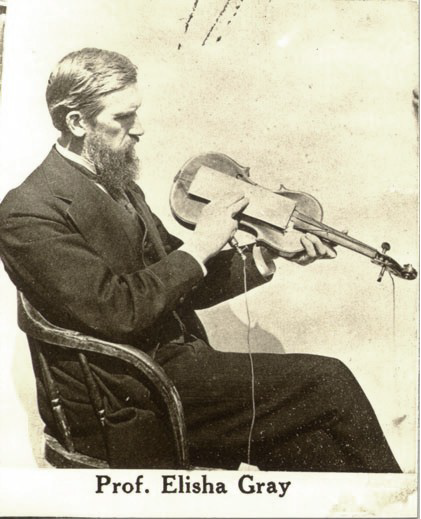
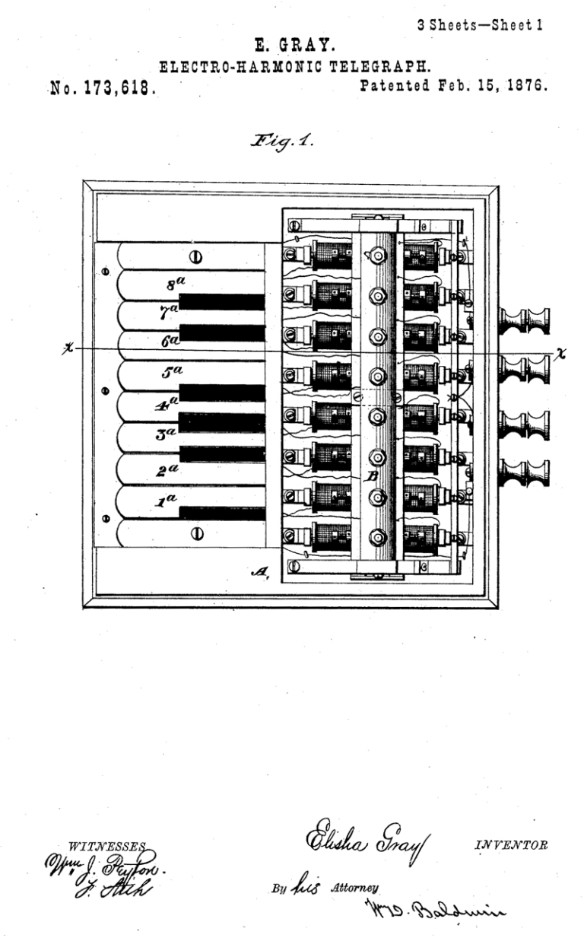

# 🎵 📮 Musical Telegraph

## What Is An Electrical Telegraph?

An electrical telegraph was a point-to-point text messaging system, used from the 1840s until the mid 20th
century when it was slowly replaced by other telecommunication systems.

## Musical Telegraph

One of the first synthesizers that used electricity to generate and transmit sounds. Invented by Elisha Gray in 1876. (And here we must digress. Elisha Gray also “invented” the telephone, in 1874, but arrived at the U.S.
Patent Office a scant three hours after Alexander Graham Bell did, and thus lost out on the glory. After years of
lawsuits, Gray’s company, Western Electric, became the sole-source manufacturer of telephones, while Bell’s
company controlled the transmission lines.)

Elisha Gray would have been known to us as the inventor of
the telephone if Alexander Graham Bell hadn’t got to the patent
office one hour before him. Instead, he goes down in history
as the accidental creator of one of the first electronic musical
instruments. Gray was inspired to investigate electro-acoustic
effects after witnessing his nephew playing with his uncle’s
equipment. The child had connected one end of a battery to
himself and the other to a bathtub; by rubbing his hand on the
bathtub’s surface he created an audible humming tone
proportional to the electric current.

Gray discovered that he could control sound from a self vibrating
electromagnetic circuit and in doing so invented a basic single
note oscillator. The original intention was to use this principle to
develop an early version of multiplex telegraphic transmission;
sending multiple telegraphic messages encoded as different
pitches simultaneously over the same line which could be
decoded at the receiving end. Using this principle he designed a musical instrument; The ‘Musical Telegraph’ or
‘Electro-Harmonic Telegraph’ initially to demonstrate and promote his ideas.

Elisha Gray’s Musical Telegraph keyboard transmitter.

"My invention primarily consists in a novel art of producing musical
impressions or sounds by means of a series of properly-tuned vibrating
reeds or bars thrown into action by means of a series of keys opening or
closing electric circuits. It also consists in a novel art of transmitting tunes
so produced through an electric circuit and reproducing them at the
receiving end of the line."

Elisha Gray; Patent notes No. 173,618, Feb. 15, 1876.

## Next Topic: Telharmonium

## Sources

- Wikipedia / 120years.net / Sweetwater.com

## About the Author

"Guido F. Matis (a.k.a. widosub), a seasoned producer-composer authority with an unquenchable compassion towards the musical
expression, and many years of experience in the fields of event organizing, movie post-production, and recording with professional
musicians. His devotion to movie sounds shows in his art - widosub's music is filled with landscapes of emotions, dramatic twists and
melancholic moods. He's one of the hosts of Tilos Rádió's MustBeat show, in which he's is focusing on drum'n'bass and chillout
music. He's also one half of the duo Empty Universe."
