# ➖ Negative Binomial Distribution

When we refer to probability theory and statistics, this type of negative binomial distribution is of discrete probability and it is important to refer to it as including the Pascal distribution. Also being an extension of a geometric distribution, which is used in processes where it is necessary to repeat the test until a number of favorable cases is achieved, that is, the first success.

The negative binomial distribution measures the number of successes in a sequence of n number of Bernoulli trials, but which are also independent of each other and that there is an occurrence of successes with a probability p of those trials.

Let us remember that in a Bernoulli distribution, the main characteristic is that it is dichotomous and therefore there are only two possible outcomes.

When we refer to a geometric random variable, it is because a number of Bernoulli trials are needed to obtain the first success. 

However, if what we want is to know the number of trials necessary to achieve n successes, the random variable is then a negative binomial.
A random variable that has a negative binomial distribution whose parameters are r and p, it can be said that it is the number of Bernoulli experiments with parameter p and that they are also independent, which are repeated until the r-th success is obtained.
In the specific case of a negative binomial distribution when r = 1, we are referring to a geometric distribution.
The necessary conditions to apply this process are:

1- An indefinite number of tests must be carried out and the process will end, when it is possible to have a certain number of favorable results r.

2- It is important to take into account that the tests can give two possible results and that they are also mutually exclusive, for example, A and not A.

3- The probability of obtaining A as a result is called p and the probability of obtaining the result “not A” is called q, but we also know that p + q = 1.

4- On the other hand, p and q are independent and also constant in each test.

5- If we determine that X is “the amount of tests that are necessary to achieve x successes or obtain A as a result”, we can then say that X follows a negative binomial distribution whose parameters are p and r.

6- The nomenclature to use for this type of distribution is:

X ~ BN (p)

Being:

X = the number of Bernoulli trials required to obtain the ith success

7- The probability function X is given by:
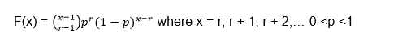

Let's go with the first example of a negative binomial distribution: suppose we have an electronic component whose chance of passing the quality control is 0.9. If we assume that among the results there is independence with respect to quality control and in view that they are different electronic components.

Two questions are posed to us:

1- Calculate the probability that by checking 5 electronic components it can be obtained that 3 of them pass the quality control

2- Calculate the probability that when checking less than 5 electronic components, 3 of them pass the quality control.

Answer to question 1:

The first thing to do is determine the random variable:

X = number of components to be reviewed until 3 that pass the quality control

We also know that X is distributed as a negative binomial of probability p:

X ~ BN (p)

Being p the probability that the quality control passes, that is:

p = 0.9

The r-th success is the number that we determine as the success to be achieved, in this case:

r = 3

Since they propose to review 5 components, then we must find the probability for x = 5

P (x = 5) =?

Let's substitute the values into the negative binomial distribution formula:
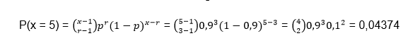

Answer to question 2:

The question we must ask ourselves mathematically is:

P (x < 5) =?

To find the probability of all variables less than 5, we generally calculate each of the probabilities when x = 1, x = 2, x = 3, x = 4 and add them together. But it is important to take into account that for a binomial distribution x = r, r + 1, r + 2, ..., this implies that x starts from the value r = 3, so in this case P (x <5) only goes to consider the values x = 3 and x = 4, therefore:

Example 2 of negative binomial distribution: a clinical study is carried out in which the volunteers are analyzed, because they have a variant of a gene that is capable of increasing the risk for a certain disease. The probability is 0.1 for a person to be a carrier and there are two questions:

1- What is the probability that 4 or more people must be analyzed in order to find 2 of them with the variant of the gene?

2- How many people must be analyzed to be able to detect 2 people who have the variant of the gene?

Answer to question 1:

The first thing we must do is identify the values that we must substitute in the formula and determine the random variable
X = number of volunteers who must be analyzed to find 2 people who have the variant of the gene
We know that the probability is:

p = 0.1

r = 2

Question 1 expresses mathematically is:

P (x ≥ 4) =?

Let us remember that one of the ways to solve this type of probability is taking into account that the sum of the probabilities is equal to unity, so to find P (x ≥ 4) we can express it as follows:

P (x ≥ 4) = 1 - P (x <4) = 1 - [P (x = 3) + P (x = 2)]

It is important to take into account that the probability P (x = 0) and P (x = 1) are not possible, since we must find at least 2 volunteers with the variant of the gene, that is why we start from r = 2 and the probabilities are discarded when x = 0 and x = 1.

Let's separately calculate the probabilities for x = 3 and x = 2

Substituting in the initial formula we have:

P (x ≥ 4) = 1 - (0.018 + 0.01) = 0.972

Answer to question 2:

What the second question asks us is to calculate the mathematical expectation or the mean value of the negative binomial distribution and for this we must use the following formula:

This indicates that 20 volunteers are expected to be analyzed to find 2 carriers of the gene.

## Geometric distribution
This type of geometric distribution is quite convenient for those processes where the tests are repeated, until the desired success or result is achieved, it also has endless applications for the samplings that are carried out in this way. Of course, it also implies that there is a dichotomy in the possible outcomes and the tests must be independent of each other.
The geometric distribution can come from a Bernoulli or pure experimental process, which also has the following characteristics:

1- The process must consist of an undefined amount of experiments or tests that can be separated or separable and this process will end when the desired result is obtained for the first time (success).

2- Each test can give one result or another mutually exclusive, that is, A and not A.

3- In the same way as in other distributions, the probability of obtaining a successful result A will be called p and we will call the probability of obtaining a result other than A q, also being p + q = 1.
The probabilities both p and q are constant in all the experiments and therefore the tests are independent. In the event that there is an extraction process, the extracted individual must be replaced.

4- The random variable must be determined by X = the number of tests required to obtain the desired result for the first time and this variable must be determined by a geometric distribution of parameter p, the nomenclature used is:

X ~ G (p)

5- The same assumptions as the binomial distribution are fulfilled, only that in this case n is not fixed. To see the difference we are going to suppose that we have an expert marksman and we want to know after 10 attempts how many times does he hit the target? In this case we would be facing a binomial distribution since we are establishing the number of attempts, but if we are facing a geometric distribution the question could be in which attempt does the first failure occur? Or in which attempt does the shooter achieve his first hit hitting the target?
How to get the amount function
As we expressed before, the variable x is the amount of tests necessary to obtain the first success. So the random variable will take positive integer values from the number x = (1, 2,…).
The quantity function is in charge of matching for each value of X the possibility of achieving the first success in the x-th test and for this it will be necessary to use the following formula:

Being:

k = the number of failed attempts before obtaining the first success

p = the probability of success of each test

We now go to the first example of Geometric Distribution: suppose we are in the presence of an expert marksman who has a 95% probability of hitting the target and we want to know what is the probability that he misses his 15th shot for the first time?
 

The first thing to observe is that this problem satisfies all the conditions of a geometric distribution: We do not realize that there are only two possibilities: they are to hit the target and obtain a success or failure. Later we observe that each shot is independent, so that if a shot hits or misses this will have nothing to do with another shot being successful or missing and we also realize that the probability of success is constant and the 95%.

As we can see, so far all the conditions of a binomial distribution have been met but they do not specify the number of shots, since all we want to know is the probability that it fails for the first time in its 15th attempt and therefore, this small difference makes that we are in the presence of a geometric distribution.

We can realize that:

X = 15 because it is in that attempt where we want to see the failure, but our success in this case would be that it fails.

p = 0.05 since there is a 95% probability that it succeeds, but what we are looking for is that it fails and its probability would be 5%.

Applying the formula we would have:
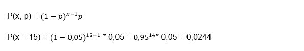

If we take it to percentages, we have a probability that he will miss for the first time on his fifteenth shot is 2.44%.
Geometric distribution example 2: Suppose that in a certain manufacturing process the probability of obtaining a defective part is 2%, we want to know what is the probability that the first defective part is the eighth inspected part?

Again we are facing a dichotomous case since the part is defective or it is not defective. On the other hand, the fact that one part is defective does not imply that the next one is defective or not, so each case is independent and finally, that the probability that the part is defective is constant and is equal to 2%.

x = 8

p = 0.02

We apply the formula:

In this way, we conclude that the probability of the eighth piece being defective is 1.74%.
Geometric distribution example 3: suppose that a telephone exchange of a certain company is always busy. If the probability of making a call at times of greatest congestion is 6%, you want to know what is the probability that 10 attempts will have to be made to communicate.

x = 10

p = 0.06

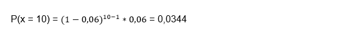

Interpreting the answer, we can reach the conclusion that the probability that 10 attempts will have to be made to communicate with the telephone exchange at times of greatest congestion is 3.44%.

Boltzmann distribution

In both mathematics and statistical mechanics the Boltzmann distribution is a distribution of probability or frequency of particle distribution, which is measured during its various possible states and is expressed as follows: The state function is proportional to 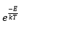

Being

E = The energy of the state and also varies between one level and another

k = Boltzmann constant

T = thermodynamic temperature

The Boltzmann distribution in statistical mechanics is a probability distribution where a system is balanced as a function of the energy found in that state and also the temperature of the system, it can be expressed as:

Being

pi = The probability that state i has

εi = The energy that state i has

k = Boltzmann's constant

M = The number of states of the system

T = The temperature of the system

It is important to take into account that here the term system has a very broad meaning, which can be from a macroscopic system such as a storage tank that can have natural gas or simply an atom. As you can see, the Boltzmann distribution is applicable to solve a wide range of problems. This type of distribution tells us that states that have lower energy, in general, have a higher probability of being occupied than those states that have higher energy.

A Boltzmann distribution that is calculated for two states has a proportion called the Boltzmann factor, which will only depend on the difference between the energy of the two states.

This distribution is named after Ludwing Boltzmann who was able to formulate it in 1868 for the first time while conducting his studies of statistical mechanics in the thermal equilibrium of gases. Subsequently, it was investigated in 1902 by Josiah Willard Gibbs in a much broader way.
Starting again from the distribution formula:
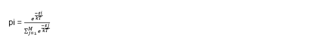

The denominator of this formula is also called Q which represents the canonical partition function and some authors call it Z.
So the Boltzmann distribution can also be written as:
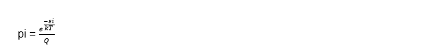

We can calculate the partition function if we know the energy that each of the levels of our system of interest have. If we want to know the partition 
function for atoms, we can find their values in a database called: NIST Atomic Spectra.

This distribution offers us the quantitative relationship that exists between the probabilities of both states that are occupied and we can establish this relationship of probabilities between states i and j as:

Being pi and pj the probabilities of state in i and j respectively and in the same way εi is the energy of state i and εj of energy of state j.
The Boltzmann distribution is frequently used to determine the distribution of particles such as molecules or atoms and the energy states to which they have access.

Suppose we have a system that is composed of endless particles, the probability that a particle has of being in state i is similar to the probability of choosing a particle at random in the system and checking at what level a state is. and we will realize that it is in state i. To find this probability we must divide the number of particles that are in state i by the total number of particles that the system has, this fraction is given by:

Being N the total amount of particles that make up the system and Ni the amount of particles that are in state i, but we can also express it in terms of energy and the equation would be as follows:
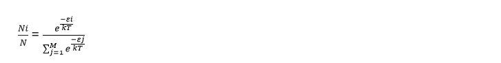

This formula is very important in spectroscopy, there you can observe a spectral line where the molecules or atoms move from one state to another and that is why certain particles that are in the first state undergo a transition, where this condition can be expressed through the fraction of particles for the first state. Since the transition is negligible, it is most likely not reflected in the temperature that was used to perform the calculation. Generally, when there is a larger fraction in the first state, this implies a greater number of transitions that will occur in the second state. A more robust spectral line will be the result, but there are other factors that can influence the strength of a spectral line, such as when the transition crosses the “forbidden line”.

We speak of a forbidden line in physics and chemistry when the spectral line emitted by the particles subjected to energy transitions, break the selection rules established by quantum mechanics. This implies that the process does not follow the most efficient route and although the transition is nominally "forbidden", the fact that it occurs spontaneously is not exactly impossible, when the molecule or the atom are in an excited state.

Applied to statistical mechanics

In statistical mechanics, the Boltzmann distribution is used when we study isolated systems of fixed composition that are also in thermal equilibrium, that is, in energy exchange equilibrium, and the most widely used application is when we use the Boltzmann distribution for the canonical set . This distribution is even used in certain special cases that derive from the canonical assembly, but which also intervene in the distribution in different 
aspects:

For the general case of the canonical set: in statistical physics, the canonical set is one that allows describing the states that occur in a macroscopic system that has a certain number of particles, temperature and volume.
When the canonical set does not interact with a smaller subsystem: in this case, it is advisable to find the statistical frequency of a subsystem of a given state. The canonical set has the property of separability in the case that it has been applied to any of the following conditions: when those systems that are in interaction have not fixed their composition and therefore, each subsystem is independent of the rest and therefore , the expected 
frequency distribution of these subsystem states has the Boltzmann form.

When the particle system does not interact and we are in the presence of a Maxwell Boltzmann distribution of classical gases: in particle systems, many times the particles share the same level and regularly change places with another particle. In statistics, the Maxwell Boltzmann distribution gives us the opportunity to calculate the expected number of particles that are in a given state and these particles do not interact when they are in equilibrium within a classical case. In this way, the distribution of the expected number of particles has the Boltzmann shape.
Although it is true that the aforementioned cases have certain similarities, it is important to know how to distinguish them, since they generalize in a different way when changing the following crucial assumptions:

1- When a system is in thermodynamic equilibrium with respect to the exchange of particles and the exchange of energy, in some way the fixed composition relaxes and instead of a canonical set, a large canonical set is obtained. On the other hand, if both energy and composition are fixed, a canonical micro set is applied instead.

2- When the subsystems interact with each other within a canonical set, then the expected frequencies of the subsystems of the states no longer tend to a Boltzmann distribution. They may not even have an analytical solution, however, this distribution can still be applied to the states if the system is considered as a whole and also, it must be considered that the system is isolated and in thermal equilibrium.

3- When we refer to the particles of quantum gases that do not interact in equilibrium, the amount of particles that are in the state of a given particle does not have the Maxwell Boltzmann distribution, but there is also no simple and closed form in the canonical set for quantum gases. On the other hand, depending on whether these particles are fermions or bosons, they will be described by the Fermi Dirac or Bose Einstein statistics, respectively.

The Boltzmann distribution in mathematics

The Boltzmann distribution in the field of mathematics is also called as the Gibbs measure, however, in machine learning and in statistics and what is called the linear model register, while this distribution is used in stochastic neural networks regarding: Boltzmann machines in general, deep and restricted Boltzmann machines.

## Particle distribution in levels or states

When a system is isolated and is made up of a set of particles, each particle can occupy any of the energy levels, Ei = iε The energy of level i and ε The difference in energy between consecutive levels.

As the particles are distributed among the different levels, the particle n0 will have the energy of the E0 level, while all the particles that are at the E1 level will have the energy of that level.

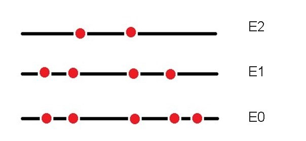

The total number of particles is:

N = n0 + n1 + n2 +… + n11

The total energy of the system remains constant since it is isolated and can be defined as:

U = n0E0 + n1E1 + n2E2 +…

Thanks to the collisions and interactions that exist between molecules, the particles are continually changing level. However, in each macroscopic state of the system there is a particle distribution that is more likely than some other distribution and once this distribution is reached, that is when the system is said to be in equilibrium.

The particles n0, n1, n2, ... can fluctuate around the equilibrium situation without producing macroscopic effects. We are now going to determine the way in which the particles are distributed in an isolated system between the energy levels.

Microstates and macrostate

The particles in the classical statistics of a system are equal but indistinguishable, this implies that we cannot distinguish one particle from any other on a macroscopic scale, but we can come to imagine individual particles on a microscopic scale.

It is important to be able to differentiate between microstate and macrostate. In the macroscopic state, macroscopic properties such as temperature and pressure interfere, while experimentally in microstates that correspond to the same macrostate, they are indistinguishable from each other at the experimental level.

For the same macrostate there may be different conformations of microstates and we can know the possible amounts of microstates that can be formed, through the following formula:

Where N is the total amount of particles in the isolated system and n0, n1, n2, etc. the particles that intervene in the system.
Suppose we have three particles at the zero (0) energy level and a single particle at level 6. The number of possible microstates for these four particles is:

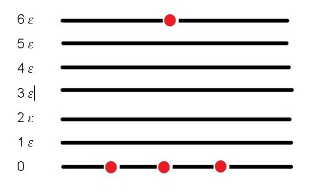

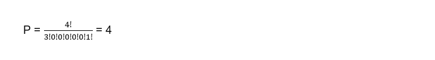

This means that at level zero there are three particles, no particles at levels 1, 2, 3, 4, 5, and one particle at level 6, for a total of four possible microstates. Since each of the particles that is in the zero state can be exchanged with the particle that is in level 6 and give way to a different microstate, in addition to the one initially proposed.

Suppose we have two particles in the zero state, one particle in state 1 and a last particle in level 5

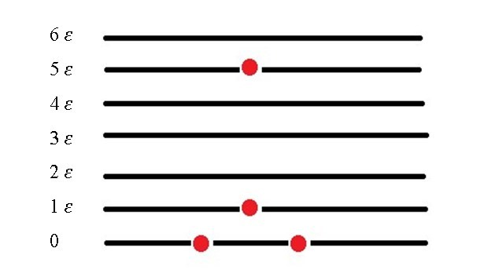

In statistical mechanics the fundamental postulate tells us that for a system in equilibrium, there is the same probability that it can be in any of its allowed microstates and the distribution of particles for which P yields the highest value, will be the distribution more likely to have the particles within the system.

We are going to consider a distribution of particles where in the fundamental level (0) there are 2002 particles, while in the first level there are 1002, 102 in the second level and 52 in the third level, if we calculate the amount of microstates for this macrostate in particular we have to:

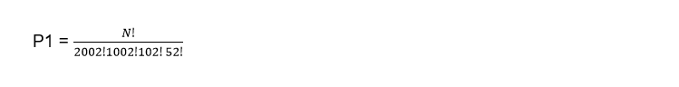

But suppose that at the first level there are two interacting particles, where one of them gains one unit of energy and rises to the second level, while the other loses one unit of energy and goes to the fundamental level (0). 

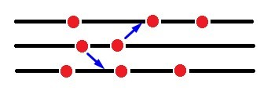

As we can see, the total energy of the system does not change, since the energy of the particles both before and after the interaction is exactly the same. What will change is the number of microstates that will correspond to the new macrostate and will be given by:

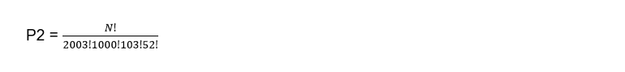

If we calculate the quotient between the two we will have:

As we can see, some small changes in the initial macrostate generate large variations in P and this implies that the system is far from being in equilibrium. A system is near equilibrium when small changes in the initial macrostate distribution do not substantially change the value of P.

Now suppose that two particles of the first level interact in such a way that one of them gains a unit of energy, while the other loses, but the amount of particles that exist in each level are:

n0 = 4016

n1 = 1354

n2 = 458

n3 = 155

The quotient of the variation of P would be:

In this case, the number of microstates hardly changes and we can realize that in a system that is in thermal equilibrium, the collisions between the particles change towards a macrostate that has almost the same amount of microstates as the initial one.

If we want to find the most probable distribution that the isolated system can have, then we must calculate the maximum of P whose number of particles and energy in the isolated system remain constant, then it is enough to condition the variables for this to happen.
