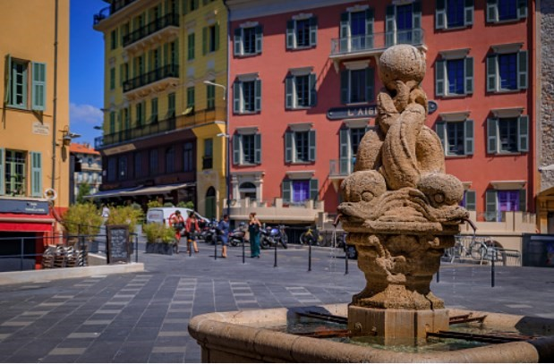
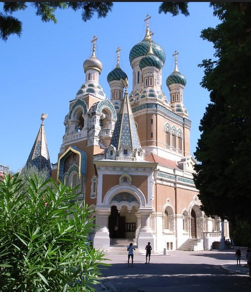

# 🌆 Nice

Nice belongs to the Provence region, specifically to the Alpes-Maritimes department of the Côte d'Azur in France. It is located next to the Mediterranean Sea a few kilometers from Monaco and Italy, being one of the most frequented tourist destinations both by the French and by travelers from all over the world. Nice seduces for its privileged location, beaches with crystal clear turquoise waters, for its climate, its art galleries, museums and its beautiful historic center.

Through this article we will guide you through the most important tourist sites in Nice.

## Vielle Ville

One of the best activities to do in this city is to lose yourself in the streets of the Old City, surrounded by historic buildings with their wooden shutters in yellow and ocher colors, its curved and narrow streets, terraces full of people, shops from all over the life, old churches and markets that will enchant you at first sight. In addition to finding a large number of charming corners, the recommendation is to go to Maison Auer, opened in 1820, to try its delicious chocolate, the ice creams from Fenocchio or Azzurro and the socca from Chez Pipo. In this area there are also two of the best restaurants in the city: Les Amoureux and Le Millésime.

## Promenade des Anglais

The Promenade des Anglais is an avenue adjacent to the beach of Bahía de los Ángeles with about 7 kilometers, the name comes from the first tourists (mostly British) who took long walks along this avenue. It is worth walking this long street to see the beautiful facades of the buildings in the Belle Epoque style, take a photo in the popular blue chairs, which are a symbol of the city and see the exclusive Negresco hotel. It is also a place for lovers of sports that are practiced outdoors and especially for roller skaters. You can even access any of its public beaches to take a swim in the beautiful turquoise blue waters that characterize the Costa Azul.

## Saint Nicholas Cathedral

The Cathedral of Saint Nicholas is similar to the Saint Basil's Cathedral that remains in Moscow, it was built in 1912 to honor Tsar Nicholas II of Russia by the immense community of Russians who stayed to live and fell in love with this city, It is also the largest Russian Orthodox cathedral outside of Russia and is really worth visiting.

Photo taken by Steve Cadman

## Castle Hill

Castle Hill is the best vantage point in Nice and you can walk or take a lift up from the end of the Promenade des Anglais (promenade of the English). At the top you can see some remains of a medieval fortress, a large artificial waterfall and a botanical garden, but without a doubt the best thing is the wonderful views of the orange roofs of the Old Town, the Walk of the English and Lympia Harbour.

## Lascaris Palace and Matisse Museum

The Baroque-style Lascaris Palace is located in the Old City and was built in the 12th century. The palace stands out for an exterior façade similar to that of Italian palaces and a rather ornate interior, where collections on the history of the city are permanently exhibited.

Another of the emblematic sites of Nice is the Matisse Museum dedicated to the famous French painter Henri Matisse, since he lived in Nice for more than 30 years. The museum is located in the Villa des Arenes built in the 17th century, where you can enjoy an extensive tour of many of the paintings by this renowned artist, in which the use of intense colors predominates.

## Flower Market

The Flower Market or Marché aux Fleurs de Cours Saleya is located in the heart of the old town, being the most beautiful and famous market to see in the city. In this market you can find all kinds of flowers, vegetables, food, spices and some souvenirs. It opens every day (except Monday) from six in the morning and closes at six in the afternoon, with the square full of parasols and several terraces that invite you to enjoy the atmosphere.

## Nice churches

Among the most important churches in the city are:

The Cathedral of Santa Reparata: this church was built between 1650 and 1699, being one of the best examples to see in the city of the Roman Baroque style.

Church of St-Jacques (Gesù): it has a Corinthian façade, as well as a bell tower that is 42 m high and is another example of Baroque architecture in Nice.

Basilica of Notre Dame: this church has a style similar to that of Notre Dame in Paris and inside you can see its eight side chapels.

## Lympia Harbor

This port is one of the oldest on the Côte d'Azur, it was built in the 18th century and is located at the foot of the ancient citadel of Lympia. This beautiful rock-cut port is surrounded by historic buildings with their facades painted in the typical colors of the city, and has numerous pleasure boats and yachts. From there you can book one of the excursions offered by boat and which are very popular among tourists who visit the city, such as the exclusion that runs along the coast of Nice and Monaco or the one that will take you to Cap Ferrat.

## Nice squares

The city has beautiful squares, among which is the Rossetti, the Palace of Justice and especially the Garibaldi and Massena squares.

The Plaza Massena is surrounded by old buildings, full of picturesque cafes, restaurant terraces and we consider it to be the most beautiful in the city. It also has one of the most important works of art in Nice, which is a sculpture with seven people kneeling on a pole representing the seven continents.

Images George Rex

Garibaldi Square is another of the most famous and around it are elegant buildings whose facades are ocher yellow and with green shutters.

## Excursions from Nice

You will be able to get to know the Côte d'Azur by taking day trips to the most beautiful towns and cities that are within walking distance. Among the excursions most valued by travelers are:

- The Excursion to Monaco and Eze
- The Excursion along the Côte d'Azur
- The Excursion to San Remo and Menton
- The tour of Antibes, Annes and Saint Paul de Vence
- The Excursion through the towns of Provence

Nice is one of the most spectacular cities in France and if you have the opportunity to visit it, you will take back beautiful memories.

## About the Author

Idais, Graduated in Mechanical Engineering, and a master’s degree in teaching component, she gave classes in several institutes of mathematics and physics, but she also dedicated several years of my life as a television producer, she did the scripts for mikes, the camera direction, editing of video and even the location. Later she was dedicated to SEO writing for a couple of years. she like poetry, chess and dominoes.
