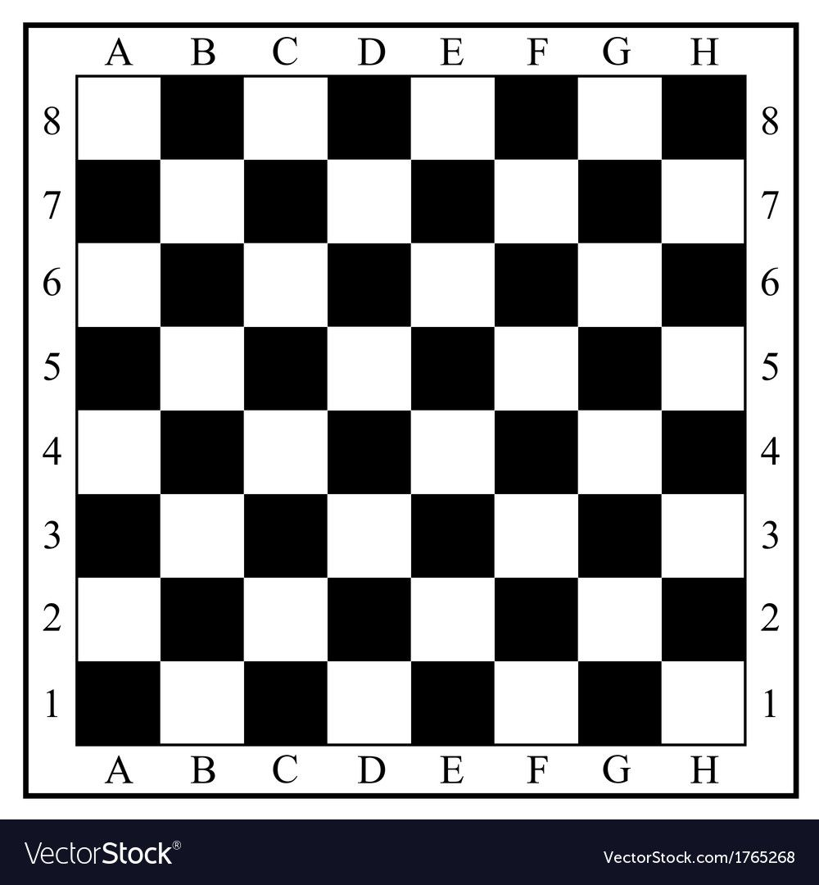
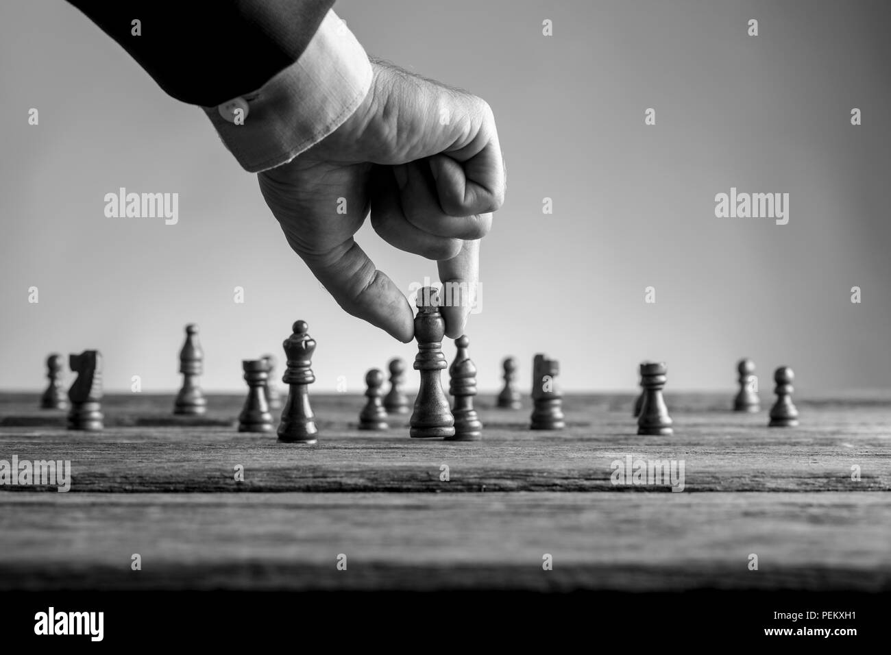
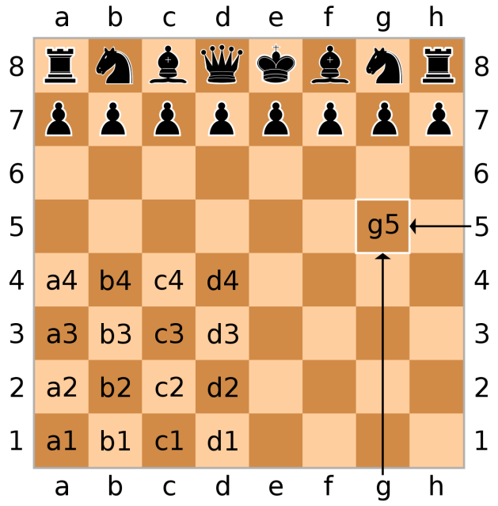

# ♟️ No Two Situations or Events are Exactly the Same in Life and in Business so is Your 64 Black and White Squares on Your Chess Board

Nothing stays the same; everyone and everything changes with time, no
wonder "what goes around comes around", as the book of Proverbs advices.
Circumstances, events, and happenings seem to repeat themselves, leaving
us with a sense of \"de javu\" and, in most situations, \"a
probability.\"

 
Picture1.0: The Chess Board

 Probability theory is a branch of mathematics concerned with the study
of random events that cannot be anticipated in advance but can have a
variety of possible outcomes and are said to be determined by chance.

 When a situation repeats itself, we react in the same way we did before,
recycling behaviors and patterns. Our default subconscious mind is where
this happens.

 When confronted with a circumstance, your default mind either recalls
similar occurrences from the past or creates new ones by making
connections between present and past occurrences. In certain situations,
this is a good way to think, but not in all cases. We usually go back
into a pattern of conduct and habit most of the time, forgetting that
not all conditions, occurrences, phenomena, or events are **exactly**
the same.

 Many conditions and occurrences may appear to be the same on the
surface, but digging deeper reveals a few unexpected twists, turns, and
bends that are unfamiliar. How many times have you noticed that
something that looked to be the same wasn't exactly what it was?
According to Einstein, "the only thing I know is that I know nothing".
\"Subtle Act of Not Giving a F\*ck\" author Mark Manson says that you
are not fully wrong, but rather more or less wrong, and that the more
you know, the less you are wrong.

 We eventually come to realize that our ideas and customs are not what we
thought they were as time passes by. My elder brother and I graduated
from the same high school, which is a boarding school, and most of the
male students in his graduation set believed at that time, that the more
unkempt a male is, the more macho and attractive he is to the opposite
sex. Fast forward today, after 17 years, he (my older brother)
recognizes that unkemptness has nothing to do with manhood, respect, or
machismo. As time passes, he will understand that masculinity is far
more than well-kept hair, nails, and polished shoes; now, he is an
entrepreneur and a business magnate who has learned to unlearn certain
beliefs and perceptions about life, people and business.

Picture 1.1: Strategic Business Planning

 Every economy's lifeblood is business right?
When two or more individuals zinteract formally or informally, business occurs consciously or subconsciously, which is why business
(money) makes the world go round.

 Every successful business requires the grouping of  two or more people with the goal of achieving a desired result between or among the parties involved. However, no two of these meetings are alike; they may appear similar, they may appear familiar, but they are not
100% identical; why shouldn't you look out for the puzzle?

 

Picture 1.2: Showing the Fusion of a Rank and a File (g5)

 The chess pieces are placed on a 64-square chess board with eight rows and eight columns.

 It has a square shape and uses bright and dark square colors in checkered patterns.

 Each player\'s right-hand corner square is brightly lit on the board.

 A chessboard\'s columns are known as file while the rows as rank.

 In either algebraic or numeric chess notation, each square on the board is assigned a name.

 From left to right, files are marked letter
A-H, and ranks are numbered 1 through 8 in from top to bottom.

 Despite similarities in appearances, size, color and looks, yet
different in computation, structure and formation.
Each square is a fusion of a rank and a file, that is, a number and a letter, which differentiates
each square from the other.

 Like the chessboard with the same size, same color, same appearance yet
totally different structure, form and composition, so is your similar
phenomenon, events and occurrences yet different underlying capability
and capacity , wisdom, and ability in your life and business.

 Even if you look, talk, and appear the same as everyone, you will never
think, respond, or process life and business in the same manner. At the
end of the day, we are not identical. This becomes possible because you
now have the capacity to be open minded to unlearn and relearn ideas,
beliefs, and perspectives. Realizing that you and the person next to you
are not exactly the same helps you to be more tolerant, patient, and
loving. This permits you to embrace change, broaden your thought
process, and increase your uniqueness. This is what distinguishes you.

 Continually use your past experiences only as a guide to treat and react
to events, phenomena, and situations as they unfold across time because
no two life is Ever exactly the same.

## References

Mark Manson The Subtle Art of Not Giving a F\*ck (A Counterintuitive
Approach to Living a Good Life), ISBN 978-0-06-245771-4, 2016

 Weisstien, Eric W. Chess Board (2022, April 7). In Wikipedia

 Worldometer

## About the Author

Samuel Obande is a Linguistics graduate of the University of Jos,
Nigeria. During his compulsory one year national service while
volunteering as a teacher in his neighborhood where only a few children
could read and write English in the city of Gombe 2019, he started a
food processing company Kingz Fudz from the leftover space in his one
bedroom apartment and sold its first batch of product (White beans) on
the streets.

Today, Kingz Fuds (Beans) can be found in over eleven supermarkets and
stores within and outside the state, as well as in two varieties: White
and Brown Beans (1kg)

Samuel adores children and hopes to have two (2) in the future. He likes
to write, cook, and play chess.
