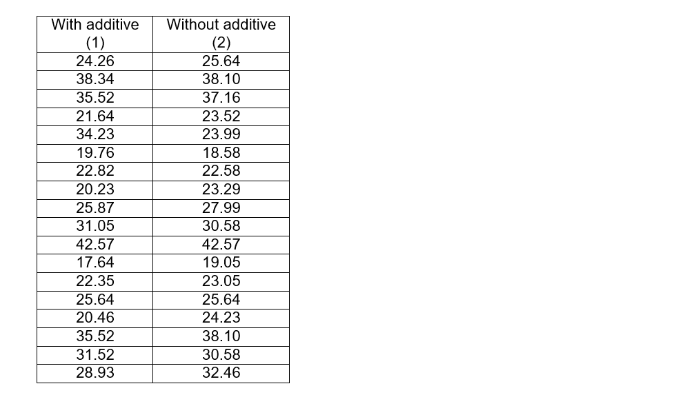
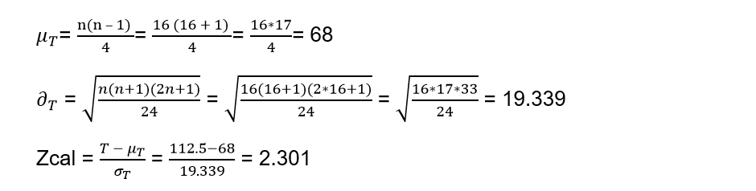
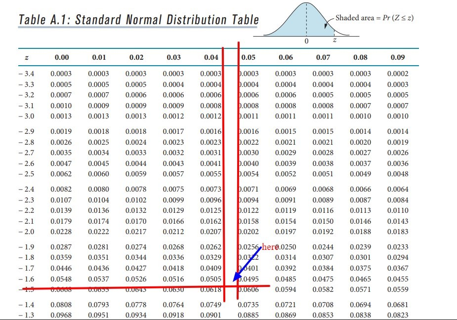
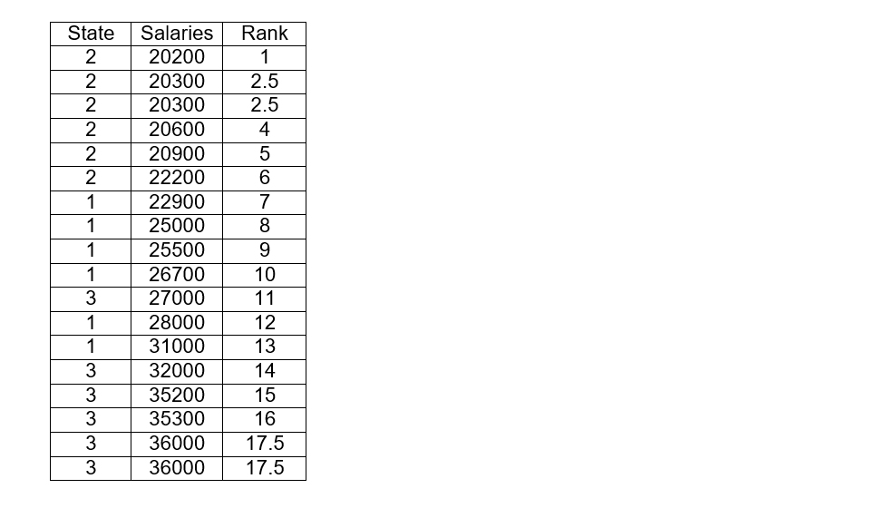
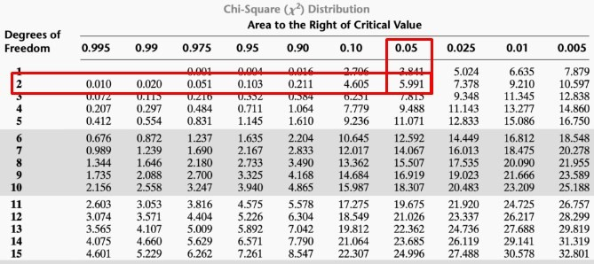
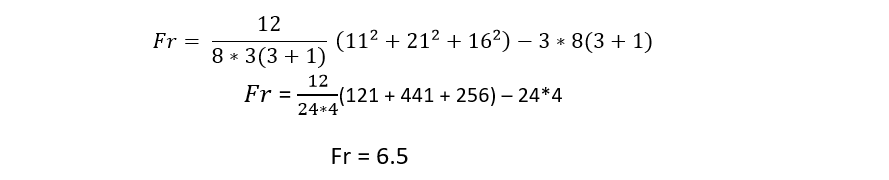
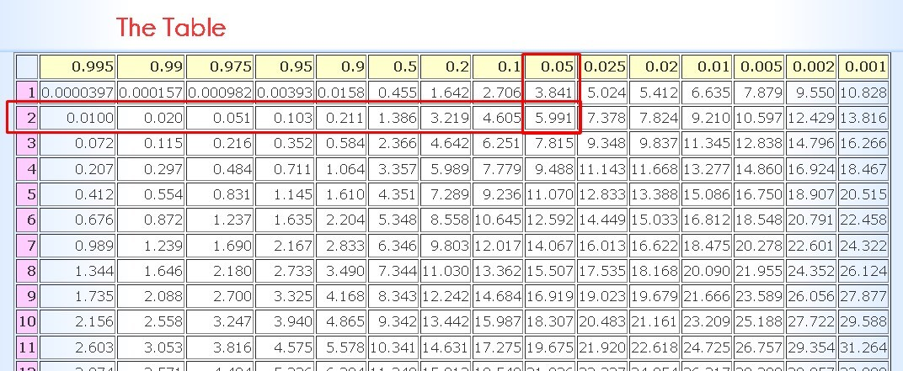

# ✏️ Nonparametric tests (part two)

When we need to analyze the data for an investigation, we must choose the appropriate analysis method, to avoid at all costs reaching erroneous conclusions. To select the most appropriate analysis technique, different aspects must be taken with respect to the nature of the data to be quantified and the study design. It is also necessary to take into account the number of groups and observations to be compared, if the samples are independent or not, if there are repeated observations with respect to the same individuals, if the variables are qualitative or continuous, and their probability distribution. All these elements are decisive before deciding which statistical technique to use.

When the normal distribution is not obvious or simply cannot be assumed since the sample size is small, the variable of interest is usually transformed to achieve symmetry in its distribution, or robust techniques that are not very sensitive to the absence of normality.

But nonparametric methods are easier to implement and do not require a normal distribution of data, and can also be used with small sample sizes.

For two samples that are independent, the Wilcoxon rank sum or Mann Whitney test can be used (It is the same test).

There are circumstances where it is necessary to test if the distribution of a certain variable "x" is the same for two different populations or if this variable tends to be lower or higher in one of the two populations. For example, you can try to compare the weight loss in people subjected to two different types of diets or the level of pain in patients with osteoarthritis, where one group receives a treatment, while the other group receives a placebo.

To perform this type of comparison in traditional statistics, the t-student could be used, but tests not for metrics such as the sum of the Wilcoxon or Mann Whitney ranks can also be used.
In short, given the case that there are observations in two different populations of the same variable "x" with samples of sizes n1 for the first population and n2 for the second.

One way to proceed is by ordering the observations from lowest to highest regardless of the source population, and then assigning ranges to each of the data after they have been ordered. The observation that has the smallest value will be assigned rank 1, the immediately subsequent observation as regards value, will be assigned rank 2 and so on. In the case that there is a repetition of values, that is, when two observations have the same value, each of them will be assigned the average of the ranges according to the position they occupy.

In the case that there are no differences between the two populations, the ranges will simply be mixed randomly between the two samples. But if the sum of the ranges that are assigned to the specific observations of a population are ultimately much greater than the sum of the ranges of another population, this then indicates a difference in terms of the distribution of the variable "x” between both populations.

When the variable is measurable and on an ordinal scale, the ideal non-parametric test is the Wilcoxon test, in addition to being the most powerful. The null hypothesis is established as that the samples of the two populations have the same probability distribution, while the alternative hypothesis indicates that there are differences in the central tendency of both populations, either directionally or bilaterally (two tails).

The contrast can be observed with the differences in the scores between the elements of each associated pair and it is necessary to take into account not only the magnitude of the difference, but also the sign. Given the case that the difference between the scores of any of the associated pairs is null because both values are equal, this pair is eliminated from the analysis and also from the sample size, that is, the number of pairs whose difference is null are subtracted. of the number of observations "n" for the effects of the formulas to be used. On the other hand, when assigning ranges, only the absolute value of each element is taken into account, regardless of its sign. However, the signs of each observation will be taken into account when adding the corresponding ranges, in order to obtain the sum of positive differences on the one hand and negative differences on the other.

If it is the case that the null hypothesis is true, both populations will have the same central value and therefore the ranges are expected to be randomly distributed between their positive and negative differences. This directly implies that the sums of their ranges are approximately equal. On the other hand, the test statistic that we will call "T" will be taken as the smallest value that exists between the two sums of the ranges, both positive T (+) and negative T (-).

When we have a number of observations greater than 15, that is, n > 15, it can be assumed that the null hypothesis that is established for the value of the sampling distribution of T, approaches a normal distribution. So we can assume that the test statistic for this type of case is Z. With the required level of significance, the null hypothesis will be rejected, when Z is found in any of the critical sections located in the two tails (if it is the case) or in the region established for a single tail, always depending on the alternative hypothesis.

Therefore, the formulas used in these cases are:

Now let's go with an illustrative example:

A certain inventor claims to have devised a gasoline additive that increases fuel efficiency. A potential product funder runs two tests on 18 different cars that are driven under the same conditions, one test with the additive and one without the additive, and the results are shown below:

The alternative hypothesis is the one that proves what is to be demonstrated, that is, that with the additive the performance is increased and therefore, the median of the tests with the additive must be greater than the median of the tests without the additive.

Ha: Me1 > Me2

In contrast to the alternative hypothesis we can establish the null hypothesis

Ho: Me1 ≤ Me2

As we can see, the number of observations is greater than 15 and therefore, we can assume that it behaves as if it had a normal distribution and for this we will use the formulas described previously. But first, we must subtract both paired samples and place the value of the subtraction in the next column, and then establish the ranges according to the absolute values obtained from that difference. The smallest value regardless of whether it has a positive or negative sign, will be assigned rank 1, the next smallest value will be assigned rank 2, and so on.

As we can see, the smallest absolute value of differences is 0.24, but it is repeated three times occupying positions 1, 2 and 3 in the range, so we take the average = 1 + 2 + 3/3 = 2 and that will be the range for those three values. The next value (0.47) will directly occupy the place of rank 4. Then the absolute value (0.18) is repeated again so we repeat the operation, as both occupy ranks 7 and 8, the average between these places will be 7.5 , and then place the absolute value that will occupy the range 9. Later we add the last column with the signs corresponding to each difference, and then add the positive values to obtain the value of T (+) and the negative values to obtain T (-)

T (+) = 2 + 2 + 7.5 + 2 + 4 + 6 = 23.5

T (-) = 7.5 + 10 + 11 + 14 + 12 + 9 + 5 + 16 + 13 + 15 = 112.5

Remember that the values that are not positive and negative, that is to say zero (0), are subtracted from the number of observations, if before we had 18 observations, now they will be n = 16.

As the alternative hypothesis states “Greater than”, the first thing that comes to mind is that it is a single-tailed test and that in addition, we must take the largest of the values between 23.5 and 112.5, therefore:
T = 112.5

Applying the normal distribution formulas since the number of observations is greater than 15 we have:

If we look within the table for the value of α = 0.05 and we look at the values found both in the row and in the column, we can establish the value of Z for this level of significance.

As we can see, from the left side we obtain the value -1.6 and the value found in the upper columns are 0.04 and 0.05 that represent the columns of the values that are between 0.0505 and 0.0495 (interpolating these values we will obtain the α = 0.05) thus than average both values we will have = (0.04 + 0.05) / 2 = 0.045. If we add those hundredths to the value obtained in the row, we will have the critical value of Z = -1.645 for this level of significance. Now we must compare it with the value of Zcal. Given the case that the critical Zcal> Z obtained in the table, the null hypothesis will be rejected and this is ultimately what happens, since:

2,301> -1,645

By rejecting the null hypothesis we can reach the conclusion that we will accept the alternative hypothesis and that therefore, gasoline will have a higher performance with the additive and that the researcher achieved his mission.

## The Kruskal-Wallis test

This test is also known as the H test and is the non-parametric alternative for unpaired data of the one-way ANOVA test. Many think that it is the extension of the Wilcoxon rank sum when it involves more than two groups and, therefore, it is a test that uses the ranks to contrast a hypothesis with k number of samples that have been subtracted from the same population. .

Although it is true that in the ANOVA test the means are compared, in this Kruskal Wallis test what is contrasted is if the different samples are equally distributed and that therefore, these samples belong to the same population. Under certain simplifications it can be said that this test compares the medians.

Ho: All samples come from the same population

Ha: At least one sample comes from a population, whose distribution is different from the others.

The Kruskal-Wallis test is appropriate when the data have a natural order and must be ordered to make sense of it. It can also be used when the conditions do not exist to apply the ANOVA test. For example, when a study is required on the difference between men and women in a certain university degree, two types of data are available: when we refer to the time of each participant, the ANOVA test should be used. But if what is required is to know the positions in which each participant in the race has arrived, it is advisable to use the analysis of Kruskal Wallis.

Requirements and conditions to be able to apply this test:

- The samples that are contrasted need not come from a normal distribution.

- Homoscedasticity: Given that the null hypothesis proposes that all groups belong to the same population and that therefore they will have the same medians, it will be an essential requirement that all groups have the same variance. This can be verified through graphical representations or using the Levenne or Barttlet tests.

- They must all have the same distribution: Although it is true that the distribution of the groups does not necessarily have to be normal, it is necessary that it be the same in all the groups. For example, all groups show an asymmetry to the right.

If these conditions are met, the requirements to apply the Kruskal Wallis test or the H statistic will be:

When k is the size of the groups is equal to 3 and the number of observations for each group is not greater than 5, one must resort to tabulated tables with the theoretical values of H.

For the rest of the cases not specified in the previous point, the H statistic is assumed to follow an X2 distribution (Chi square) and that it also has k - 1 degrees of freedom.

In almost all the bibliography consulted, the ANOVA test is considered quite robust for medium or large samples, whose distribution is not normal. In general, they recommend the use of the Kruskal Wallis test when the populations to be compared are clearly asymmetric and also fulfill the condition that they all have a homogeneous variance and are in the same direction.

Given the case that the variance between populations is not homogeneous, the most appropriate test may be an ANOVA with Welch correction and it is important to note that when dealing with only ordinal data, the ANOVA test is not an option.

Nomenclature used in formulas:

N = number of total observations, including the combination of all samples

k = number of samples

R1 = The sum of the ranges, but only from sample 1

n1 = The number of observations from group or sample 1

The nomenclature is repeated for the rest of the samples or groups, that is, R2 will be the sum of the ranges but of group 2 and its number of observations will be n2 and so on with the rest of the groups or samples.

The test statistic H for non-repeating data is defined by:

Once the test statistic is obtained, it is compared with the chi-square test (X2).
But what is the chi-square test?

This test is within those belonging to descriptive statistics and in this case, it focuses on extracting information from the sample as opposed to referential statistics whose information is extracted from the population. This test is used to determine the dependency or independence between variables. It is important to take into account that the independence between variables implies that they are not related and that therefore, one variable does not depend on the other and vice versa.

To determine if there is any type of correlation between variables, there is a table to consult. The chi-square test does not allow us to know the intensity of the correlation, since it takes values between zero and infinity and although it is true that as the sample increases, the value of chi-square also increases, that does not mean that there is a higher correlation.

This type of test belongs to the so-called contrast or goodness-of-fit tests, since their objective is to decide whether the hypothesis that a given sample comes from a population can be accepted, but also with a probability distribution that is specified in the null hypothesis. A null hypothesis is established that indicates a specified probability distribution, such as, for example, the sample can be the mathematical model of a population that has generated the same sample.

Once we have the hypothesis, then we will carry out the contrast and it is necessary to have the data found in a frequency table. To do this, the empirical or observed frequency is indicated for each value or interval. Starting from the assumption that the null hypothesis is true for a certain value or interval of values, then the expected frequency is calculated.

When the chi-square statistic takes a value equal to zero, it can then be said that there is a perfect agreement between the expected and observed frequencies. On the contrary, if the statistic takes a large value, there will be a large discrepancy between both frequencies and therefore the null hypothesis must be rejected.

The chi-square tables to find the critical value must be entered with the significance level α and the degrees of freedom, the latter represented by the value (k-1).

Let's do an example:

The annual salaries in dollars of some university professors from different states whose qualifications and experience are similar are compared, where the following results were obtained:

The null hypothesis establishes that there is no substantial difference between the salaries of university professors in the three states. A significance level α = 0.05 should be used.

In this case, I have to check if the three means are equal, so the null hypothesis is:

Ho: μ1 = μ2 = μ3

Ha: At least one of the means is different

To carry out the exercise, we must order the salaries from lowest to highest including the data of the three states and it will be necessary to place a column with the state to which they belong. To then assign rank 1 to the lowest of the salaries, the salary that follows will be assigned rank 2 and so on.

As in previous exercises, if certain values are repeated we will have to average the range with the positions they occupy. For example, in cells 2 and 3 the salary 20300 is repeated, so we must average: (2 + 3) / 2 = 2.5 and both cells will have that range. The next box will start from rank 4. The same happens in the boxes that occupy places 17 and 18 where the salary is also repeated, when averaging we have that each of these boxes will be with rank 17.5.

Now we must calculate the sum of the ranks of the states or groups 1, 2 and 3

R1 = 7 + 8 + 9 + 10 + 12 + 13 = 59

R2 = 1 + 2.5 + 2.5 + 4 + 5 + 6 = 21

R3 = 11 + 14 + 15 + 16 + 17.5 + 17.5 = 91

We are now going to calculate the statistic that we will call Hcal:

Where:

N = 18

n1 = n2 = n3 = 6

k = 3

Substituting the values in the formula we have:

Hcal = 14.3625

The null hypothesis is rejected if the Hcal is greater than the chi-square value located in the tables with α = 0.05 and the specified degree of freedom, that is, k-1 = 3 - 1 = 2

With these values we go to the chi-square table and intersecting both values we obtain that X2= 5.99

As we can effectively observe the Hcal is greater than X2 since:

14.3625 > 5.99 and therefore, the null hypothesis is rejected. In this way we can conclude that not all the means of the wages of the three states are equal and that there is at least one of the means of the wages of some state, which is different from that of the others.

## Friedman rank analysis of variance

It is also called the Friedman Xr test and like the previous ones shown in this article, it is a non-parametric or free distribution test. This test is in charge of comparing the differences in related groups that have more than two observations. In other words, the same group is evaluated on more than two occasions, which may be before, during and after a certain intervention. In this way, the change that occurred in the group will be evaluated after being intervened.

It is important that the data we are evaluating are at an ordinal level of measurement and that the sampling does not necessarily need to be random.

Steps required to perform the Friedman Xr Test

1- As we explained previously, this test is performed on related samples, that is, we are going to evaluate a single group in more than two moments. Therefore, each participant in our research will have two or more measurements and it will be necessary to place these measurements in a table.

2- Subsequently, ranges from lowest to highest are assigned to each of the measurements of each individual or participant. Given the case that the value is repeated in the same individual for two different moments, each of the moments will be assigned the average of the two positions they occupy, as we have done in previous exercises. This procedure will be carried out with each of the individuals, unlike the previous tests, where the ranges were established including all the observations.

3- The third step will be to add the ranges of each column and therefore we will have the sum of the ranges for each of the moments or conditions.

4- The fourth step is to apply the Friedman equation that we will specify below:

Where:

n = number of individuals or subjects

k = number of moments or conditions

Rk2= Sum of ranges for each moment or condition, but squared.

5- Now we calculate the degrees of freedom and for this it will be necessary to subtract k - 1

6- The next step is to find the critical value of Xr in the table, where it will be necessary to enter the level of significance (α) and the degrees of freedom.

7- The last step is the statistical decision making, for this it will be necessary to compare Fr with the critical Xr obtained in the table. If Fr > Xr, the null hypothesis will be rejected, accepting the alternative hypothesis.

Now let's go with an example:

A researcher wants to find out if there are differences in relaxation levels for a group of people between different conditions: with noise, in silence and with music. For this, the participants are given a certain scale from 1 to 5, where it is established that 1 means that the person is not relaxed at all, while the answer 5 is for the person who is very relaxed and the scales 2, 3 and 4 are the reflection of intermediate points between both conditions.

After applying each of the conditions to 8 people, the following results were obtained:

Ho: There are no differences between the 3 different conditions in the relaxation levels

Ha: There are differences in the 3 conditions as far as relaxation is concerned.

Now we are going to establish the ranges for each of the people and for this we will add a column for each condition. For example, for person 1 the lowest value among the 3 conditions is 2, to that value we will assign rank 1 that will be placed in the column to the right, the next value in ascending order is 4, then we will assign rank 2 and finally the highest of the 3 values is 5, to which we will assign the rank 3. We will have to carry out this same procedure, for each of the people and then we will have to add the ranges of each column for each of the conditions.

In person 3 the values are repeated in their conditions 2 and 3, which should also occupy ranges 2 and 3, so we will make an average: (2 + 3) / 2 = 2.5 and this number will be the range for both values. Exactly the same case occurs for person 6 and again the ranges of conditions 2 and 3 will be 2.5 for each one. We calculate Fr:

Being:

n = 8

k = 3

We substitute the values in the formula:

We enter the chi square table with the value of the degrees of freedom:
k - 1 = 3 - 1 = 2 and with a significance of α = 0.05, we obtain that the critical value is 5.991

If the calculated Friedman value is greater than the critical value obtained in tables, then the null hypothesis is rejected and we can realize that we are facing precisely this case since:

6.5 > 5.991

By rejecting the null hypothesis, the alternative hypothesis is then accepted in which it is established that there are indeed differences in the relaxation levels, depending on each of the sound conditions.

## About The Author

Idais, Graduated in Mechanical Engineering, and a master’s degree in teaching component, she gave classes in several institutes of mathematics and physics, but she also dedicated several years of my life as a television producer, she did the scripts for mikes, the camera direction, editing of video and even the location. Later she was dedicated to SEO writing for a couple of years. she like poetry, chess and dominoes
