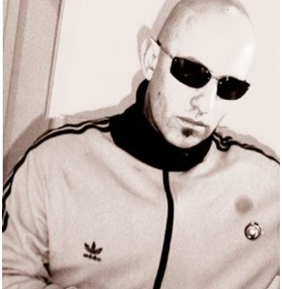

# 💔 Nu Skool Breaks

Nu skool breaks (or nu breaks as it is sometimes referred) is a subgenre of
breakbeat originating during the period between 1998 and 2002. The style is
usually characterized by more abstract, more technical sounds, sometimes
incorporated from other genres of electronic dance music, including UK garage,
electro, and drum and bass.

Typically, tracks ranged between 125 and 140 beats per minute (bpm), often
featuring a dominant bass line. In contrast with big beat, another subgenre of
breakbeat, the sound set consisted less of hip hop samples and acid-type sounds,
instead emphasizing dance-friendliness and "new" sounds produced by modern
production techniques using synthesizers, effect processors, and computers.

The term "nu skool breaks" is widely attributed to Rennie Pilgrem and Adam
Freeland, who used it to describe the sound at their night Friction, which was
launched at Bar Rumba in 1996, with promoter Ian Williams.

The tracks "Renegades" by Uptown Connection and "Double Impact" by Boundarie
Hunters are considered to be the earliest produced to formally adopt the genre.

In 1998, the term "Nu Skool Breaks" was used on two compilations, Nu Skool
Breakz, Volume 1 and 2, mixed by Rennie Pilgrem and released through UK-based
Kickin Records. The first volume of these was recorded live at the
aforementioned London club night Friction.

Labels that featured early Nu Skool Breaks releases included Botchit & Scarper,
Fuel Records (UK), Hard Hands, Marine Parade Records, TCR, and Ultimatum Breaks.

The original nu skool was basically more positive, cheerful music: the sounds of
the future and not the end of the world mood half pointed the direction.
Simultaneously dance-centric and twisting the brain, transmitting an amazing
amount of auditory information. Unfortunately, by 2001, this genre had also set
in, although this set-up still covered more exciting pieces (such as Meat
Katie’s compositions) than other styles.

If you think you’re discovering human speech or something like that, don’t be
trapped: it’s usually made using vocoders and various effects. Although the
authors also work from samples, they usually generate the sounds themselves. And
they are not averse to "strangeness" either: proving the fertilizing effect of
folk music in the general sense, sometimes an accordion or flute is also played

You can find more details about its formation and development on Ishkur's Guide
to Electronic Music, and you can listen to nu skool breaks music right away
<https://music.ishkur.com/?query=NuSkoolBreaks>

The Every Noise at Once platform provides an opportunity for people to get to
know better the names of the creators who have ever been in the genre and thus
the peculiarities of it.

Sources :

- MENNYEK KAPUI - Az elektroniks zene évtizede (The decade of electronic music)
- Wikipedia
- Ishkur's Guide to Electronic Music
- Every Noise at Once

## About the Author

"Guido F. Matis (a.k.a. widosub), a seasoned producer-composer authority with an
unquenchable compassion towards the musical expression, and many years of
experience in the fields of event organizing, movie post-production, and
recording with professional musicians. His devotion to movie sounds shows in his
art - widosub's music is filled with landscapes of emotions, dramatic twists and
melancholic moods. He's one of the hosts of Tilos Rádió's MustBeat show, in
which he's is focusing on drum'n'bass and chillout music. He's also one half of
the duo Empty Universe".
