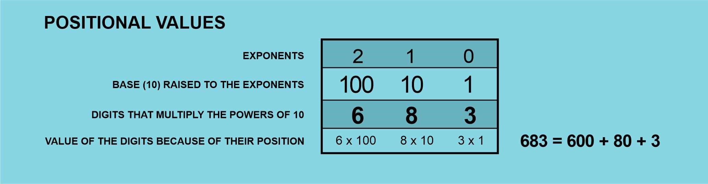
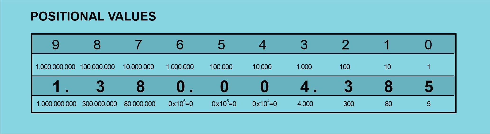

# 🪙 Numeral Systems

Before the invention of writing, humans spent a good deal of time developing the
first attempts of civilization by settling in convenient places, selected
because of water sources, good soils for agriculture, abundance of animals for
hunting or climate. These small human groups started growing and relationships
changed from tribal societies to small town complexities, making it necessary to
develop some ways to control quantities. They needed to count people, food,
animals, days, distances etc.

No doubt, the first ways used to count (after the obvious use of the fingers)
involved small pebbles. As a matter of fact, the word “calculus” originally
means “small rock”. The first approach to this way of representing quantities
was probably a “one-to-one” relationship between the rocks and the numbers, so
to register the number 50 you needed 50 small rocks. Not very practical but
thinking about this from our advantage position in the XXI century is not fair.
To develop a better numeral system requires a good deal of ingenuity, to a point
that some humans groups never did it.

Even in the present days, there are some isolated tribes which have not numeral
systems. The Piraha tribe from Brazil just don´t have any word for the numbers,
they just have concepts for small or large (one bird is a small bird, several
birds are a large bird), and they just reject the possibility to learn about
quantities, they say then don´t need such a thing. The Vedda tribe, at Sri
Lanka, and the Caquinte tribe at Peru, have only numbers for one and two. For
greater quantities the use something like “one more” or “many”. The Munduruku
people, an Amazonian tribe, has numbers only up to five, so let´s not assume
that it´s an easy task to develop a practical numeral system.

Humans started counting by using their fingers. The word “digit” has its origin
in the Latin for finger, “digitus”, and that´s the reason why so many cultures
developed numeral systems with a basis on the number ten. Nevertheless, 10 can
only be divided by 2 and by 5, so it´s not a good number when it comes to
divisions into smaller parts. Twelve is better in this department, so it´s
frequent to use dozens, and when more divisions are useful, 60 and 360 are
great; 60 can be divided by 2, 3, 4, 5, 6, 10, 12, 15 and 30, and when large
quantities are involved 360 has all the same divisors as 60 and many more, and
it has another advantage: 360 is very close to the number of days in a year, so
it can even be used as the basis for a primitive calendar. Primitive Persians
had a 360 days calendar, 12 months of 30 days, and every six years they would
add a ritual additional month to keep the years synchronized with the stars and
the change of seasons. The ancient Egyptians had a similar calendar. Obviously,
they liked the 360 number because how easy it was to get exact subdivisions.

## A hard decision

The first numeral system we find at the dawn of history is the Sumerian, just
like the first samples of writing were found on the same area. Sumerian
civilization was very advanced for it´s time, so it´s no surprise they had a
sophisticated development of mathematics and astronomy. What numeral system did
they embrace?

Well, apparently the decision was so hard they just didn´t decide. They used
both the 10 and the 60 in a very convenient fashion. They represented the
numbers in an additive way (much like the Roman numeral system, centuries
later). It means they added numbers to represent quantities, and these numbers
they used were only 1, 10, 60, 600, 3600, each represented by a different
“token”, like small pebbles made with clay. Number 1 was represented by a small
cone of clay, number 10 by a little ball, 60 by a large cone, 600 was
represented by a large cone with a hole on it, 3600 by a large ball and when the
large ball had a hole it represented 36.000.

We can see that this system can represent a number like 683 without the need of
683 tokens; they just needed 7 tokens. It was a great improvement over direct
relation, a magnificent idea, to assign different values to different tokens
and, to represent any number without an assigned token, you just add as many
tokens as needed. This system is known as an additive system and it was used by
most civilizations for the longest part of our history. Europe used the Roman
system until the XIV or XV centuries.

## The Roman numeral system

The Roman numeral system is derived from the Etruscan system. Etruscan people
inhabited the Italian peninsula before the VIII century B.C. and around 750 B.C.
Rome was founded. Romans developed the Latin alphabet and adapted the Etruscan
numerals using these characters. They assigned the “I” to number one, “V” to
number five, X to number ten, “L” to number 50, “C” to number 100, “D” to number
500 and “M” to number 1.000. These symbols worked in an additive way, and the
bigger number should always be written to the left; the smaller numbers should
go to the right, and when a smaller number was written to the left of a bigger
number, it was not to be added but subtracted. So “VI” means six, but “IV” means
four.

This Roman system was very useful, but it had the inconvenience that arithmetic
operations were too complex, and large numbers required too many symbols to be
written. This fact can be observed in the present because Roman numerals are
still in use for some specific applications, like in classic style clocks,
chapter numbers in some books or when they register the year when a movie was
made. Usually when we watch a movie, at the end of the credits list, the year
makes its appearance in Roman numerals, and we can see how hard it is to make
this large list of letters into a number. For instance, the 1988 classic, “Who
Framed Roger Rabbit” shows this at the end of the credits: MCMLXXXVIII. When you
have figured out the first 4 characters, the credits scrolling is over.

What kind of advance in the conception of the numeral systems was necessary to
represent large quantities with just a few characters, and on the other hand, to
make arithmetic operations easy and straightforward? Additive numbers were not
enough, more consistency was needed. If you were to add two numbers, you would
need to put one on top of the other and operate one character at a time, but
when using Roman numerals, this way of adding up produced confusing results, not
consistent with the inherent rules of Roman numerals. The same happened when
subtracting, and if we tried to multiply or complete a division, operations
became a nightmare.

The solution had been in use since around the V or VI century at India, possibly
inspired by an older Chinese system. Two important advances made the difference.

A) Positional numeral values: It means the value of a character is not always
the same, it depends on its position. The basis of the positional numeral system
is the number of different characters or digits the system uses (like 0, 1, 2,
3, 4, 5, 6, 7, 8, 9 in our decimal system which has its basis on ten and have
ten different digits), and the positions of the digits means they will be
multiplied by different powers of the base number.

B) The invention of zero: The positional system cannot work properly without
some way to fill positions which should not be added. The first character used
at India to fill positions which didn´t represent any quantity was just a dot.
It was the first character for zero.

What does it all means? Let´s see it in more detail.

## The power of Powers

Using increasing powers on the base number has the advantage that powers grow
very fast when you raise them.

- 100=1
- 101=10
- 102=100
- 103=1.000
- 104=10.000
- 105=100.000
- 106=1.000.000

Only by reaching the sixth power of ten, we are in the zone of millions, not
bad. Can we use these powers to represent any number? Yes, of course we can,
this is when the other digits enter the ballroom. Remember we used 7 clay
pebbles to write down the number 683? We can see that our decimal system only
needs 3 digits to write it down: 6-8-3. Let´s see how it works.

This is how we use powers of ten to represent any number in our positional
system; the exponents for each position grow from right to left (2, 1, 0), this
is why the digit 8, second position, multiplies 10. Ten is the second power of
10 (101) since the first one is 1 (100). It means the numeral 683 contains 8
tens. The complete meaning for 683 would be 6 hundreds + 8 tens + 3 units.

This way we can write down any number, no matter how big. If we need to
represent the population of India (1.380.004.385 people), we do it like this:

Where again, the numbers in the first row, going backwards from 9 to 0, are the
exponents, and in the second row we have the base number, ten, raised to the
exponents.

The third row shows the digits which represent the number, the population of
India, and the fourth row shows the results of multiplying these digits and the
powers of ten. By adding up all the numbers on the fourth row we get the total
number.

1.380.004.385 = 1.000.000.000 + 300.000.000 + 80.000.000 + 0 + 0 + 0 + 4.000 +
300 + 80 + 5

## The importance of Zero

In the previous example, we can notice the total number has three zeroes in the
positions for tens of thousands, hundreds of thousands and millions. It means
these powers of ten are not needed to represent our total number, the population
of India so these positions should be “empty” but, if we had no zero to be used
in these positions, the number would look like this:

1.384.385

Only 1.38 millions instead of 1.38 thousand of millions!!

So, the zeroes are important to keep track of the positional value of each
digit. This idea of a digit representing “nothing” is what the Romans didn´t
think, it would have helped them develop a better numeral system. Zero was in
the first place used at China by the 4th century B.C. and one century later at
India, but to develop a complete positional system including zero the Indians
took as far as the fifth century A.C., the beginning of western middle ages.

All through this time, western civilization had been using Roman numerals. By
813, a Persian astronomer published some astronomical tables using zero, and by
976, an Iranian author explained how to use zero when doing arithmetic
operations. This way, he said, the rows can be kept in order.

The decimal system reached Europe through Spain, which was occupied by Arab
people by 11th century. This is why we know the decimal digits as "Arabic
numerals". An Italian mathematician, Fibonacci, did his best to make the Arab
system known and by the 15th century it was commonly used by mathematicians, but
regular people didn´t embrace the system until one century later.

## Other numeral systems

We are so much used to live with the decimal system that it´s very easy to think
it´s the only numeral system, we count with our 10 fingers, and we operate with
the 10 Arabic digits. Nevertheless, when we study mathematics it´s common to
have some lessons on numeral systems and how any number can be used as a base,
not only ten; but even in this case, we hardly come back to this subject, a
simple curiosity.

We use other numeral systems as well, without giving it too much thinking, when
we count time (hours, minutes, seconds) with roughly a base 60, or when we
measure angles (360 degrees, base 360). But it was the invention of computers
which gave a huge importance to other numeral systems. Computers don´t use 10
digits, not at their very core. Computers use electronic components which only
can have 2 possible states: On-Off or 1-0. So the whole arithmetic system inside
computers needs to have only two digits, a base 2 system which we know as the
binary system. It works exactly in the same way as the decimal system, but the
base is 2, and we work with powers of 2, and only 2 digits: 0 and 1.

Let´s see how it would work when applied to the number we used before, 683.

We can see that the binary (base 2) digits for this number are 1010101011, and
this is how a computer ultimately stores numbers. Number 2 is the lowest one
which can be used for a numeral system, and a memory position inside a computer
which stores a 0, or a 1 is the smallest piece of information, and it has
received the name Bit.

Usually, computers use groups of 8 bits to define characters or instructions, so
these groups of 8 bits are known as Bytes.

## Octal and Hexadecimal

There are two more important numeral systems related with computers. Back in the
1960´s there were some primitive computers, like Univac or the IBM Mainframe
which used for some operations a base 8 numeral system (Octal system) because of
the way they packaged groups of bits. Since Octal system has base 8, it only
uses 8 numerical symbols: 0, 1, 2, 3, 4, 5, 6, 7

In the present days, computer programmers use another numeral system,
Hexadecimal (base 16). This system was selected because 16 is a power of 2 so in
a way, Hexadecimal keeps a relation with binary system. Groups of 4 bits
correspond to one Hexadecimal digit so, in certain cases, using Hexadecimals can
make it easier to read information than a long list of ones and zeroes.

Being the base 16, we need 16 different numerical symbols, and the convention
dictates we use numbers from 0 to 9 plus A, B, C, D, E, F.

Any number below 10 is represented the same in decimal or Hex, but if we want to
write down ten in Hexadecimal, we use A. B is for eleven, C is for twelve, D is
for thirteen, E for fourteen and F for fifteen.

Sixteen is represented as 10 in Hex system. Let´s see how the same number we
used before can be represented in Hexadecimal system.

Then, we can represent 683 with only 3 digits: 2AB

Hexadecimal system is one we will find frequently in programming literature
because it´s a very short way to write down long binary numbers or lists of
bits. Memory locations, media access control addresses, codes for error messages
are some examples of information expressed in hexadecimal; also colors on the
screen or all the different characters that can be displayed or printed.

As we have seen, there are countless ways to count but the more efficient,
coherent and useful for arithmetic operations are the positional systems which
include zero. This number we all take for granted, it looks so obvious today
that we forget it took about 20 centuries to evolve and travel from ancient
China and India to the Western civilization.

Next time you buy a wristwatch, don´t bee fooled by the idea that watch spheres
with Roman numerals are more elegant. There is nothing more elegant than the
clean efficiency of positional systems, and the use of zero.

## About The Author

Jorge Araica is a
[Graphic Designer](https://www.upwork.com/o/profiles/users/~01abf139414e3d1c0d/)
with technical background, an old school pro with some knowledge in the
engineering and programming fields and also a promotor of critical and rational
thinking as a way to spread a scientific attitude towards knowledge. Freedom is
his other passion, and he will stand for it at every opportunity he gets.
