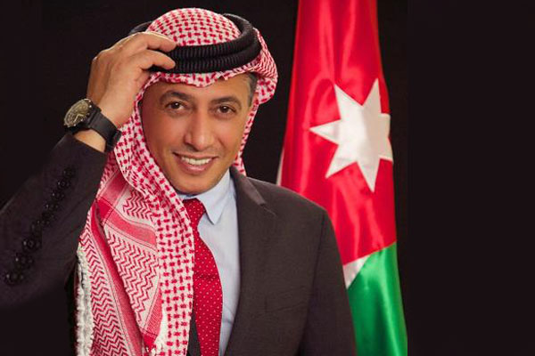

# 🎙️ Omar Al-Abdallat, The Sound of Jordan

Omar Hussein Al-Abdallat, a Jordanian singer from the city of Salt, was born in
the northern region of Marka and spent most of his life there. He started
singing since he was nine years old at parties and weddings and learned to play
the lute to sing Jordanian heritage songs and songs in the Gulf, and he stuck to
his artistic ambition to reach the level of Senior technician.

Omar Al-Abdullah released a song for the homeland, which is one of his first
songs, which was the reason for his fame, which is (Hashemi Hashemi), during the
reign of King Hussein bin Talal, and after that, he participated with the Ma'an
Folk Troupe, which is one of the most popular groups in the world. At the time,
he released a song in the early nineties called "Ya Saad".

He released more than one patriotic and emotional album, as he sang Jordanian
songs such as: "Our Army, the Homeland Army", the song "Ghaz Al-Bayariq", the
song "Army of Heroes", and "Kif Al-Himma", and sang for the struggling people in
Palestine during the conditions of Gaza the song "Coming Coming" He also sang
the "Quds of the Homeland" song "We are Palestinian".

Al-Abdallat participated in more than one operetta, most notably: "The Arab
Dream", "Baghdad Don't be in Pain", "The Arab Conscience", "Voice of Peace", and
participated in many festivals at the local and Arab levels.

Omar Al-Abdallat married the Jordanian media, Nariman Hamid, and after a 10-year
marriage they had two sons Hussein and Diala, and then they separated for a
short period during which he married an Egyptian girl from outside the artistic
community, an Egyptian and her name was Suzy, while he was holding a party in
Jerash at the Jerash Roman Theater Then the couple could not bear the separation
in 2011, so they returned to resume their married life one week after his second
marriage.

Nariman Hamid started her media career more than fifteen years ago, during which
she presented many public programs. In 2019, their daughter Diala graduated, and
Omar congratulated her with moving words: "When you were born, I was very happy
with you, I planted you love in my heart and I saw you as a feeling from my soul
until you grew up and became a flower that smells of perfume, magic and beauty,
and God willing, literature, balance, and commitment."

He added: "My affectionate daughter, Diala, today is the day you graduate from
your school life to start a new stage of your life in seeking knowledge. You
don't know my joy when I see you excel, successful, and determined to achieve
your dreams. I love you so much and I always pray for you, the sweetest girls."

In 2019, Omar Al-Abdullah was a guest on one of the programs, and the presenter
of the program tried to make him fall into the trap of questions to find out if
he considered that the State of Qatar supported “terrorism.” He asked him if he
would be allowed to sing in it if he agreed to the 13 conditions of the
blockading countries, to which Al-Abdullah replied by saying: Qatar is an Arab
country, and I do not know these conditions."

The announcer returned and asked him if he sang in Qatar after the crisis,
"because it supports terrorism," he replied, " I did not sing after what
happened, but not for this reason." Omar's answers were highly praised by the
Jordanians, who considered that Saudi Arabia was trying to exploit them in their
crisis with Qatar, through its media.

## About the Author

Mujahid Al-Majali, a 29-year-old former air force soldier and an economic
development and business specialist, also does translation and copywriting.
Loves long drives, chill music and old school movies. A nicotine addict and a
huge fan of Jack Daniel’s whiskey. Owned multiple businesses in Amman and
southern of Jordan PRE-COVID and now focusing on translation and copywriting
part of my experience through Upwork.
