# 📈 Parametric Methods To Compare Two Means

In many clinical trials, including most studies, it is necessary to compare characteristics of two or more groups of individuals. Such would be the case when we think that a certain treatment can achieve greater improvement than another treatment that is on the market or simply when it comes to considering whether or not children from different autonomous communities could have the same height or not. In this text we will analyze the comparison of two groups when we have a continuous variable, in addition to choosing an appropriate analysis method for each case, which will depend on the way in which they have been obtained and on the very nature of these data.

Generally, when 2 or more groups are compared there are two types of design. The first refers to two groups of individuals that are independent and in the second case, it is the one where data are collected for the same individuals but under different conditions. Depending on the case in which we find ourselves, the type of methodology will be different and another aspect to consider will be the probabilistic distribution and the type of data.

Parametric methods for independent groups require that the distribution of each group be approximately normal or of a similar variability, if the available data do not have such conditions, they can be transformed by applying logarithms, square root, etc. or resort to non-parametric methods.

Starting from a starting hypothesis that we call the null hypothesis, which generally, as its name indicates, assumes the null effect of interest. For example, it can be assumed that the blood pressure in men and women is the same or that two treatments used for hypercholesterolemia are equally effective. Subsequently and according to the analysis of the observed data, the probability of whether this hypothesis is correct or not can be evaluated. Each statistical test provides us with the possibility of knowing if the value of this probability agrees with the p-value, so that the lower this value, the more unlikely it is to verify the initial hypothesis.

We are going to present the Student's t test used for two independent samples, but if the variability of the two groups is different, the necessary modifications will have to be made.

Student's t distribution

At the beginning of the 20th century, William Sealy Gosset applied his knowledge of statistics to improve and control the quality of both Guinness beer and farm-grown malt. However, Gosset was subject to errors with respect to his estimates, since he worked with small samples and sometimes ran into extreme values in his samples.

Gosset was a friend of Pearson, who decided to help him with the construction of a new probability distribution, which is known today as the Student's t-distribution.

At present, this distribution is one of the best known in statistical inference for small samples and is generally used to contrast the sample mean with the population mean, but also for the comparison between two means.

This distribution is quite similar to a standard normal distribution, unlike the latter, which is determined by its mean and its variance, the Student's t distribution adds the degrees of freedom, these being equivalent to n-1, where n is the sample size.

As well as the normal distribution, the Student's t distribution is also symmetric and flared, however it has somewhat heavier tails than those presented in the Gaussian curve. This implies that the data have a greater dispersion and therefore the estimates are somewhat less precise, while the confidence intervals are slightly wider than those obtained in a normal distribution.

It is important to take into account that the differences between both distributions will disappear as the sample size increases, that is, an approximation can be made to a normal distribution when n is large and with a minimum degree of error. This is because the characteristics of the tails will depend on the degrees of freedom that the distribution has and they are lighter, when the number of degrees of freedom increases, therefore, when the sample size is increased, the degrees of freedom.

In other words, and expressing it in a more technical way, it can be said that as the sample size decreases and therefore also its degrees of freedom, the cumulative probability increases in the tails and vice versa. Suppose we have a Studen t distribution whose degrees of freedom are greater than 30, this implies that it is practically not distinguishable from a normal distribution that has the same variance and the same mean.

The Student's t distribution and its utility

As we mentioned earlier, Pearson was the one who helped Gosset with the tabulation of the distribution and also published the article in his journal called Biometrika. However Pearson did not realize at the time the importance of Gosset's discovery. The good news is that another of his friends, Ronal Fisher (also well known within the field of statistics) was able to realize how revolutionary his method was. Even Fisher was the person who introduced the degrees of freedom that are so important in this distribution, since they allow adjusting the deviation of the estimates that are produced as a consequence of a small sample size, of course, all this in exchange for less precision and over all with those samples of smaller size.

This is what makes it possible to estimate the population mean in a random variable whose distribution is normal through the Student's t distribution, being the parameter extracted from a small sample and its population variance is also unknown.

On the other hand, when there is equality between the variances (homoscedasticity) of two groups that are contrasted, it is when a hypothesis test between their two means is used and its random variable has a normal distribution.

## Comparison between two independent means

In general, it is usually contrasted if there is a significant difference between the mean of two different and independent populations and for this, the usual thing is for two independent samples to use the Student's t test.

This test is used to compare the means of a certain quantitative and continuous variable obtained for two categories determined by a qualitative variable and is based on the calculation of a statistic, which takes into account the difference between the means to be compared, in addition to their standard error and for this, the following formula is used:

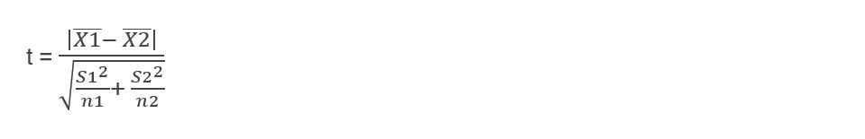

Where 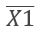 and (S1)2  are the mean and variance of the first sample and in the same way, 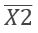 and (S2)2  are the mean and variance of the second sample.
The assumption of the null hypothesis is that both means are equal, so the value of t will also be equal to zero (0). It is important to emphasize that the further away t is from this value, the less likely it is that both equal means are due to chance.

The conditions that are required to be able to apply this test are the following:

1.- Both groups must be independent and this implies that each individual must belong to only one of the two groups and that in addition, it has no relationship with the individuals of the other group.

2.- The variable to be considered must be continuous and have a normal distribution in both groups.

3.- The homoscedasticity assumption must be fulfilled, that is, the variance must be the same in the two groups.
To verify if the distribution of the variable is normal in both groups, the Shapiro Wilk test can be performed for when the samples are small (less than 50). For large samples, it is best to use the Kolmogorov Smirnof test and in case of having a large sample and not knowing both the standard deviation and the population mean, it is advisable to use this same test but with the modification of Lilliefors.

On the other hand, both normality tests have the disadvantage of assuming a null hypothesis of normality. This implies that when the result is significant, the null hypothesis can be discarded and the conclusion reached that the variable simply does not have a normal distribution. But for non-significant results, this does not allow us to precisely assert the normality of the alternative hypothesis, that is, it only indicates that we cannot reject the null hypothesis.

It is important to emphasize that both tests are not very powerful for small sample sizes and, furthermore, the Student t assumption is more sensitive in the absence of normality. That is why it is advisable to complete the contrast test with some graphic method, such as the theoretical quantile graph or through a histogram.

If we are faced with the situation of not having a normal distribution, we are presented with three possibilities. The first is to test hypotheses by means of a non-parametric test. The second possibility is to try some transformation and check if the transformed variable is distributed in a normal way and finally, a Student's t test can be performed even if the normality condition is not met, but it will be necessary to apply a correction and it is important to take into account This third option will only be recommended when there are slight deviations from normality and also when the sample size is large (between 30 and 50 individuals per group).

Once we have verified normality, it will be necessary to determine if the two variances are equal and if they fulfill the homoscedasticity assumption. In which case it will be necessary to calculate Snedecor's F and the quotient of the two variances, where the numerator will be made up of the largest variance of both groups and, of course, the smallest of the two will occupy the denominator. Being n the size of each group and the degrees of freedom will be n - 1.

Under the assumption of equality of variances the value of F will be equal to 1 and as the value of F is greater, the probability that the difference between the variances is caused by chance will be less.

It is important to take into account that the Snedecor F test is highly sensitive to the lack of normality and it is in these cases, when it is advisable to use the Levene test.

Once we have verified both the equality of variance and its normal distribution, we will then proceed to use the Student's t-test to carry out the contrast and, given the case that homoscedasticity does not exist, we will have to apply Welch's correction.

## Steps to apply the Student's t test for independent groups of the same size:

The first thing to be clear about is when two groups are independent, they are those whose characteristics are well differentiated, for example: the groups of men and women when measuring blood pressure or two independent groups can also be married people and single people, among others.

The other important thing to take into account is that this test can only contrast the means of two groups at a time, where each group has less than 30 individuals.

Once we have identified two clearly independent groups, we are going to start with the first step, which is to establish the null hypothesis and the alternative hypothesis. Where it is determined in the null hypothesis that the means of both groups are equal, while the alternative hypothesis indicates that both means are different.

Step 2: The samples are taken from each of the groups and placed in a table, but in addition two more columns must be added (one for each group) and in these columns, the values of each measurement are calculated squared and the sums for each column. This will later facilitate the calculations of the formulas to be used.

Step 3: I calculate the average or the mean of each of my groups, as we have already seen before, the average is calculated by adding each of the data per column of each group and dividing it by the number of data.

Step 4: The standard deviation of each of the groups must be calculated and for this it will be necessary to use the following formulas:

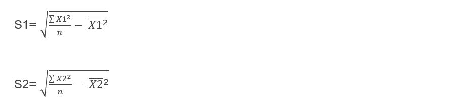

Step 5: Calculate the standard error of each of my samples and for this, it will be necessary to use the following formulas:

Step 6: Now I must calculate the standard error of the difference and to obtain it I will have to use the following formula:

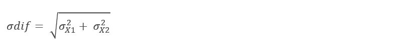

Step 7: We already have all the elements to use the Student's t method, so we are going to calculate all the steps and substitute the results of the formulas obtained in the subsequent equations and finally, we must use the following formula:

Step 8 = Once we have the value of t, what we must do is contrast with the tables of critical values of Student's t for independent groups, but to enter tables we will need the degrees of freedom and for this, it will be necessary to apply the following formula:

DF = n1 + n2 - 2

Step 9: When we already have the critical value located in the tables, I simply have to follow the rule for decision making which is: Yes and only if the calculated t is greater than or equal to the t obtained in tables, then I can reject the hypothesis null and this implies that I have significant differences.

Let's take an illuminating example: A social researcher wants to know if when a person makes an anonymous donation to a certain charitable foundation or knowing for sure the person who makes the donation, it will influence the amount of money donated.

Following the previously established steps, we must determine that the null hypothesis tells us that there will be no statistically significant differences between the donations made by people who want to remain anonymous and those who allow their name to be made public, that is:

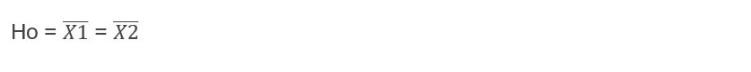

While the alternative hypothesis will determine the opposite, therefore it is established that both types of donors do present significant differences:

To contrast both hypotheses, the researcher focused on 12 donors, of which 6 were people who wanted to remain anonymous and the other 6 allowed their names to be made public.

Each of the results refers to the number of times that a certain amount was donated, that is, if the result is 1, this implies that the person donated that amount only once, while if the result is 5, this would indicate us that the person in question donated 5 times the pre-established amount of money. We are going to show the results:

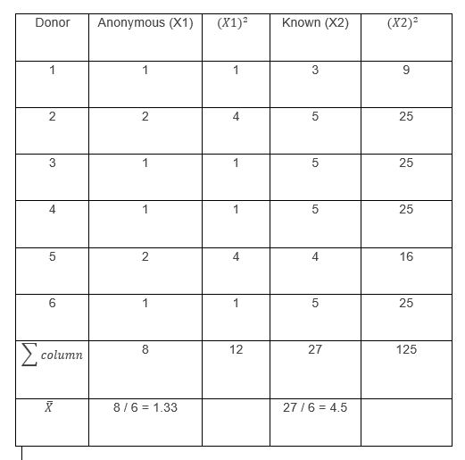

The data collected by the researcher are those found in the columns "Anonymous" and "Known", the columns were added (X1)2,(X2)2,a summation row and another that includes the mean of each group, to facilitate the calculations of the formulas.

Now I calculate the standard deviation of each of my groups:

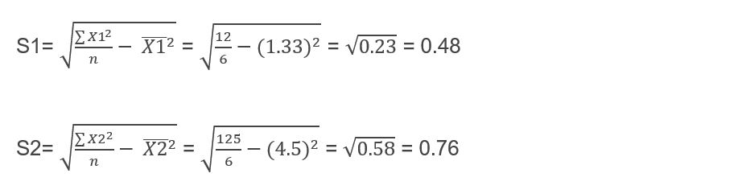

The next step is to calculate the standard error of each of my samples:

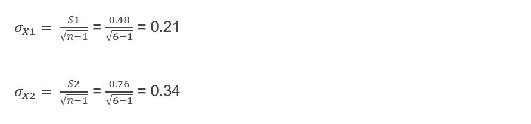

Now I must calculate the standard error of the difference:

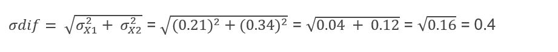

We can now calculate Student's t:

I must look in tables for the critical value of t, to be able to contrast it with the value of t that I have just calculated, for this it will be necessary to calculate the degrees of freedom:

DF = n1 + n2 - 2 = 6 + 6 - 2 = 10

From the way the hypotheses are raised, we can deduce that it is a two-tailed problem and therefore, we must use the value of α / 2 = 0.05 / 2 = 0.025 to enter tables

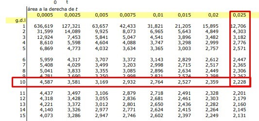

The value given by the t Student table is: 2.228 and I use this value for my statistical decision making, let us remember that if the t cal ≥ t critical, the null hypothesis must be rejected and we can observe that this is precisely what it happens since:

7.93 ≥ 2.228

So we can conclude that by rejecting the null hypothesis, we must assume the alternative hypothesis where it is established that there are significant differences, in terms of donation means, between people who want to remain anonymous and those who prefer to have their name come to light public.

## Student's t test for independent samples of different sizes

For independent samples of different sizes, all the previous procedures are followed up to step 5 (inclusive), only that in this case the standard error of the difference is calculated with another formula and also, it will not be necessary to calculate the standard error of each separately. one of my samples, but we skip this step and directly apply the following formula:

The rest of the steps are the same as those carried out in the previous exercise.

We are going to carry out an example for this type of case: A social researcher wants to know if there are significant differences between the probability of having an unwanted pregnancy in two different groups, which are university students of psychology and students of medicine.

To do this, the researcher surveyed several students from both majors and raised his hypothesis. The null hypothesis is determined as that there are no differences between the probability of having an unwanted pregnancy between the two groups of students, while its alternative or research hypothesis determines the opposite, that is, there will indeed be significant differences in the unwanted pregnancies among students in both groups.

After conducting the surveys, the researcher obtained the following results:

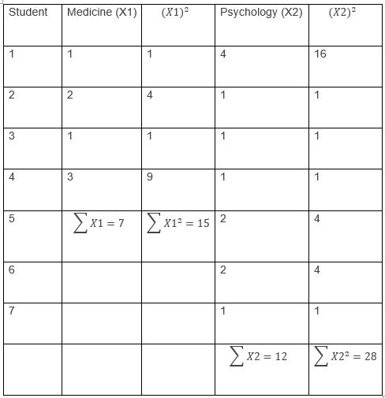

The next step is to calculate the means of each of the groups:

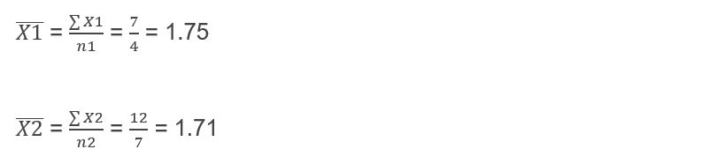

Now we must calculate the variance of each of my groups:

The next thing we need to do is calculate the standard error of the difference:

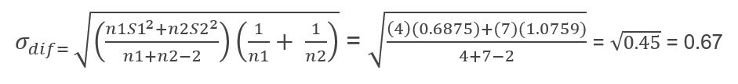

We already have all the elements to be able to calculate the Student's t, applying the same formula as for the previous case:

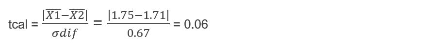

To reject the null hypothesis according to the decision rule, the Student's t that we have just calculated must be greater than or equal to the critical t obtained in tables and for this it will be necessary to calculate the degrees of freedom:

DF = n1 + n2 - 2 = 4 + 7 - 2 = 9

Again we are in the presence of a two-tailed process and therefore the tables must be entered with the value of  α/2 = 0.025 and the newly calculated degrees of freedom.

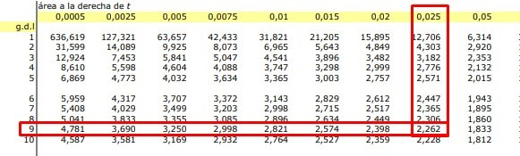

As we can see, the critical Student's t gives us a value of: 2.262 and when we buy it with the t cal, we realize that tcal is less than the critical t since:

0.06 < 2.262

This tells us that the condition to reject the null hypothesis is not fulfilled, so we must accept it and this means then, that there are no significant differences between the probability of having an unwanted pregnancy between medical students and psychology students.

## Student's t test for two dependent samples

As we commented previously, it is important to differentiate the cases when the samples are independent or for those cases, whose data are paired. In this type of case, dependent groups generally emerge when the same data is studied twice for each subject in the sample. These types of observations can be found, in those circumstances where each case will be treated individually, with some type of control.

This means that the study will be carried out for a single group, but evaluated at two different moments and that between both moments, the group has received some type of intervention capable of changing the data. For example, the before and after the application of a salary increase to check the performance of a group or perhaps, measure the benefits of a certain drug applied to a group of patients and for this it will be necessary to obtain the before and after measurements after treatment through random sampling.

For this case, we are going to work directly with an example and for the rest of the cases, simply repeat the steps carried out on the sample that we will propose below: A researcher wants to know if there are differences in the levels of aggressive behavior of a group of six children, before and after watching a television program. To test his theory, the researcher takes a series of measurements capable of measuring aggressiveness before and after watching the program in question.

The researcher obtained the following measurements where 1 represents a low aggressive level and 6 represents a very aggressive behavior:

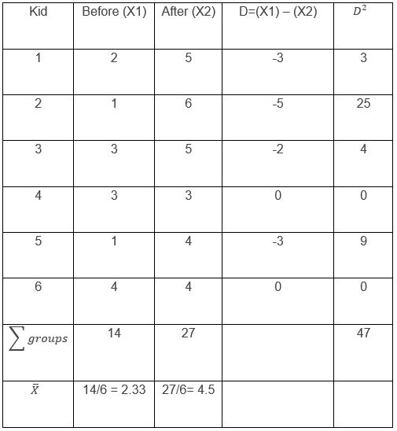

It is important to take into account that the measurements are in the first columns, but for the purpose of facilitating the calculations, two columns were added. The first, with the difference in the values between before and after, which we will call “D”, and the second, with those same values squared. We will also add a row with the sum of each column and a last row, with the means of each of my groups.

The next step is to calculate the standard deviation of my sample and we are going to do it using the following formula:

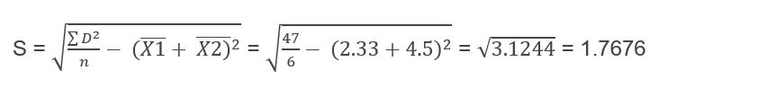

Now I must calculate the standard error of the difference and for this it will be necessary to use the formula:

Con estos valores ya puedo pasar a calcular mi t de Student para grupos relacionados o dependientes y lo único que necesito, es sustituir los valores en la siguiente fórmula:

Será necesario ahora contrastar con el valor crítico que aparece en las tablas y nuevamente, vamos a necesitar calcular los grados de libertad. Para ello será necesario utilizar la siguiente fórmula:

DF = n1 + n2 – 2

Siendo n1 la cantidad de personas a las que se le hicieron las mediciones en el primer grupo y n2, la cantidad de personas a las que se le hicieron las mediciones en el grupo dos. Como podemos observar, el grupo es el mismo sólo que en dos momentos diferentes, pero para efectos de la fórmula se deben considerar el número de personas dos veces, es decir:

DF = 6 + 6 – 2 = 10

Así como en los ejercicios anteriores, vamos a buscar el valor crítico de la t de Student para compararlo con la t que acabamos de calcular y de la misma manera, rechazaremos la hipótesis nula en el caso que:

tcal ≥ t cri

Así que nos dirigimos a las tablas sabiendo que es una prueba de dos colas y que por tanto, entraremos en ellas con el valor de los grados de libertad (10) y un α/2 = 0.025
Podemos observar que el valor obtenido es de: 2.228 y efectivamente nos podemos dar cuenta que el t cal es mayor que el t crítico obtenido en las tablas, ya que:

2.77 > 2.228

Por tanto, debemos rechazar la hipótesis nula y esto implica que existen diferencias significativas en el comportamiento agresivo de un grupo de infantes, antes y después de ver cierto programa de televisión.

## About the Author

 Idais, Graduated in Mechanical Engineering, and a master’s degree in teaching component, she gave classes in several institutes of mathematics and physics, but she also dedicated several years of my life as a television producer, she did the scripts for mikes, the camera direction, editing of video and even the location. Later she was dedicated to SEO writing for a couple of years. she like poetry, chess and dominoes
