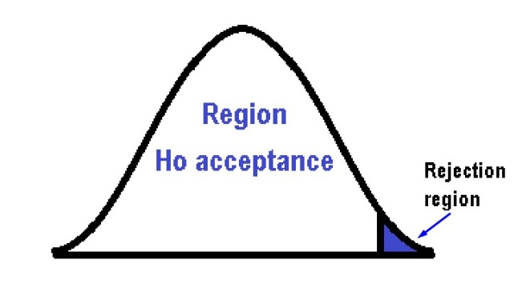
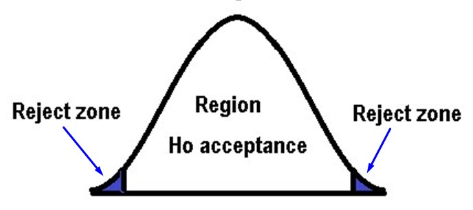
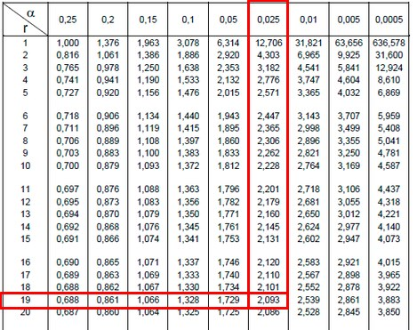
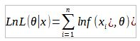

# 🔢 Parametric statistics

Parametric statistics is part of statistical inference and uses
resolution criteria that are based on known distributions.

But what is statistical inference? They are a set of methods that allow
us to promote, through a statistical sample, the behavior of a certain
population. Statistical inference leads us to study how the application
of these methods in the data of a sample cannot provide conclusions
regarding the parameters of a certain population of data. As well as it
is in charge of studying the degree of reliability of the results
obtained from a study or investigation.

It is important to understand these three concepts:

1.- Inference: It means that from certain assumptions it is possible to
draw conclusions or judgments, either particular or general.

2.- Population: The total data set that exists on a certain variable is
what we call a data population.

3.- Statistical sample: It is a part that is chosen within the data
population.

Once we are clear when we refer to the concept of inferring, one of the
main doubts falls on the fact of choosing a sample, instead of a
population.

In general, statistics work with a large amount of data and among them
it is necessary to use a sample of the population. For example, if we
want to infer regarding the results of certain elections, it will be
impossible for us to investigate the entire population of a country.

To solve problems of this type, a representative and varied sample is
chosen, which can lead us to extract an estimate regarding the final
result. It is important to choose a suitable sample and it will be
necessary to use some sampling technique.

Statistical inference methods

The methods of statistical inference are divided into two large
branches, which are: hypothesis testing methods and parameter estimation
methods.

\- Hypothesis testing methods: their main premise is to check when an
estimate corresponds to population values ​​and in all hypothesis
testing, there are always two assumptions that are: the null hypothesis
where it is established that a certain value has a predetermined value.
Given the case that the null hypothesis is rejected, then the
alternative hypothesis must be accepted.

\- Parameter estimation methods: they are in charge of assigning a value
to the parameter that characterizes the study subject. Of course, as it
is an estimate, it must be taken into account that there is a certain
error and to access estimates adapted to reality, what is done is to
create confidence intervals.

Parametric statistics tries to estimate certain parameters in a sample
of the data population. It is important to note that parametric
statistics base their calculations on the assumption that the
distribution of the variable is known.

On the other hand, a probability distribution is a tool that tells us
precisely how the probabilities are distributed and depending on the
structure that this distribution has, the distribution can be of one
type or another.

The best known of all probability distributions is the normal
distribution and it is the one that applies around most random
phenomena, since many of these phenomena tend to behave as a normal one,
when repeating the data a large Number of times.

We can find distributions such as the Chi square one that was developed
by Pearson. This distribution represents those random variables made up
of strictly positive values ​​and is usually used to see the structure of
the variance of a certain random variable. It should be noted that the
variance is always positive.

Different types of distributions that can be found in parametric
statistics

Among the best known distributions used in parametric statistics are:

The discrete probability distributions:

\- Uniform distribution

\- The binomial distribution

\- Bernoulli\'s distribution

\- The geometric distribution

\- The hypergeometric distribution

\- The negative binomial distribution

\- The Poisson distribution

Continuous Probability Distributions

\- The Chi square distribution

\- The exponential distribution

\- Continuous uniform distribution

\- The Gamma distribution

\- The normal distribution

\- Snecdor\'s F distribution and

\- Student\'s t distribution

Advantages of parametric tests

\- They are more efficient

\- According to the information obtained and its characteristics, they
are more perceptible

\- They have very exact probabilistic calculations

\- Errors are unlikely

\- As they are commonly used, it can be observed through an analysis,
the data obtained

\- When the conditions of their application are fully met, they are a
very powerful method.

Disadvantages of parametric tests

\- They are more difficult to calculate

\- Observable data may be limited

\- The variables must follow a normal distribution

Hypothesis contrast

Statistical inference is based on decision-making where hypothesis
testing and estimation are important aspects, which, although it is true
that they are differentiated from each other, are complementary.

Hypothesis testing is a test of significance where the process by which
we decide whether a proposal regarding a population should be accepted
or not is indicated. To do this, it will be necessary to use the
decision rule, which tells us when to accept or reject the hypothesis
and if the sample data is closely related to the population data.

A statistical hypothesis is nothing more than a proposition regarding
the probability or probability density function of one or more random
variables. This proposition must address either the estimation,
inference, probability distribution, hypothesis testing or the value of
the parameter or the parameters that define it. The hypothesis contrast
will be based on the information extracted from the sample. Given the
case that the hypothesis is rejected, it is important to indicate the
data of the sample where its falsehood is evidenced.

In a hypothesis test, two hypotheses are studied, the null (Ho) and the
alternative hypothesis (Ha). In this way, the researcher divides the
sample data between two zones, an acceptance zone and a rejection zone,
depending on where the result is, the hypothesis will be accepted or
rejected. In other words, there is a critical region where the null
hypothesis is rejected and conversely, there is also an acceptance zone
where the null hypothesis is accepted.

On the other hand, the hypothesis is simple when the value of the
parameter is perfectly specified and it is compound, if it has two or
more parameters. In general, the null hypothesis is usually simple and
more concrete, while the alternative hypothesis is the one that can be
composed.

Depending on the type of contrast required, the assumptions are made:

\- Assumptions regarding the data that are intended to be manipulated or
about its characteristics, such as the level of measurement used, the
independence of the observations, among others.

\- Assumptions regarding the starting distribution that can be normal,
binomial, etc.

When a researcher violates the assumptions of the model, he can
invalidate the probabilistic model and obtain erroneous decisions,
therefore, the researcher must know the consequences arising from the
violation of these assumptions. So when making the assumptions, it is
important that they are not too demanding, to be able to comply with
them.

When we consider a hypothesis test of one direction (one tail), it is
one-sided and can be established as follows:

Ho: Me = Meo

Ha: Me \> Meo

It can also be set as:

Ho: Me = Meo

Ha: Me \< Meo

While in the bilateral or two-tailed hypothesis test, it is of the form:

Ho: Me = Meo

Ha: Me ≠ Meo

When a test is directional or one-sided, in order to make the decision
to reject the null hypothesis we will only require very large or very
small values, when comparing them with the test statistic.

When a test is bilateral, to reject the null hypothesis we must have
both very large and very small values ​​(both) with respect to the values
​​of the test statistic. The α value will determine the level of risk or
significance and represents the probability that the contrast statistic
is located in the critical or rejection zone.

In directional contrasts,
 is
concentrated at one end of the distribution, while in bilateral
hypothesis contrasts, α is distributed or divided between both ends of
the distribution
").
It is important to take into account that the unilateral tests are
generally better than the bilateral ones and the choice of any of the
tests is conditioned by the alternative hypothesis. When the latter is
greater or less than the test statistic, it is said to be one-sided. But
if the alternative hypothesis is different from the test statistic, it
is considered two-sided.

Parameter estimation

Before getting into the estimation of parameters, we must remember what
a point estimate is. A point estimate is when a single value is used to
estimate a population parameter, that is, a specific point in the sample
is used to estimate the desired value.

If we estimate a parameter in a specific way, we can know for sure what
that value is. Suppose we have a population of 30 people in which we
select a sample of 20 people whose ages we know. To estimate the mean
age in a specific way, it is as simple as adding the 20 data from the
sample and dividing it by the total data, in this case it will be 20
data.

However, if we want to estimate their average height from that same
sample, unlike age, we simply do not have the measurements of the
heights of these people and that is why we will not be able to make a
point estimate, not being able to find the value specific to that
average height. It is in this case that we must make an interval
estimate, in other words, limit the lowest and highest values
​​corresponding to the heights of the people in the sample, with a
certain level of confidence or security.

When we want to obtain a point estimate, we use a statistic that we call
the decision function or estimator. Some of the most widely used
estimators are: the sample mean, which is very useful for estimating the
mean of a population, and on the other hand, the sample standard
deviation, which, as its name indicates, is very useful as an estimator
of the standard deviation of a population.

Estimation of the mean of a certain population

Let\'s try to explain this point with an example: Suppose we want to
estimate the average number of children that women have in a given
population. For this, a sample of 20 women were selected who were
interviewed and an average of 3.2 children was obtained as a result with
a standard deviation of 0.8. We could make a point estimate with these
results and come to the conclusion that there are an average of 3.2
children per woman in this population. But this has a drawback and it is
that the error that is being executed is unknown.

It would be advisable to assume an estimation interval with a lower
limit and an upper limit than that average of 3.2. This is how an
estimation interval is assigned to the result which we will call error
(E) and if we also establish the probability that it occurs to the
values ​​included in this interval, we will have determined a confidence
interval when calculating the average of children that the women of our
population have.

Generalizing then what was explained above with respect to the "average
number of children", it can be said that to estimate the average of a
population, a confidence interval must be made consisting of the
following elements: the estimation error and the sample average.

By means of the following formula we can obtain the error when
constructing an interval for the average:

Where (S) is the standard deviation of the sample, n is the sample size
and t is a value that is searched in the Student t table with two
values:
 and the degrees of freedom that are calculated with (n - 1) = (20 - 1) = 19. If we establish a 95% confidence, this implies that  =
0.05 and therefore

= 0.025, already having both data we go to the table:

The value obtained in the table is: t = 2.093

The sample size is n = 20

The standard deviation is S = 0.8

Substituting the values ​​in the formula we will obtain that the error
is:

E = t x  = 2.093 \*
 = 0.37

Now we are going to construct the estimation interval and for this it
will be necessary to add and subtract the error from the average, as we
already know the average is 3.2 so that the lower limit will be equal
to: 3.2 - 0.7 = 2.83, while the limit higher will be: 3.2 + 0.37 = 3.57

This is how an interval of (2.83, 3.57) is obtained and thus it can be
concluded that with 95% confidence, the average number of children in
women in our population is between 2.83 and 3.57.

Examples of point estimates

To obtain a point estimate, a statistic is used that is called an
estimator or decision function.

The study of populations is determined by a probability function that
establishes the random behavior of our variable of interest. In most
cases we can know the distribution of the population, but it may be that
we do not know the variance in the mean of that population. We can know
that our variable of interest is binomial, but we do not know what the
probability of population success is. Perhaps in other cases we can know
that it is governed by a Poisson process, but that we do not know the
number of rare events that exist per interval.

Of course, in all these circumstances the probability function that
determines the variable under study is specified by knowing the
population parameters and for this it will be necessary to use the
so-called parameter estimation methods. Estimating one or several
unknown parameters of the population is only possible if we construct
probability functions of the random variables or commonly called sample
estimators.

These estimators guarantee us an approximation of the population
parameter that we do not know. But it is important that they comply with
some properties such as: They must have a minimum variance in the data
concentrated around the estimated parameter, a maximum of symmetry or
unbiasedness and a maximum probability.

Estimator features:

Unbiased estimate: when we have a large number of samples and we obtain
the estimator for each of them, the ideal would be for the mean of these
estimates to coincide with the value of μ. When an estimator is said to
be unbiased, it is because its mathematical expectation coincides with
the parameter to be estimated.

Efficient estimator: An estimator is said to be efficient when it
generates a distribution with the smallest standard error. In other
words, between 2 unbiased estimators of certain parameters, the one with
the lowest variance will be more efficient.

Consistent estimator: An estimator is said to be consistent the moment
its value tends towards the true value of the parameter, while the
sample size increases. Therefore, the probability tends to 1 as the
estimate is the true value of the parameter.

Sufficient estimator: When an estimator is able to extract all the
important information from the data regarding the parameter, it is said
to be a sufficient estimator.

The density function as a dependency of the parameters

The object of our study is a random variable x whose distribution
depends on a parameter θ and from now on we will use a generic notation
to refer to the density function as we will express it below: f (x, θ)

As we can see, the previous function has two arguments x and θ. On the
one hand, the argument x goes through the values ​​of the variable, while
the second argument θ will go through the possible values ​​of the
parameter and corresponds to the density function. We will call the set
of values ​​θ of interest θ⊂ space of parameters θ ⊂ R and it is an
interval of the real line, as well as it could be a countable or finite
set.

It is important to note that we will only be interested in the values
​​of x where

f (x, θ) \> 0

Estimation methods:

Maximum likelihood estimate

This maximum likelihood estimation model is used to estimate the
parameters that depend on the observations of the sample, in a
probability distribution.

The maximum likelihood estimation takes care of the parameters of the
density functions, to maximize them. Suppose we have a sample X =
(X1,... Xn) and we have the parameters θ = (θ1,..., θn), the maximum
likelihood function is denoted by the letter L and is defined as:

L = \prod_{i = 1}^{n}{f\left( x_{i},\theta \right)}")

It is important to note that this symbol
")
means that it is a productive and is treated in a similar way to the
summation for sums, only that in this case it represents the
multiplication of each and every one of the density functions, which in
turn depend of the parameters and observations of the sample.

The larger the value of the maximum likelihood function, the more likely
the sample-based parameters are.

To simplify the calculations, the natural logarithm function of the
maximum likelihood estimate should be used, since the properties of
logarithms help greatly in its calculation.

By properties of logarithms, the multiplications of the values ​​of the
density function become the sum of their natural logarithms and that is
why we can change to the summation symbol. This process is called
monotonic transformation through logarithms and what you do is simply
change the scale to smaller numbers. Furthermore, the estimated value of
the parameter capable of maximizing the probability of the maximum
likelihood function with logarithms is perfectly equivalent to the
estimated value of the parameter to maximize the probability based on
the original maximum likelihood.

That is why we will always work with the monotonous modification, since
this way the calculations are facilitated.

Once we calculate the natural or natural logarithm, we must derive the
result and set it equal to zero, remember that this is the mathematical
way to find the maximum or minimum of a function.

}{\delta\theta}")
= 0

Once we have derived the function, we will have to solve for θ and this
will be my maximum likelihood parameter.

Let\'s go with an illustrative example:

Suppose we have a probability function with a Poisson distribution. This
function has a maximum point that is given by the average. The first
thing we must do is determine the Poisson function that is given by the
formula:

f(x) =

Being λ the parameter, so λ = θ and if we use the maximum likelihood
formula we have:

L = \prod_{i = 1}^{n}\frac{e^{- \theta}.\theta^{x_{i}}}{x_{i}!}")

There is a property for the productory that states that:

= 

So if we take  as a constant since it does not depend on the changing value (i) we can say that the first element of the function remains as:  = .

While  =

this last term rises to the summation since it is a multiplication of
powers of equal base, where the same base is left and the exponents are
added, the exponents being the sum of
 and
the factorial term found in the denominator will be replaced by
!
and when we put all the elements together, we have that this term would
be:

L(

We add the natural logarithm to both sides of the equation so that it
does not change and we have to:

Ln
L(Ln

By properties of logarithms, the logarithm of a multiplication is the
sum of the logarithms and the logarithm of the division is the
subtraction of the logarithms, therefore it does not remain that:

Ln
L(Ln
 +
Ln

-- Ln

By properties of logarithms, the exponents can be placed by multiplying
the logarithm and the product of a logarithm becomes a summation

Ln
L(-n
 +

Ln +

When I apply the logarithm to a function, it preserves the maximums so
that the maximum of the function L(θ) that will be reached in a certain
θ and the logarithm of that function LnL(θ) is also reached in the same
θ. So the derivative set to zero of the logarithmic function to find the
maximum probability value will be equal if we express it:

}{\delta\theta}")
= 0

The derivative of Lne = 1 and the derivative of θ = 1 so the derivative
of the first term will be simply (-n) and the derivative of
Ln =

and the derivative of the last term is zero (0) because if we realize it
does not have θ and therefore it is assumed as a constant.

}{\delta\theta} = - n") +

I equal the term to zero and I clear θ

 +

= n

= 

This value being the average of all the data and the maximum likelihood
value of the problem.

The estimators provided by the maximum likelihood method are better than
those obtained.

This value being the average of all the data and the maximum likelihood
value of the problem.

The estimators provided by the maximum likelihood method are better than
those obtained through many other methods, due to their asymptotically
unbiased properties and the maximum disadvantage of this method is that
the density function must be known (which is not always known) .

As we understand that the method can be a bit complicated, we are going
to perform another exercise

Suppose we have a function: f(x) =

The idea is to try to find an estimator of this function using the
maximum likelihood method and we are going to vary the way we do the
calculations a bit, to see if we get to a better understanding.

L(

L( \*

\*... \*

We can realize that each term that is multiplied repeats
(
and if we extract it and multiply it n times (one for each term) we
have:
^{n}")

On the other hand, if we group:
(

=

We need to group:
...\*

We can realize that each \"x\" is different from the other, but if they
share the same base, so if we apply multiplication of powers of equal
base, we leave the same base and add the exponents, therefore the result
of grouping this part of the function we are left as:

By joining each of the groupings and compacting them in the maximum
likelihood function, we obtain that:

L(
^{n}.\prod_{i = 1}^{n}{x_{i}^{3}.}e^{\sum_{i = 1}^{n}\frac{- x_{i}}{\theta}}")

Since this expression is so difficult to derive, it is necessary to
apply the natural logarithm to simplify the calculations.

Ln
L(
Ln
^{n}.\prod_{i = 1}^{n}{x_{i}^{3}.}e^{\sum_{i = 1}^{n}\frac{- x_{i}}{\theta}}")

Applying properties of logarithms we have:

Ln
^{n}") +
Ln
 +
Ln

Ln
L(
n Ln
 +")
3Ln
 +

Ln e

It should be noted that Lne = 1 and as LnL(θ) = l(θ) to simplify since
the logarithmic function has the same maximum value, we have:

 =")n(Ln1
-- Ln

Now we must derive this expression and set it equal to zero to extract
the maximum value of θ

But we will derive term by term to better understand the result, then the first term would remain as: -n.Ln2 since Ln1 = 0 and its derivative is a multiplication of two elements --n.Ln2 and by properties of derivatives, the derivative of a multiplication is
the derivative of the first element (-n) by the second without
derivation, plus the derivative of the second element (Ln2θ \^ 3) by the
first without derivation. However, the first term does not contain θ and
is therefore zero (0). While the derivative of (Ln2 is  multiplied by its internal derivative that is , but we must multiply this second element by the first without derivative that is --n, recapitulating we have that the derivative of first term is: -n =  = 

The derivative of the second term is zero since this term lacks θ and
then it is assumed as a constant and for the third term, we must apply
the properties of the derivative of a division. Recall that the
derivative of a quotient is: The derivative of the numerator () which since it does not depend on (θ) is zero (0) multiplied by the
denominator (θ) = 0.θ without deriving and the derivative of the
denominator which is (1) is subtracted by the numerator without deriving
,
divided by the denominator without deriving squared
.

Returning to all the above, the derivative of the third term would be as:

 = 

The expression of the derivative in total would be:

}{\delta\theta}")
=+

If we set this derivative equal to zero and solve for θ

+

