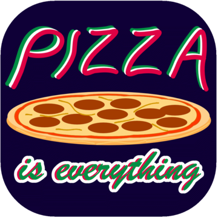

# 🍕 Pizza

Pizza is, well, everything. Just type “types of pizza” into any browser search
box. Use any search engine, and you will see that point illustrated. Basically,
pizza is a round (usually but not always by any means) bottom crust, covered
with Marinara sauce, and a mixture of other ingredients including cheese and one
or more other toppings.

A little investigation will tell you that there are two types of pizza crust,
thick and thin. Further investigation will broaden the choices out to five or
more styles of crust. The variations seem to be based on location primarily, for
example: Chicago Deep Dish, NY Style Pizza, Neapolitan Crust and Sicilian Style.

The cheeses are even more numerous. Usually Mozzarella cheese and often
Provolone are standard, but literally any other kind of cheese that sounds good
to a person can be found on a pizza SOMEWHERE. Just a quick search yielded
Parmesan, Goat cheese, Cheddar, Arugula, Blue, Colby, Edam, Emmental, Ricotta
and Gruyere.

The “toppings” are insane. Think of ANYTHING you like in the way of meats,
seafood, vegetables, spices and even fruits, and it can be found on top of a
pizza. I have even seen Hummus used as a pizza topping. Here’s one: “Brown
Butter Lobster and Spinach Pizza with Bacon + Fontina”. But what’s REALLY good
on a pizza? How many people are there? That’s almost how many opinions there are
and of course we are talking about our big round planet. So now we are down to
MY opinion because this is MY article.

The best pizza that I have found, and I have traveled some, not widely, but all
around the USA and touching Canada and Mexico, is in a small city, Prescott,
Arizona. There, downtown, in what was the original capital of Arizona, is the
Prescott Brewing Company. The beer is excellent to say the least. There are many
styles and even multiple styles (some seasonal) of IPA , my personal favorite.

PBC has some great food, including my favorite burger, the Peppercorn Gorgo
Burger. It’s encrusted with crushed black peppercorns and topped with onion
straws (like breaded onion rings, but not rings), and Gorgonzola cheese spread,
served on a Ciabatta roll. I have them add bacon too. YIKES!

OK, now to my favorite food on earth, literally, the PBC BUFFALO CHICKEN PIZZA.
The crust is thin, not quite crispy usually. The cheeses are Mozzarella,
Gorgonzola Spread and “Gorgo crumbles”. The chicken is cooked with Buffalo sauce
(a vinegar-based cayenne pepper hot sauce, like Buffalo Wings) and rather than
Marinara, they use what they call a Tornado sauce, which is really, you guessed
it, Buffalo sauce. Add some little green onion slices, and you have pure bliss
in your mouth, IN MY OPINION. You can find the PBC here:
<https://www.prescottbrewingcompany.com/> ENJOY!

## About The Author

Harley Armentrout is a happy husband and father, former silversmith, aerospace
electronics prototype assembler, test, calibration & repair technician, also
writing test procedures at [BallAerospace](https://www.ball.com/aerospace). Then
21 years in the gaming industry, in a range of positions, culminated as a Gaming
Inspector, observing and reporting on rules violations, safety issues and
criminal activities for the
[Yavapai Prescott Indian Tribe](https://buckyscasino.com/). After “retiring”
Harley taught himself a few graphic design skills and he works as a freelance
designer.
