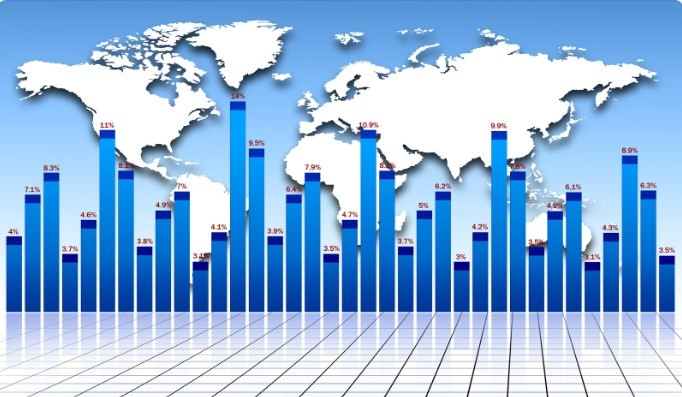

# Poisson Distribution

## Some History

Siméon Denis Poisson was the creator of this distribution, he was a French philosopher and mathematician who was in charge of modeling event frequencies but during a fixed interval of time, but he was also in charge of perfecting and correcting the law of large numbers.
This type of distribution is used in the area of operational risk in order to model those situations in which a certain operational loss occurs. The Poisson distribution is also used in the waiting times that exist between financial transactions, for those data of high frequency in the market risk. It is even capable of modeling the amount of bankruptcies on credit risks.

The Poisson distribution is one of the most important ones used in discrete variables and its application in general refers to modeling situations in which it is required to determine the amount of a certain type that can be produced in a certain interval of space. or time, always under some assumptions of randomness and restrictive circumstances. It is important to emphasize that the interval can not only be time, the interval can also be area, distance, volume or another similar unit.

It is also highly used in considering limits of dichotomous processes that happen repeatedly many times, but when the probability of success is very small.
This distribution can be derived from an empirical observation process that has the following characteristics:

1. It comes from the observation of certain types of events that happen in a period of time through an observation space.
2. The events that are observed have a random nature and may or may not occur in a non-deterministic way.
3. The probability of obtaining x number of successes in a given amplitude interval will not depend on the origin of the interval, instead it will depend on its amplitude.
4. The probability that exists of the occurrence of a certain event within an infinitesimal interval will be proportional to the width of that interval.
5. The probability that exists of two or more events occurring within an infinitesimal interval is an infinitesimal that belongs to an order greater than two.
   Therefore, in an infinitesimal interval, 0 or 1 fact can be produced, but never more than one.
6. When in certain circumstances we randomize so that the variable X is determined by “the amount of events that can occur in a certain interval of space or time”, this implies that this variable X is going to be distributed with a distribution of the parameter μ
7. The probability that an event occurs in a certain time interval will be the same for different intervals of the same length.
8. What happens or does not happen in one interval is independent of what happens in any other interval, that is, the occurrences are independent.
9. At the same time two events cannot occur simultaneously.
10. The variable can only adopt integer and positive values, for example: X = [0, 1,2, 3,4,…]
    Since this parameter is a proportionality factor that expresses the probability that a certain event occurs in an infinitesimal interval, this parameter is designated as the intensity parameter and corresponds to the mean of the events expected to occur in a unit interval and is also able to match the variance of the distribution.

On the other hand, the field of variation of the variable because it is a discrete model will be part of the set of natural numbers including zero: x ϵ [0, 1, 2, 3,…]

## Amount function

If we start from the hypotheses of the process, we can get to obtain a differential equation capable of defining it and that can also be easily integrated, in order to obtain the quantity function of our variable "number of events capable of occurring in a unit interval of space or time ”, it can be expressed as follows:

`F(x) = P(X = x) = (e^(-μ)*μ^x)/x!`

Where:

μ = To the measure of the expected value that an event occurs
e = Is the base of the natural or natural logarithm = 2.71828

Let's go with some examples where the Poisson distribution can be used for a certain type of interval:

1. X = The number of people who come to a dentist's office in a time interval of one day.

2. X = Number of cars that show up at a gas station in a period of eight hours.
3. X = The number of bacteria found in a liter of water.

Let's go with the first example of Poisson distribution: Jorge is a veterinarian and receives an average of four pets a day. If we know in advance that the number of pets Jorge receives in one day at his veterinary clinic follows a Poisson distribution. Is it required to know what probability Jorge has of receiving 3 pets in one day?

X = No. of pets Jorge receives at his veterinary clinic in one day
X ~ Poisson (μ)
`μ = 4`
P (X = 3) =?
F(x) = P(X = x) = (e^(-μ)*μ^x)/x!
F(3) = P(X = 3) = (e^(-4)*4^3)/3! = 0,1954

If we want to establish it in percentages, we multiply the result by 100:

`F (3) = 19.54%`

Poisson Distribution Example 2: suppose a rate of 0.4 customers per minute enters a bank, we want to know the probability that there is no customer entering the bank in one minute.
X = No. customers who enter the bank in one minute
μ = 0.4
If we want to evaluate the probability that no customer enters the bank, then the value of x = 0 by instituting the data of the Poisson formula we have:

`P( x = 0) = (e^(-0,4)*〖0,4〗^0)/0! = 0,67 `

If we want it in percentage 0.67x 100 = 67%
But now we are going to calculate the probability that 2 clients enter the bank in one minute

`P(x = 2) = (0,4*〖0,4〗^2)/2! = 0,053`

When multiplying by 100 we have that the probability that two clients will enter the bank in one minute is 5.3%.

Suppose we now want to know the probability that at least 2 customers enter the bank in the space of one minute. To do this, it will be necessary to calculate the probability of 2, 3, 4, 5,…, ∞. As we know, this would not only be a daunting task if not impossible, but there is a property in the probabilities that for this type of case can be of great help and that is that the sum of all the probabilities must be equal to unity. So from the unit (1) we subtract the probability of x = 0 and x = 1, we will obtain the probabilities from 2 to infinity, which is precisely the answer we are looking for.

`P (X≥ 2) = 1 - P (X ≤ 1) = 1 - [P (x = 0) + P (x = 1)]`

In the first part of this exercise we already calculated the probability when x = 0, we will have to carry out the rest of the calculations:

`P(X≥ 2) = 1 – [0,67 + (e^(-0,4)*〖0,4〗^1)/1! ] = 1- [0,67 + 0,27] = 0,0618`

We can conclude then that the probability that at least 2 clients enter in one minute is 6.18%.

It is also required to know the probability that at least two clients will enter in a period of 10 minutes.

The interval that concerns us is now 10 minutes, this implies that I must modify the Poisson equation and redefine the random variable

X = The number of customers that enter the bank in a period of 10 minutes

It will also be necessary to modify the average, since previously the rate was 0.4 in one minute, with a simple rule of three we can calculate the average and in this case it will then be a rate of 4 clients in 10 minutes
μ = 4

Substituting the values in the Poisson distribution formula and applying the probability property again where it indicates that the sum of all probabilities is equal to 1. We can subtract the probabilities of x = (0,1) from unity to obtain the probability from 2 to infinity and therefore we have:

We can conclude then that the probability that at least 2 clients enter in one minute is 6.18%.
It is also required to know the probability that at least two clients will enter in a period of 10 minutes.
The interval that concerns us is now 10 minutes, this implies that I must modify the Poisson equation and redefine the random variable

X = The number of customers that enter the bank in a period of 10 minutes
It will also be necessary to modify the average, since previously the rate was 0.4 in one minute, with a simple rule of three we can calculate the average and in this case it will then be a rate of 4 clients in 10 minutes

μ = 4

Substituting the values in the Poisson distribution formula and applying the probability property again where it indicates that the sum of all probabilities is equal to 1. We can subtract the probabilities of x = (0,1) from unity to obtain the probability from 2 to infinity and therefore we have:

`P (X≥ 2) = 1 – P(X ≤ 1) = 1 – [P(x=0) + P(x=1)] = 1 – [(e^(-4)*4^0)/0!+ (e^(-4)*4^1)/1!] = 0,9084`

When expressing the probability as a percentage, we are left with 90.84%

As you can see, the probabilities are quite high, since we have considerably increased the time interval.

## Benford's law

One day in the year 1881, Simon Newcomb, an astronomer and mathematician, was using a book of logarithms and he noticed that the initial pages were more used and older than the last pages of the book. It is important to take into account that at that time computers did not exist and at that time, tables of logarithms were widely used for multiplication between large numbers. It is as if today the wear of the number (1) key on calculators is examined. The question of why the logarithm pages beginning with 1 had been consulted many more times than those logarithm pages that began with higher numbers arose immediately.

At that time Newcomb deduced that the initial numbers are not equiprobable since the number 1 appears more frequently than the rest of the successive digits, until it reaches the number 9 which is the least frequent. That is why Newcomb enunciated a logarithmic law: "the occurrence of numbers in the probability law is such that the mantissas of their logarithms are equiprobable."

This probability law was forgotten until in 1938 a physicist from the General Electric company named Frank Benford was able to observe the same pattern and devoted himself to studying 20,229 numbers that came from 20 samples of physical magnitudes and all kinds of constants such as: statistics of baseball, river lengths, figures taken from magazine covers, people's addresses, etc. Based on these data extracted from the real world, Benford came to verify that the probability of a number from a series of data that begins with the digit d is going to be given by: P (d) = log (1 + 1 / d) and this postulation was called "Benford's law of anomalous numbers." In this probability law, it was found that the possibility that the first digit of a series is number 1 will be 30%, while the first digit is number 2 will have a probability of 17.6 % and 3 have a probability of 12.5%, as one advances in the digits closest to 9, the probability decreases. Although it is true that Benford's analysis provided some evidence for the existence of the law, the physicist was not able to explicitly explain the reason for this pattern.

The first person who stepped forward to try to explain this relationship was a New Jersey mathematician named Roger Pinkham in 1961. The reasoning that mathematician used was as follows: Let's assume that there really is a law regarding the digit frequency, if so, this law should be universally enforced. So if we measure a certain length in meters or inches, if we calculate prices in dollars or euros, the ratios with respect to the frequency of the digits should be equal.

In other words, Pinkham argued that the frequencies of the digits should not change in the face of scale changes. He later showed that when a digit frequency law did not vary with respect to scale, then it could be Benford's law, that is, the test provided confirmation of the existence of Benford's law.

While it is true that this law is quite obvious with just a few small checks (as long as the data set was valid), it was not until 1996 that Ted Hill a mathematician achieved a fairly satisfactory demonstration of this pattern and this The proof comes from certain central limit theorems and their relation to multiplication of random values and the behavior of mantissas.

Benford's Law is a relevant and very interesting result, but Dallas-based accounting professor Mark Nigrini proposed in 1994 to use digit frequency analysis to be able to detect irregularities and fraud situations. He started by applying it in the investigation of tax data and lately he generated a program to detect to what extent certain supplied data meshes with Benford's law.
The manipulation of results and variables to generate fraud can exist in all areas of knowledge: plagiarism in investigations, tax, electronic, banking, electoral fraud, in medicine, among others. Any dishonest practice deprives others of their rights with the intention of causing harm.

In 2015 Kroll presented a report based on several surveys made to senior executives from companies and referring to fraud. To carry out this report, 768 executives were interviewed and the conclusion was that fraud tends to increase, the executives expressed that 75% of the companies they represent have been victims of fraud during 2014 and this implies an increase of 14 % with respect to the figures reported just three years before that year.

On the other hand, the Association of Certified Fraud Examiners in 2016 carried out another study on fraud where 2410 cases were investigated between January 2014 and October 2015 with respect to labor fraud. They found $ 6.3 trillion in losses and were able to conclude that in 23% of the cases, they had suffered more than $ 1 million in losses for the fraud victim company.

Hernández, Llanes & Rodríguez presented a research work in 2007 that was based on improper statements in the communication and production of scientific results, which occurred during the period from 2004 to 2006. This research work discusses important falsifications and fabrications of data, plagiarism and other less severe frauds than the previous ones such as duplicate publication, unjustified authorship and publication biases. Examples of scientific fraud that occurred between 1974 and 2006 are also discussed.

To reach these conclusions in each of these investigations, Benford's law was used.

## Benford's Law Enforcement

It is important to take into account that to apply this law it is necessary to find experimentally the probability that the first digit (not null) in a series of numbers from the real world, if not manipulated, is presented as a logarithmic probability. That number other than zero must be taken as the first digit and it was shown that this first digit is much more likely to be odd with a probability of 61%, while if it is an even number, the probability is 39%.

The first significant digit is the nonzero that appears to the left of the decimal expression. Suppose we have the number 0.00574, the first significant digit would be the number 5 and if we are observing the value of the number π the first digit to take into account would be 3. Also Benford's law concludes that the probability of the first two Base 10 significant digits are able to satisfy the following relationships:

We will call the first significant digit as d1 and the second as d2:

`P(d1) = log_10⁡(1+ 1/d1)`

`P(d2) = ∑▒log_10⁡[1/((d1+d2))] `

Benford's law determines that the probability that the 1st digit is a set digit "n" is:

`P(n) = log_(10 )⁡(1+ 1/n) = log_(10 )⁡〖(n+1)- log_10⁡n 〗, where n = 1, 2, 3,…, 9`

The general formula for any set of the first “n” digits is as follows:

`P(n_1 n_2…n_n) = log_10⁡[1+ 1/((n_1 n_2…n_n ) )]`

Each digit determines a probability of occurrence based on its position, that is, we can calculate the probability of the first digit (1) as:

`P(1) = log⁡(1+1/1) = 0,301`

If we want to express it in percentages, we must multiply the probability by 100 = `0.30 * 100 = 30.1%`

Let's suppose that we want to calculate the probability that the first two digits are the number 37, when applying the formula we have:

`P(37)= log_10⁡[1+ (1/37)]= 0,0116`

The probability that the first two digits are 37 is 1.16%

We are now going to calculate the probability that the first three digits are the number 280:

`P(280) = log_10⁡(1+ 1/280) = 0,0015`

The probability that the first three digits are 280 is 0.15%

Requirements that must be met for Benford law to apply:

1. It is important that those data that have a geometric sequence contain neither a maximum nor a minimum.
2. The set of data or observations must be made up of magnitudes of the same phenomenon that are measurable.
3. This law is independent of the scale in which it is measured
4. The advisable thing to do to apply the study of the first three digits is to have at least 10,000 data.
5. This law is not applicable for a series of random numbers, since in this case, all the values have the same probability of occurrence.

Here is an illustrative example that can clarify Benford's law: suppose that in a certain city a new street is created that begins to fill with houses from one of its ends, over time the municipality begins to assign numbers to these houses that for reasons obvious ones will start with: 1, 2, 3, etc. As we can see, the lowest figure has a greater probability of leaving since they are used first, however, when the portal number 9 is listed, the probability is balanced and when building house 10, again the digit 1 takes advantage again.

In the same way, once the street has reached 19 houses, each of the digits will have come out twice minus the digit number 1 that will have been used 12 times, this happens frequently and is never compensated.

With regard to fraud, if anyone tries to falsify their tax return in any way, they will most likely make up the data and most people use numbers that start with the digits 5, 6 and 7 are those that occupy the middle Very few of the scale use the digit 1. So statistically speaking, when Benford's law is not fulfilled, one begins to suspect fraud.

This law is used to evaluate results obtained either by analytical means, through simulation or through mathematical models whose data verify a logarithmic distribution such as: the income tax declaration, the results of presidential elections and certain data prosecutors. In this way, irregularities and fault situations can be detected.

Benford's law has been very useful as an analytical tool for audits, the area of finance, geographical dimensions, constants of chemical and physical quantities, in the decay of radioactive particles, social quantities, populations, and to detect electoral fraud, among others.

However, there are data in which Benford's law is not satisfied, these data where the law cannot be applied are the following:

1. Data on the ages of the people, in this case it is not applicable because they follow a normal distribution.
2. Those data that come from uniform distributions, for example, lotteries.
3. The telephone numbers and neither the identity data, because the first numbers have been assigned depending on the area.
4. Those numbers that come from the evaluation of quadratic functions, those that come from the evaluation of roots, among others.

Main frauds detected with Benford's law:

1. Several mathematicians determined that the 2009 elections in Iran were manipulated because they did not comply with this law.
2. The data that Greece presented to the European Union to form part of the eurozone, were also fraudulently manipulated.
3. One of the most notorious cases was that of the energy giant Enron, this company was listed on the United States stock exchange and was also audited by one of the five most important auditors in the world at that time, which was the Arthur Andersen company. Enron's financial status was found to be out of compliance with Benford's law and in light of this, it was decided to dig a little deeper. In this way, it was found that this company paid just over 1 million dollars a week to its auditor to be its accomplice in the fraud. Thanks to Benford's law, neither Enron nor the auditing company exists anymore.
4. Benford's law was used to analyze the Covid cases presented by each of the countries according to their report presented last year and the experts realized that the number of positive Covid cases exposed by the countries Russia and Iran did not comply with this law and therefore the figures given had been manipulated.

To verify some type of fraud either in elections or in finances, it is enough to take all the data of the population of each of the municipalities and extract the first digit.
To know what the first digit of any number n is, what we must do is divide the number n by 10^(k-1), k being the number of digits that n has and then, find out in which of the intervals this result falls, that is, [1,2, 3,4,…, 9]. The data sets that follow Benford's law are those whose log_10⁡x is uniformly distributed.

After knowing what the first digit is, we calculate its frequency of appearance number by number and we obtain the percentages of that frequency. If the percentages roughly follow the following table extracted from Benford's law, we can assume that there is no type of fraud, otherwise, we must begin to suspect that there was some type of manipulation in this data.

The following table was calculated for each of the digits from 1 to 9:

 | Digito d      | P(d) | %     |
| :-----------: | :-----------: | :-----------: |
 | 1      | 0,301       | 30,1   |
 | 2      | 0,176       | 17,6   |
 | 3      | 0,125       | 12,5   |
 | 4      | 0,301       | 9,7   |
 | 5      | 0,301       | 7,9   |
 | 6      | 0,301       | 6,7   |
 | 7      | 0,301       | 5,8   |
 | 8      | 0,301       | 5,1   |
 | 9      | 0,046       | 4,6   |

We are not going to do a complete exercise, why we should handle a very large amount of data, but the calculation itself is very easy to perform.

We are now going to deal with those probability distributions also for discrete variables, but this time, whose domain is infinite

1. The Pascal or negative binomial distribution: this distribution is capable of describing the number of Bernoulli trials that are necessary and independent to achieve an amount n of correct answers, when they give us an equal probability p of constant success.
2. The geometric distribution: this distribution describes the number of attempts that are necessary to get to the first hit.
3. The extended negative binomial distribution
4. The negative binomial beta distribution: this distribution is capable of determining the number of experiments that are of the "yes or no" type that are necessary to achieve n number of hits, but when the probability of success that occurs in each one of those attempts, has a beta distribution.
5. The Boltzmann distribution: This type of distribution is very important within statistical mechanics and is capable of describing within a thermal equilibrium the levels that energy occupies, within this distribution we can list several special cases such as:

- The Gibbs distribution.
- The Maxwell Boltzmann distribution.

6. The parabolic fractal distribution: This is a type of probability distribution in which the logarithm of the size or frequency of the individuals in a population comes from a quadratic polynomial and this notably improves the adjustment by means of a simple power law relationship.
7. The asymmetric elliptical distribution.
8. The extended hypergeometric distribution.
9. The logarithmic distribution: This type of probability distribution is derived from the Maclaurin series expansion
10. The generalized logarithmic distribution.
11. The distribution of Polya Eggenberger.
12. The Yule Simon distribution.
13. The Poisson distribution with its various variants such as: the hyper-Poisson distribution, the Conway Maxwell Poisson, the displaced Poisson, and the Poisson binomial, among others.
14. The zeta distribution: This type of distribution uses Riemman's zeta function in order to assign a probability for each natural number.
15. The Skellam distribution: it is a type of distribution capable of describing the difference that exists between two random variables, which are also independent but with Poisson distributions and whose expected values are different.
16. Zipfs law: this law is used to determine the frequency with which the words of a certain language are used.
17. Zipf Mandelbrot's law: this version of the previous law is much more precise.

## About the Author

Graduated in Mechanical Engineering, and a master’s degree in teaching component, I gave classes in several institutes of mathematics and physics, but I also dedicated several years of my life as a television producer, I did the scripts for mikes, the camera direction, editing of video and even the location. Later I was dedicated to SEO writing for a couple of years. I like poetry, chess and dominoes.
