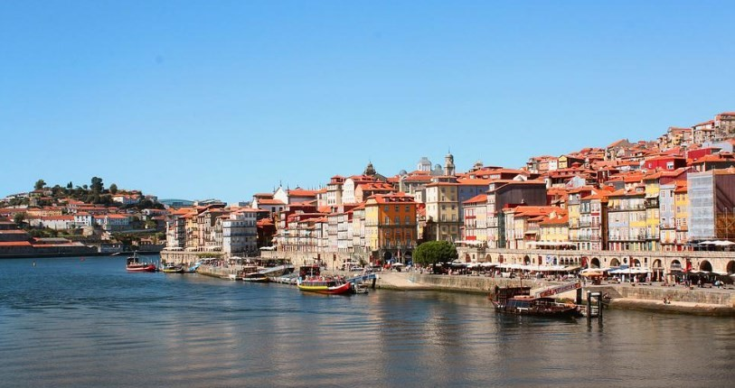
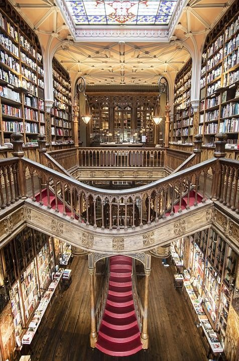
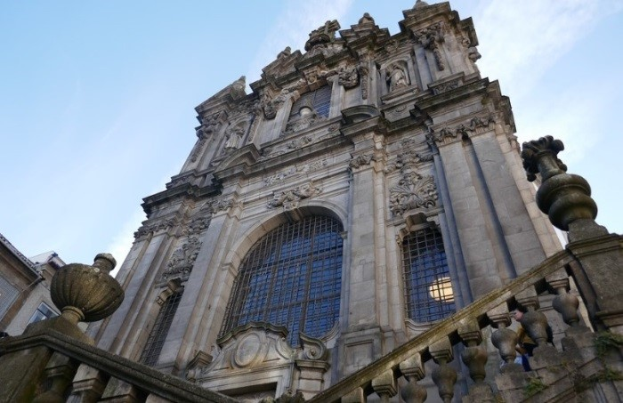

# 🚢 Porto

Porto is one of the most surprising and charming cities in Portugal, known for its famous wine and for the bridges that pass over the Douro River. It offers you a large number of tourist activities such as strolling through the Ribeira towards sunset, visiting the Bolhao Market, climbing to the top of the Clérigos Tower, watching the sunset over the Luis I bridge, tasting a Bacalhau a Brás or a francesinha or drink a glass of wine in any of the Vila Nova de Gaia wineries, are just some of the many activities you can do in Porto.

We will provide you with a guide to the most emblematic places that you should know if you visit this beautiful city.

## Lello and Irmão Bookstore

This bookstore is located in a neo-Gothic building built in 1906 and is considered one of the most beautiful in the country. It stands out for its impressive wooden staircase and the natural light that passes through the stained glass window located on the ceiling, inside you can enjoy a large number of modernist and neo-Gothic details.

## Clerigos Church and Tower

The Clérigos Church was built between 1735 and 1748 on the Cerro de los ahorcados where the executions were carried out, it has a 76 m high tower and when you climb its 240 steps you can see its 49 bells. Although it is true that it requires a good physical effort, it is worth going up for the privileged views that you will get of the city.

## Ribeira

The walk known as Cais de Ribeira is one of the busiest and most famous places in the city, where you can see buildings with colorful facades and terraces full of people who gather, either to have a glass of good Port wine. or eat excellent cod with views of Vila Nova de Gaia and the Duero.

During the walk you will see several rabelos, which are the traditional Portuguese boats, which are in charge of carrying the wine barrels from the vineyards to the cellars that are in Vila Nova de Gaia. You can also book a Douro river cruise that goes under the 6 main bridges of the city and once you get off the boat, you will be very close to the Casa do Infante, built in 1325 and the birthplace of the discoverer Enrique el Navigator.

## The Porto Cathedral

The Porto Cathedral located in the Batalha neighborhood, is the most important religious temple in the city. This church built in the 12th century has a sober exterior, but inside you will be surprised by its beautiful cloister decorated with 14th century tiles in the Gothic style, where religious scenes are shown and you can access the Casa do Cabildo, where you can find objects religious that are considered as the treasure of the cathedral.

In the Plaza de la Catedral you can see a column that was used in the past to execute criminals, as well as a fabulous terrace where you can get magnificent views of the city. Another of the important churches is San Lorenzo dos Grilos, located near the cathedral. It was built between the 16th and 18th centuries and stands out for housing the Museum of Sacred Art and Archeology.

## Do Barredo neighborhood

This neighborhood is located between the cathedral and the banks of the Duero River, where you can find the true essence of the city. In this area, the Torre do Barredo, the Ruas Das Largas, the Miradouro da Rua das Aldas, Largo da Pena Ventosa and the Escadas do Barredo stand out.

## Street of the Flowers

Rua das Flores is one of the most beautiful streets in Porto, lined with historic buildings, cafes and iconic shops such as Mercearia das Flores which specializes in Portuguese products. At the end of the street is Miradouro da Vitoria, which is an excellent viewpoint of the city. In this street you can try the delicious local cuisine such as Bacalhau a Brás or Francesinha in Petisqueira Voltaria, you can also eat at the restaurant O Buraquinho da Sé its famous Octopus al Lagareiro.

## Bolhao Market

Mercado do Bolhão opened its doors in 1914 and reopened in 2020 after an excellent restoration. There you can find all kinds of stalls to buy quality products such as meat, fruits, vegetables, fish and even flowers, there are also stalls where you can try the local food.

## Rua Santa Catarina

Santa Catarina street is located near the Bolhao market starting from Praça do Marquês de Pombal until you reach the Majestic café. This is the commercial street in the center of Porto where you will find several shops, restaurants, a shopping center and several tiled churches, such as the beautiful Chapel of Souls or the Church of Santo Ildefonso, as well as the beautiful facade of A Perola do Bolhao where they sell sausages and the impressive building of the Sao Joao National Theater.

## Stock Exchange Palace

The Palacio de la Bolsa was declared a National Monument and this neoclassical-style building has a large central patio inside, protected by a glass structure where natural light passes through. If you go up to the second floor through its marble and granite staircase you will find several beautifully decorated rooms such as the Golden Room, the General Assembly Room, the Renaissance-style Court Room and the Arab Room that was inspired by the Alhambra.

## Church of San Francisco

The Church of San Francisco built in 1245 is located next to the Palacio de la Bolsa. Inside you will find three baroque-style naves covered with golden carvings, for which they had to use about 300 kg of gold dust, you will also find the sculpture of the Tree of Jesse and finally, the catacombs.

## Vila Nova de Gaia

In Vila Nova de Gaia there are the Port wine cellars, where you can learn about its production process. Among the best known wineries are Croft, Cálem, Sandeman, Ferreira and Graham's, at the end of the guided tour in any of these wineries they will give you to taste some of their wonderful wines. At the end of the visit you can take the cable car at the Dom Luis I bridge station and go up to Jardim do Morro, to enjoy excellent views of Porto.

## San Bento Station

Even if you don't have to travel by train, it's worth visiting this station built at the beginning of the 9th century and decorated with more than 20,000 tiles that reflect the country's history.

## Porto Walls

The old medieval wall that surrounds Porto is also known as the Fernandina Wall, it has some very well preserved sections such as the one between the Luis I bridge and the Santa Clara Convent, the other interesting piece is in the Escadas de Caminho Novo where you will have a beautiful panoramic view. Another wall is the Primitive one that surrounds the area of the cathedral, it was built in the 3rd century and also has a well-preserved section.

## Crystal Palace Gardens

This Romanesque-style park has many interesting sites such as the Emílio David Garden, the Castaños and Tilos avenues, several thematic gardens such as Medicinal Plants, Aromatics, Feelings, Roses, among others.

The city of Porto is much more than the wine it produces, it has endless interesting things to discover.

## About the Author

Idais, Graduated in Mechanical Engineering, and a master’s degree in teaching component, she gave classes in several institutes of mathematics and physics, but she also dedicated several years of my life as a television producer, she did the scripts for mikes, the camera direction, editing of video and even the location. Later she was dedicated to SEO writing for a couple of years. She likes poetry, chess and dominoes.
