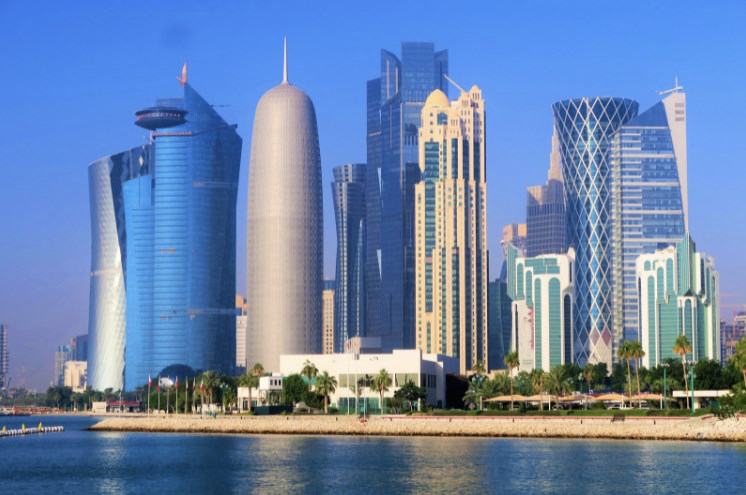
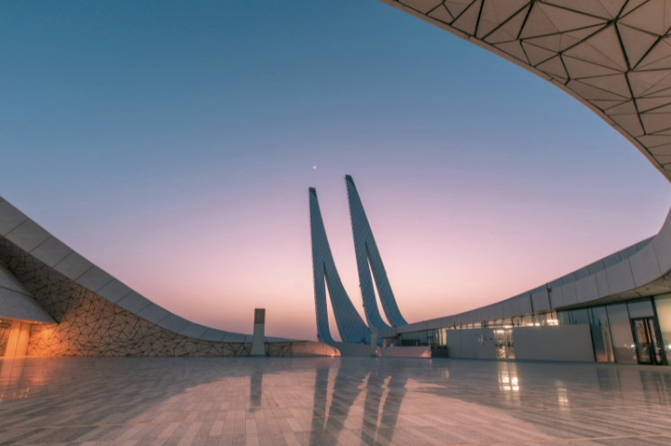
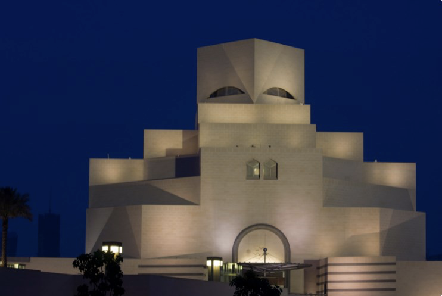

# Qatar

The world gives us the opportunity to discover fantastic destinations where some of them seem to be taken from a fairy tale. In hindsight, Qatar was a sparsely developed and sparsely inhabited desert, but this small part of the world has become a highly visited place for tourism in recent years and this tells us how a good conglomerate of effort can definitely change destiny from a town.
Qatar is a sovereign Arab state that is located in western Asia and has a single border with Saudi Arabia, since the rest of the territory is bathed by the waters of the Persian Gulf. This country has the third largest natural gas reserve in the world and that is why Qatar has the highest per capita income in the world, and is also the nineteenth most peaceful country on the planet.
Currently this country is internationally recognized as a tourist destination that not only has endless luxurious spaces, an architecture that intertwines cultural roots with the latest trends and without a doubt there is much to see in Qatar, if you visit we are going to name the most important sites and that you should not miss.

## Katara Cultural Village

The Katara Cultural Village is a village located in Doha, which is the capital of the country and its most populous city. This is a cultural village where you can find a large number of interesting artistic spaces within the city and you will be impressed with its architecture, where you can observe the entire heritage of the Arab peoples. One of the most relevant spaces in Katara is its mosque, since it is characterized by its multiple uses. This mosque is used as an opera house, an open amphitheater, a multi-purpose cinema, a conference hall and a souk. As you can see, this mosque is a celebration of the local religion and culture. Starting with its architecture, its splendid finishes and its religious importance, it is definitely one of the places you must visit in this brand new capital.

## Doha Museum of Islamic Art

In Doha there is also the Museum of Islamic Art, which is the main institution when it comes to promoting and protecting Islamic art in the region. The room not only has amazing architecture, but also houses jewels and secrets that are much more impressive than the building itself. The structure of the museum was designed by the North American architect Leoh Ming Pei and the museum was inaugurated in 2008. Although it is true that the collection is not exactly very extensive, it does contain works of art of a very high quality and therefore, it is one of the leading museums of Islamic art in the world.

## National Museum of Qatar

The National Museum of Qatar is another of the wonderful cultural spaces and its building, which was designed by the French architect Jean Nouvel, is really another work of art. The museum was inaugurated in 2019 and the tour of its rooms is an enriching experience, since it has various artists and themes where you can see the traditions of the locals. In addition to being able to observe a pleasant account of the accelerated change and modernization of this great country.

## The Pearl Monument

The Pearl Monument recalls the ancient times of the country where its main source of income was the sea, from where they obtained food and jewelry. Today its income comes mainly from gas and oil, but Qatar tries to keep its roots and makes a special effort to do so through The Pearl Monument. In large part, it is a commemoration of all those people who lost their lives searching for pearls at the bottom of the sea.

## Aspire Park

The Aspire Park has 88 hectares of green areas that are the main lung and the largest park that exists in Doha. In a city that is filled with towering skyscrapers, you can relax in the middle of the city in this beautiful space. On the other hand, there you will find numerous attractions such as fountains, playgrounds for children and one of the few lakes that you can find in this country. It even houses several of the most famous works of art you can find in Qatar.

## Imam Muhammad ibn Abd Al Wahhab Mosque

Although it is true that the name is long and very confusing, this is another of the most important and wonderful mosques in both the country and the region. It is named after an important Muslim scholar and preacher, and is considered the national mosque of Qatar. It is one of the most important religious structures, so it occupies an area of ​​approximately 175,000 m² and was designed to accommodate up to 11,000 people to pray, as you will see it is a first-class religious site that you must visit.

## MIA Park

The MIA Park is another of the places that Daha offers you to contemplate the world without worries. It is a park that is located next to the Museum of Islamic Art where you will find various activities to do and enjoy within it.

## Doha Golf Club

Doha Golf Club is another of the places you should visit in Qatar. If you are a golf fan you will enjoy it to a great extent, but even if you do not have a greater interest in this sport, it is still a wonderful place that you must visit. This golf course was one of the first built in the Middle East, so it is not only important from a sporting point of view, but also from a historical point of view.

## Aqua Park Qatar

Aqua Park Qatar is a place where you can have fun with the whole family, especially if you have children. This park has multiple water attractions, giant slides, pools of all kinds and endless activities that will not leave you wanting to leave this fabulous park. It is by far one of the most fun-filled adventures you can enjoy in this great country.

## About the Author

Idais, Graduated in Mechanical Engineering, and a master’s degree in teaching component, she gave classes in several institutes of mathematics and physics, but she also dedicated several years of my life as a television producer, she did the scripts for mikes, the camera direction, editing of video and even the location. Later she was dedicated to SEO writing for a couple of years. She likes poetry, chess and dominoes.
Qatar, a little piece of heaven in the world!!!
