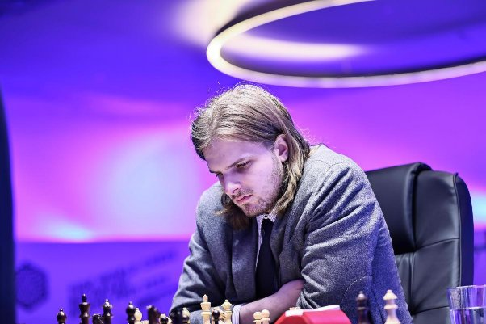

# ♟️ Richard Rapport wins the second leg of Grand Prix: Almost qualified for Candidates

In the finals of the second leg of the Grand Prix, chess fans witnessed a match between Hungarian GM Richard Rapport and Russian GM Dmitry Andreikin. Andreikin beat Anish Giri in the semi-finals in a very exciting tie- breaks game where Giri was having an overwhelming position but in a very crucial moment Anish blundered and Andreikin did not miss the opportunity and made his way to the finals. While Richard Rapport defeated Maxime-Vachier Lagrave. MVL had some chances but could not channelize his advantage into win. With this loss, the chances of MVL almost came to an end, but with good tiebreak score and win in the last Grand Prix series is only way.  

> Richard Rapport:credits World Chess   

In finals, the two classical games were fighting chess but Rapport showed his creative genius and won the match. This Grand Prix win gave Rapport 13GP points and it is almost certain that Rapport qualifies for Candidates. Rapport can only miss his spot to candidates only if Anish Giri, Leinier Dominguez, or Maxime Vachier-Lagrave win the tournament for Rapport to be disqualified and only if one of these players outscores him on tiebreak criteria.   

Richard Rapport did not shy away from showing his usual creative playing style in the first two legs of the Grand Prix, and has demonstrated thathe is particularly well versed in dealing with imbalanced and sharp positions.  

In the second game of the final match in Belgrade, Richard Rapport had the white pieces and managed to get Andreikin spending considerable amounts of time from as early as move 5. A tense and complicated game in the opening and early middlegame gave chances to both players as the time control was approaching. On move 26, the contenders began to repeat moves, signalling an implicit draw offer. After the same position appeared twice on the board, though, Rapport decided to take his chances by deviating into a double-edged struggle — despite only having two minutes on the clock with over 10 moves to go to reach the time control.   

The brave decision paid off. Andreikin soon faltered, and Rapport made the most of his chances in an excellent display of calculation and technical abilities to take home tournament victory, €24,000 in prize money and a near-certain qualification to the Candidates.  

## About the Author

Jashwaneel Patil is a student pursuing Bachelor of Engineering in Electrical and a young mind who likes to explore and research in different areas. His vision lies in making Earth to make a better place to live with taking small steps towards sustainability and making best use of technology available to make easier life for mankind.
