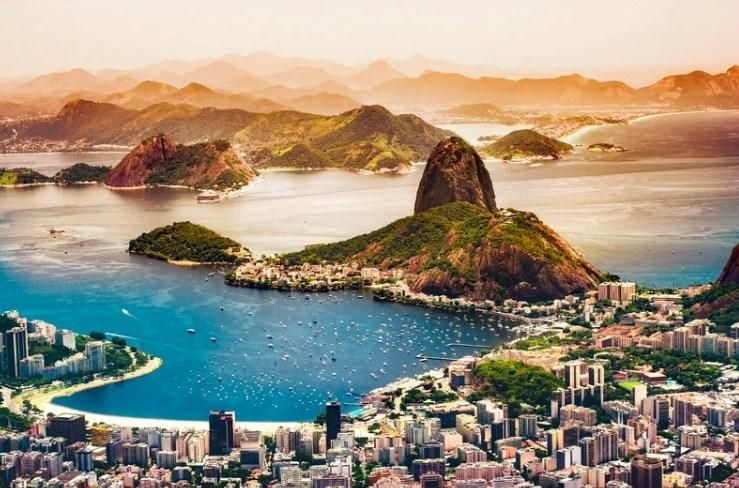
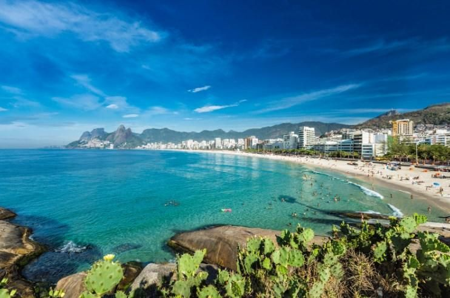
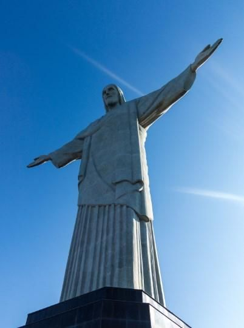
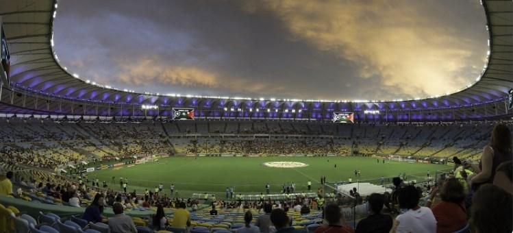

# Rio de Janeiro

Rio de Janeiro is one of the most colorful cities in Brazil, famous for its tremendous carnivals and is a destination as diverse as it is fascinating. It is the second city with the largest population and the most touristic in the country, known throughout the world for its cultural and sports icons, its landscapes and its passion for life.

If you want to enjoy Rio de Janeiro to the fullest, we are going to guide you through this article so that you do not miss the most emblematic places of this wonderful city. From the beaches to the most authentic neighborhoods and from the forests to the hills.

## Ipanema and Leblon Beach

Although it is true that Ipanema is a place better known for its beach, its neighborhood is one of the most exclusive in the city and is full of great joints and fashion stores. You can enjoy its spectacular beach or if you prefer to surf, the recommendation is that you go to Leblon beach. However, one of the best panoramic views of Rio de Janeiro is at the Leblon viewpoint, where you can appreciate the entire coastline and drink some cocktails at dusk.

## Rodrigo de Freitas Lagoon

This lagoon is located near Ipanema and is one of the most beautiful natural sites to see in Rio de Janeiro. It is a huge mirror of water where the soul of the city is reflected and is surrounded by more than 7 km of a route that you can travel by bicycle or on foot, you will also find many beach bars where you can have a caipirinha or any other cocktail.

## Copacabana

This beach has 6 km long to swim where the locals call the Princess of the Sea, being one of the most touristic and charming places in the city. You can also walk the bohemian streets of the neighborhood to taste Brazilian cuisine and learn about the customs of the Cariocas.

## Lake Park

Park Lake is a delight for nature lovers, as well as being a site adored by its local inhabitants. There you can find small lakes, English-style gardens and a beautiful mansion that houses the School of Visual Arts where you can enjoy performances and free art exhibitions. In addition to observing the landscape, you will be able to see toucans and monkeys among the foliage.

## Corcovado and Christ the Redeemer

The most emblematic place in Rio de Janeiro is located at a height of 709 meters above sea level, where Christ the Redeemer is located at the top of Mount Corcovado. It is a 30 m high Christ with its arms open to receive the thousands of tourists who go up to see it every day next to the viewpoint that is at its foot, where you can have a 360 ° view of Rio de Janeiro. You can go up by taxi, but there is also a funicular that leaves every 30 minutes from Cosme Velho.

## Bread of Sugar

The "Bread of Sugar" is a 338 m high rock that is located in the Guanabara Bay, surrounded by nature and can be seen from anywhere in the city. The best way to go up is using the cable car that you can take every 20 minutes. You will travel 1400 meters between the hills of Babilonia and Urca, to find yourself with one of the most impressive views of Rio de Janeiro and the Bay.

## Santa Teresa neighborhood

Barrio Santa Teresa is a colonial area where you can get on the electric train or try delicious traditional food in Largo de los Guimaraes. Its beautiful colonial streets at the top of a hill, together with an artistic atmosphere in the Parque das Ruinas, offer you an unforgettable experience. It is important that you get to the neighborhood of Lapa where you will find the Selarón stairs, there are 250 colorful steps that will give you the feeling of having a work of art on your feet.

## Maracana

The Maracana is one of the most iconic football stadiums in the history of this sport and one of the most important places to visit in this city. It is advisable to see a game between the teams from São Paulo and Rio, in addition to the fact that around it there is a walk of fame offered to the greatest soccer players in history.

## Museum of Modern Art (MAM)

The MAM is the cultural reference of the city and probably of all of Brazil, there you will be able to see an endless number of artistic creations from both established local painters and promises of Brazilian art. The construction of the building was designed by the architect Alfonso Eduardo Reidy and is a true work of art.

## Tijuca Forest National Park

This national park has 28 km² of extension that includes the mountains and coastal hills of Rio de Janeiro and is considered the largest urban jungle on the planet. Inside there are rock formations such as Pedra de Gávea or Corcovado, with an exceptional panoramic view and it is also home to countless species of both animals and plants, it has a large number of natural fountains and waterfalls that will leave you breathless.

## Museum of Contemporary Art of Niterói

The Niterói Museum of Contemporary Art is located in a futuristic building designed by the genius Oscar Niemeyer, located on a cliff of Guanabara Bay. This construction of sinuous forms invites you to see some of the most creative and innovative exhibitions in Brazil, a magical and wonderful place.

## Botanical Garden

This garden is an oasis of tranquility built at the beginning of the 19th century in order to store plants and seeds to acclimatize them to the tropics, with an impressive avenue of palm trees you can see toucans, hummingbirds and poised falcons. It also has an Orchid Garden with more than 1,000 different types of tropical orchids and the largest water lily in the world.

## National Museum of Fine Arts

This museum houses the most complete collection of Brazilian art in the country, it has more than 20,000 works ranging from classical art to the Brazilian avant-garde and you will be able to see the history of Brazil through the eyes of its most outstanding artists, where you will understand the idiosyncrasy of the Brazilian people.

## Sao Bento Monastery

This monastery is a reflection of the Brazilian baroque and represents the work of various local artists for 70 years, you will be able to see vaults, paintings and columns to consecrate the Virgin of Monserrat.

## Favelas

The favelas are the other face of this city where you can see the life in the commune of the traditional cariocas, the most important are the Santa Marta favela, the Cantalago favela for its excellent views, in the Tavares favela you can find live music and in Vidigal there are pensions, restaurants and bars for tourists.

Rio de Janeiro, an exotic city to enjoy!!!

## About the Author

Idais, Graduated in Mechanical Engineering, and a master’s degree in teaching component, she gave classes in several institutes of mathematics and physics, but she also dedicated several years of my life as a television producer, she did the scripts for mikes, the camera direction, editing of video and even the location. Later she was dedicated to SEO writing for a couple of years. She likes poetry, chess and dominoes
