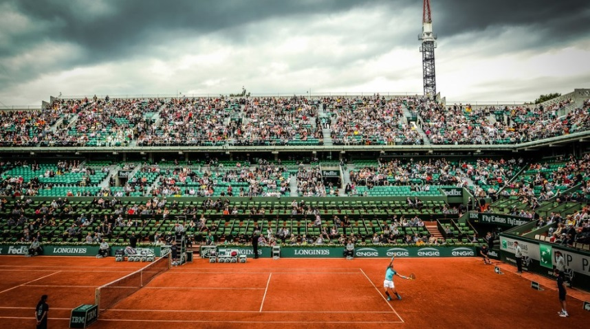
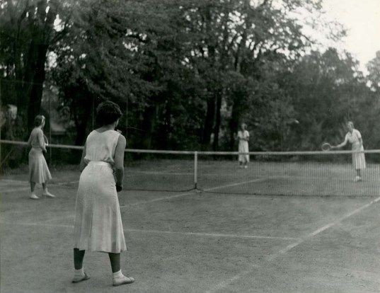
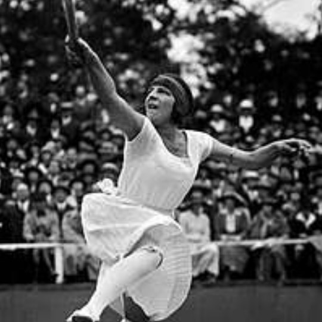
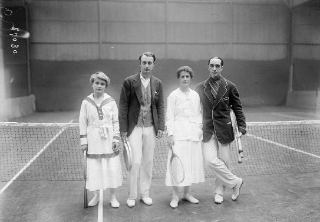
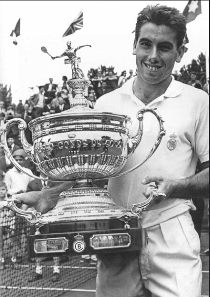
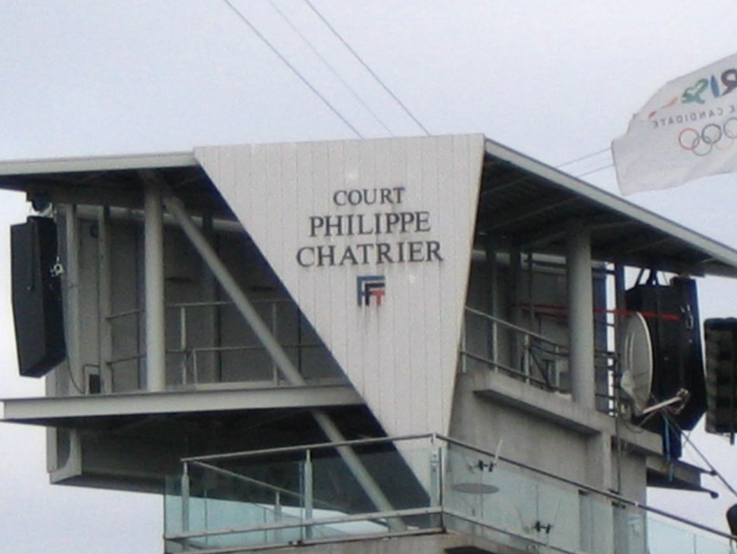
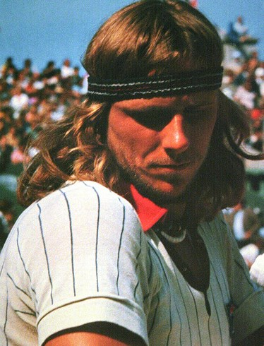
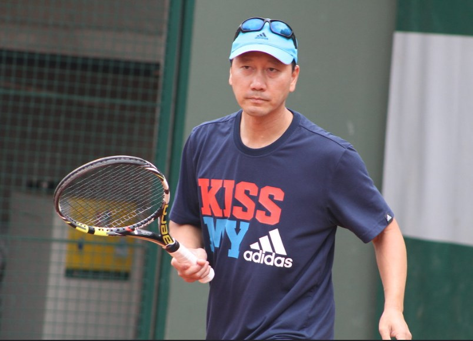
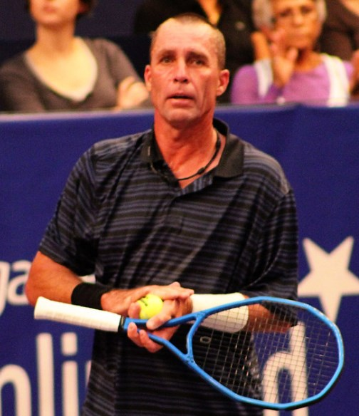

# 🎾 Roland Garros

The French Open is known as Roland Garros whose name comes from the
homonymous French aviator and is one of the tournaments that make up the
Grand Slam. It was inaugurated in 1891 under the protection and
organization of the French Tennis Federation, also known by its acronym
as the FFT. The Roland Garros is the main tennis tournament in the world
that is played on red clay and in chronological order, it is the second
of the Grand Slam after the Australian Open and the predecessor of the
Wimbledon championship, the last tournament being the Open of USA.

 The Roland Garros lasts two and a half weeks starting at the end of May
in Paris (France), it is competed in the infrastructure of the Stade
Roland Garros complex and the final of the tournament is played on the
Philippe-Chatrier center court, which has a capacity of up to 15,059
spectators, being of course the one with the largest capacity among all
the 19 courts that the venue has. This construction was achieved thanks
to the feat of four French tennis players who won the Davis Cup in the
1927 edition, also called \"The Four Musketeers\", their commemorative
statues that recall the event can be seen inside the complex.

 

 Without a doubt, it is one of the oldest and most important tennis
tournaments in the world, one of its main characteristics being that the
competition is held on clay, generating a slow game on this type of
surface. In the men\'s category, in the case of reaching the five sets
tied, a tiebreaker is not played but you have to win by a difference of
two games. Due to this and other characteristics, many consider it to be
the toughest and most demanding tournament, which is why it demands
greater physical and mental effort from the player, along with
Wimbledon.

 The Spanish Rafael Nadal is the tennis player who has won this
tournament the most times in the men\'s singles category, specifically
with 13 victories; followed in the previous period called the French
Championship by Max Décugis (French) with 8 wins. In the women\'s
singles category, the American Chris Evert was the one who was
proclaimed champion 7 times.

 

Photo of Rafael Nadal taken by Laurent and extracted from flickr

 The complex was remodeled in 2020 where the facilities were improved at
a general level and the capacity of the central court was increased, in
addition a retractable roof was placed to avoid the inclement weather
that has been common in recent years.

## Historical background

Most historians say that tennis began in France in the 12th century,
when the French hit a ball with their hands, in a very similar way to
the popular Basque ball at the time. However, something similar to a
racket did not begin to be used until the 16th century, although it is
true that it was more similar to a shovel, the game began to be called
tennis. Although this sport was played in closed areas where the ball
was capable of hitting the wall and therefore, it was still similar to
Basque sport. It was widely practiced among people of high rank and
among royalty, with the monarch Henry VIII of England standing out in
this sport, which is why historians cataloged those first practices as
royal tennis.

 Subsequently, several evolutions were added where a racket was finally
included as it is known today, and the game was moved abroad. The first
tennis club was founded in 1872 at the Leamington Spa and five years
later it was when the Wimbledon Championship began in London, being the
oldest of the current and current tournaments, where it was possible to
standardize the rules of tennis.

 This sport was very popular in France where a competition called the
French Championship (French Open) was inaugurated in 1891. This open
joined those already existing at that time such as the Wimbledon
Championship and the Open of USA. Later in 1905 they were joined by the
Australian Open, these four tournaments became the most prestigious
meetings in this sport and currently maintain that same status and are
known as the Grand Slams or \"The Big Four\".

## French Championship

As we have mentioned, the precedents of this prestigious tournament date
back to the year 1891 when a national tennis tournament began in France,
specifically in Paris and governed by the Union des sociétés françaises
de sports athlétiques (USFSA), an organization in charge at that time of
sporting events in the country. At first, the tournament could only be
played by tennis players who belonged to the French sports club called
the Racing Club de France and the venue for the tournament was the
club\'s own facilities.

 The first champion of the French Championship and to everyone\'s
surprise, given that it was a French domestic tournament, was the
British H. Briggs in the individual modality, who was able to
participate thanks to his status as a member of the club and defeated
the French P. Baigneres also won the locals T. Legrand and B. Desjoyau
in the doubles category. Only five players participated in that edition
and under an amateur character, although it is true that it had little
impact, as we already know it has been increasing over time.

 In order to gain greater importance and projection, women were allowed
to participate in the 1897 edition, where Françoise \"Adine\" Masson,
who was the daughter of the founder of the Paris Tennis Club, became the
first woman winner of the French Championship, by beating her compatriot
Suzanne Girod in two sets with a score of 5-3 and 6-1. While the mixed
doubles modality was introduced from the 1902 edition and the women\'s
doubles, it was included as a modality for the first time in 1907.

 In the first edition of the women\'s modality, only three players
participated and at the time they had to meet certain requirements
regarding clothing, requirements that were highly regulated. \"Adine\"
Masson managed to win the tournament five times and was the most
successful player in this tournament, until in 1926 she was surpassed by
her compatriot Suzanne Lenglen. It should be noted that Lenglen\'s
record was somehow considered more relevant, since he had to conquer it
in each of the editions, unlike Masson, who in some of the editions did
not have any rival, since it was the the only one that had registered in
the championship.

 

 The championship continued exclusively for club members and it was not
until 1925 that the rules of participation were regulated and opened to
any foreign player. That is why the championship changed its name and
still exists today as the International Tournament of France Roland
Garros, also known as the French Open and popularly known as Roland
Garros.

 In the first editions of the championship and in parallel, the World
Hard Court Championships were held using the sports facilities of the
Parisian Stade Français club, which also alternated on occasions as the
venue for the French Championship together with the Racing Club
facilities. From 1912 to 1923, its clay courts uninterruptedly hosted a
tournament considered by some fans and critics as the forerunner of the
famous French international tournament. Among the winners of this
tournament, the New Zealander Tony Wilding and the American Bill Tilden
stand out as the number 1 in the world at that time. However, thanks to
the Olympic Games held in the French capital in 1924, it was seen how
the tournament reached its culmination. It was then that the former
French Championship increased its category designated by the
International Lawn Tennis Federation (ILTF), currently known by all as
the International Tennis Federation (ITF) and of course, the
aforementioned participation of amateur foreigners was allowed, being In
addition, the land located in Saint-Cloud where the Stade Français
facilities were located, the new headquarters of the 1925 edition, so
that both venues alternated until the aforementioned year of 1928.

## The Four Musketeers

The achievement obtained by Lacoste, Cochet, Borotra and Brugnon by
winning the Davis Cup in 1927 against the powerful United States team,
generated the construction of a venue to host the tennis matches of the
Parisian tournament. Under the name of Stade Roland Garros it was opened
in 1928 to honor the legendary aviator Roland Garros, who was so fond of
this sport. The aforementioned tennis players managed to successfully
defend the title won the previous year in Philadelphia for a period of
five consecutive years, but this time in the new venue located in Porte
d\'Auteuil which is in the Arrondissement district of Passy. It is
important to emphasize that the four musketeers not only won the
tournament in the individual modality, but also in the doubles
tournament.

## Professionalism and the "Open Era"

In subsequent years, professionalism was gaining strength among the
great players, however many of them tried to hide it to continue
attending the famous French tournament, while others simply had to give
up their participation. That was the case of the aforementioned Suzanne
Lenglen who could not participate after her last title in 1926, which
led to her withdrawal a little later. It was then that the tournament
had to face its worst years, in view of the problems caused by World War
II and, of course, it was interrupted in the same way that it happened
in the previous war.

 

Suzanne Lenglen

 After the war the tournament was resumed in 1946 after the Wimbledon
Championship had been held, becoming the third Grand Slam tournament for
this year, at that time a player was not seen who would dominate the
tournament until the Frenchman Max Décugis managed win eight
championships.

 

Golding, Laurentz, Beamish, Decugis

 During the decade of the 60s, two important moments stood out, the first
was in the 1962 edition when Rod Laver from Australia not only won the
record, but the same year he managed to win the Grand Slam of trophies,
this was repeated 7 years later and is the only tennis player to achieve
this feat twice. In 1968, the pressure of the promoters and the sporting
and economic differences between professional players and amateurs were
felt at the inauguration of the Open Era. The main idea was that all
players could compete (without exception) in any tournament, this
definitely led to greater equality, where great players were able to
enter the competition and under that premise, the French championship
was the first Grand Slam in accept the new regulations.

 At that time, a total of 10 tennis players of different nationalities
won the men\'s singles category. The Spanish Manolo Santana won his
first title after beating Nicky Pietrangeli (Italian) in the final in
the 1961 edition. Santana won the first of the 16 titles of the
championship, which a player of Spanish nationality would achieve until
today. . It is no secret to anyone that the Spanish have been historical
leaders in this competition, in fact, they are five times ahead of the
Australian and American players, surpassing the Swedes and the French
hosts by six.

 

Photo of Manolo Santana taken by Banco Sabadell extracted from fickr

 The members of the World Championship Tennis (WCT) and the National
Tennis League (NTL) (predecessors of the Association of Professional
Tennis Players in force today) were dealing with the troubled panorama,
where there were vetoes in the participations and some initial problems
of the Open Era, to such an extent that the French tournament bore the
consequences, which is why no independent tennis player appeared in the
1970 edition. To avoid the threat and control of many promoting
organizations, the ILTF decided to intervene a couple years later to
normalize the situation, he then decided to stop a circuit capable of
regularizing the participation \"El Grand Prix\" and thus Roland Garros
was included within the new circuit.

 A short time later, the most competitive period of professional tennis
would arrive, where new players would go down in tennis history both
worldwide and in the particular tournament won at that time.

## The ATP protects new talents

There were still some conflicts that raged for a few more years, between
the WTC (which had absorbed the NTC) and the ILTF, thus depriving the
French tournament of some of the best tennis players of the time.
However, other talents emerged for the enjoyment of the ever-increasing
number of fans. Although it is true that both organizations had
disagreements and many disputes to maintain control over the famous
sport. In the same way, there was a boom and expansion stage, so given
the delicate situation, the tennis players themselves decided to form a
union among the players, in order to protect their own interests against
associations and promoters, thus it was born in September 1972 the
Association of Professional Tennis Players (ATP).

 For the year of 1981, new prizes were presented in the tournament such
as the Orange Prize, which was awarded to the player capable of
demonstrating the best sportsmanship and the most cooperative attitude
with the press. For the player with the strongest character and
personality, the Citron Award was created, in addition to the Burgeon
Price, which was awarded to the revelation player of the year.

 To honor the organizer of the Davis Cup, the main field of the venue was
named Philippe-Chatrier Stadium in 1988.

 

Court Philippe Chatrier photo taken by Mathieu Marquer from fickr

 Another novelty was that as of 2006 the tournament begins with a
schedule of 12 games starting on Sunday and they are played on three
main courts. Additionally, on the eve of the opening of the tournament,
the traditional Benny Berthet fair is held, in order to obtain profits
and allocate them to different charitable associations.

 As of March 2007, an equal amount is delivered for the first time in
history, both for male players and for female players.

## Old venues

Since the French international tournament was created in 1891, it moved
through four different venues until it reached the Stade Roland Garros,
where it finally settled.

 In the year 1909, the tournament was played at the Société Athlétique de
la Villa Primrose, which was in Bordeaux, although it is true that it
was only played there during that year, the championship was held on the
characteristic clay soil and that the tournament would never abandon in
hereafter

 The Paris Tennis Club was the oldest of the venues in Auteuil, until it
was moved in 1928 to the premises inaugurated in commemoration of the
four French tennis players who won the Davis Cup the previous year.

 The Suzanne Lenglen stadium or track was named in this way, in honor of
the emblematic player capable of winning the tournament six times. This
court is the second in importance and in terms of the capacity of the
venue, this tennis player obtained the absolute record of titles when
adding all the categories, for a total of 15 conquests between the years
1919 and 1926.

## Track 1

This track, also called Court 1, is the third stage of the venue when it
comes to capacity and importance. In the annexes of this track is the
famous Plaza de los Mosqueteros since 1989, in honor of the four famous
tennis players. In the center of the square there are four bronze
statues, to honor each of the musketeers who won the Davis Cup in 1927
and knew how to defend it during the following five editions.

## Attached tracks

The rest of the sports complex has a total of 16 tracks called annexes,
which of course have less capacity than those previously named. In the
first days of the tournament the number of matches is very high, so that
all the adjoining courts are used, thus allowing a quick and comfortable
course of the tournament.

 Once the players are organized according to their number in the
tournament\'s seeding, the competitors play on the successive courts
until the end of the championship, which takes place on the center court
of the venue.

 The tracks are numbered from 2 to 12 and then from 14 to 18, to complete
19 tracks in total, to which 3 more tracks should be added that are
intended for other practices. A curious fact is that there is no track
number 13, for a simply superstitious reason.

## Modernization project

The French Tennis Federation (FFT) stated in 2009 the poor state of the
French Open venue when compared to the rest of the Grand Slam tournament
venues. For this reason, the French organization hired the architect who
designed the Deux Rives Footbridge (a pedestrian bridge in Strasbourg),
named Marc Mimram, who was in charge of designing a significant
expansion of the Roland Garros complex. This remodeling also involved a
complete new lighting system, a retractable roof was added to the
Philippe-Chatrier main court, among other improvements.

 However, there were differences between the Council of the Municipality
of Paris and those involved, this caused the FFT to announce the
possibility of an alternative plan to move the tournament to a new
location. In view of this consideration, a total of 55 new proposals for
venues to host the tournament on the outskirts of the city were put
forward.

 It was finally agreed in February 2011 to keep the French Open in its
current location, but the capacity had to be increased by 60% and a
series of improvements were scheduled for subsequent years.

## Surface characteristics

The clay courts or courts produce a slowdown of the ball compared to the
courts of other surfaces such as grass, cement, synthetic floors, the
latter being classified as hard and fast surfaces. That is why the red
clay courts reduce the advantage of those players whose style is based
on the well-known serve-volley tactic, thus allowing baseline players to
dominate on this type of surface.

 

 A great example of the aforementioned considerations is the great former
American tennis player Pete Sampras who was able to win 14 Grand Slam
tournaments, being number 1 in the world for 218 weeks in total. He is a
highly admired tennis player for his powerful serve, however, he could
never win the French Open and in fact, it was the only Grand Slam
tournament that resisted him. Along with Sampras, another large number
of famous players and tournament winners among the big four stand out
and who ultimately could never obtain the French tournament cup, among
them we can name Boris Becker, Jimmy Connors, Martina Hingis, Lindsay
Davenport and Stefan Edberg. This shows that for many this prestigious
tournament has a greater difficulty. But there are also other players
whose styles are more suitable for this surface, such as Chris Evert and
Rafael Nadal, where both players had great success in this tournament.

 

Photo of Chris Evert taken by Tomas Flint taken from fickr

 The Wimbledon championship has significantly different characteristics
to its predecessor of the Grand Slam, since on a grass surface the
conditions for the player are very different. That is why these
differences mean that winning both tournaments and also consecutively,
is definitely one of the greatest challenges that a player can have in
the world of tennis. In the open era, only five players were able to win
both the French Open and the Wimbledon championship in the same year.
These players were Rod Laver from Australia, Björn Borg from
Switzerland, Rafael Nadal from Spain, Rogers Federer also Swiss and the
Serbian Novak Djokovic, it should be noted that all these players were
at the time number 1 in the world.

## Awards

The Roland Garros tournament establishes a prize for the winners of
individual tournaments in the amount of €2,200,000, being the same
amount of money for both men and women since the 2007 edition.

 The total amount of the prizes for the year 2012 was €18,718,000, while
for the year 2018 the budgeted amount exceeded 39 million euros.

## Trophies

All the trophies that the organization gives to the winners are made of
silver and their decorations on the sides are also silver. It should be
noted that the names of the winners are inscribed on the trophies, as
well as the year of the conquest, so that they last for posterity. Each
winner is also awarded a smaller replica of the trophy won, made from
the same material as the original trophies.

 Rafael Nadal received an exact replica of the original size of the
\"Musketeers Cup\" trophy in 2017, for having won the tournament 10
times. It is important to emphasize that no tennis player had performed
this feat in any other tournament in the world so the organization
wanted to award him as the best clay court player in the entire history
of tennis.

 

Photo of Rafael Nadal taken by mariampais extracted from flickr

## Historical background of titles

 Since the tournament was created in 1891, there have been a total of 60
different players in the men\'s singles category, for a total of 112
editions.

 In the period between 1891 and 1968, Frenchman Max Decugis stood out in
the Pre-Open era by winning eight titles when it was still called the
French Championship. But not only that, the French were the most
successful at that time with a total of 37 titles. Later in the Open
Era, that is, from 1968 to the present day, the Spanish Rafael Nadal
continues to be the most successful, who was able to contribute 13
titles to the Spanish nationality. On the other hand, the Spanish were
the most awarded, winning a total of 19 Roland Garros championships,
including the winners Costa, Gimeno, Ferrero, Moyá and the two from
Bruguera. In the same way, the French Suzanne Lenglen stood out in the
women\'s category with 6 titles and contributed significantly to her
country being also the most successful with 29 titles in the Pre-Open
era and in this modality. On the other hand, the American Chris Evert
won 7 titles in the Open Era and the United States is the most
successful country in this Open Era with 14 titles.

 Although it is extremely difficult to repeat as individual champion in
this tournament, we can mention four tennis players who have managed to
conquer the Roland Garros tournament consecutively and for four years.
In the female category we can mention the French Suzanne Lenglen and
Jeanne Matthey, while in the male category the Swedish Björn Borg and
the French Paul Aymé achieved it. However, the Spanish Rafael Nadal
broke the record with 5 consecutive titles in this championship and
likewise holds the record for total titles in the men\'s category, where
he was proclaimed champion 13 times in the French capital.

 

Photo of Björn Borg taken by Anna @ D16 taken from flickr

 In the Open Era the youngest winner of this tournament was Michael
Chang, this North American of Indochinese descent conquered his only
Roland Garros when he was 17 years and three months old. Michael
defeated Stefan Edberg himself in that 1989 final in a wonderful
five-set match. While the youngest winner in the female category was
Mónica Seles, who managed to win the championship at just 16 years and
six months old. This Yugoslav teenager battled former Roland Garros
champion Steffi Graf in 1990 and became the youngest athlete (male or
female) to win the tournament in France.

Photo of Steffi Graf taken by Tennis Buzz from fickr

 As for the oldest winner on the list of records, it was the Spaniard
Andrés Gimeno, when he conquered Roland Garros and his only Grand Slam
in 1972 at the age of 34 years and 10 months, he later died in 2019.
Although it is true that he does not seem that being 34 years old is
such an advanced age, but winning Roland Garros after 30 is really very
difficult and at almost 35 years old, even more so.

 In the women\'s category, the oldest woman to win this tournament was
the American Serena Williams, being somewhat younger than Gimeno at 33
years and 9 months when she won the title in Paris in 2015.

## Unseeded winners

In the Open Era, three tennis players have managed to win the Musketeers
Cup without being part of the seeded teams. Among them is Gustavo
Kuerten "Guga" who was able to achieve this feat with the lowest
ranking. This Brazilian-born player was number 66 in the world when he
defeated Bruguera in 1997 to win the final for the first time in Paris.
The second with the lowest ranking was the Argentine Gastón Gaudio, who
turned around that great game he played against Coria in 2004, winning
the Roland Garros and being number 44 in the world at that time. The
last in the ranking was Mats Wilander, who won as number 18 in the world
in the 1982 tournament, it should be noted that at that time there were
no 32 seeds.

 

Gustavo Kuerten photo taken by FreeCS taken from flickr

 The only player who was able to win the Roland Garros without being a
seed was the Latvian Jelena Ostapenko, although it is true that she was
close to losing when playing against Simona Halep, she ended up winning
in that grand final of 2017, being number 47 in the WTA ranking.

 Others who won without being seeded were the French Marcel Bernard in
1946 and in the women\'s category the British Margaret Scriven in 1933,
of course, it is not comparable with those mentioned above, since they
won before the Open Era .

## The longest game

In recent years at Roland Garros, three memorable matches have stood out
in this regard. The first was the one that Fabrice Santoro won when he
played against Arnaud Clement in 2004, it was the only match that
exceeded six hours, the score was 6-4, 6-3, 6-7, 3-6 and 16-14 , the
specific time was 6 hours and 33 minutes. Second place in this respect
belongs to Paul-Henri Mathieu, when he defeated John Isner in 1912 with
a score of 6-7, 6-4, 6-4, 3-6 and 18-16, the match lasted 5 hours and 41
minutes. Lastly, the Spaniard Alex Corretja stood out when he defeated,
after a long duel, the Argentine Hernán Gumy at Roland Garros in 1998 by
6-1, 5-7, 6-7, 7-5 and 9-7, the dispute it lasted 5 hours and 31
minutes.

## The game with the biggest difference in the score

The year in which Rafael Nadal won the 10th Roland Garros title he
played against Nikoloz Basilashvili and will go down in history as the
biggest beating in history with a score of 6-0, 6-1 and 6-0, in addition
to achieving it in as only one 1 and 34 minutes. While in the women\'s
category, it was Steffi Graf who defeated the Russian Natalia Zvereva
with a score of 6-0 and 6-0.

## The best matches in history

[Novak Djokovic versus Roger Federer in the 2011
semi-final]{.underline}: This was a pitched battle between two players
with an amazing first set. It was one of the most intense duels with
impossible backhands, spectacular volleys and winning forehands. The
game was won in four sets by Roger Federer, after 3 hours and 39 minutes
of play. It was almost called off due to lack of light and it was Novak
Djokovic\'s first loss after 43 matches. Although it is true that the
final was conquered by Rafael Nadal, Federer showed his total skill in
this great match.

 [Michael Chang vs Ivan Lendl in the 1989 round of 16]{.underline}: As we
know, this 17-year-old won the final that year in a big match. However,
this competition was no less glorious than the final. Ivan Lendl already
had 8 Grand Slams in his showcase by that time and was able to easily
win the first two sets, many thought that Lendl would obtain a sure
victory. But Chang changed the strategy and began to play high balls to
drive the Czech tennis player crazy and apparently he succeeded, since
he was able to take the next two sets from him and in an epic fifth set,
the American used the \"spoon serve\" thus winning the match, It was
definitely a movie game.

 

Photo of Michael Chang taken in 2014 by Tennis Buzz from fickr

 [Gaston Gaudio vs. Guillermo Coria in the final of the year
2004]{.underline}: Coria "El Mago" was the favorite to win the
tournament, since he had the skills to succeed on clay courts, in
addition to being fast, with consistency from the baseline and a good
forehand . However, after winning the first two sets he began to cramp,
so he lost the next two sets. The fifth was a challenge for the two
players where up to nine service breaks occurred. Finally, and after a
great game, he managed to beat Gastón Gaudio, who was emerging as the
favorite.

 [John McEnroe vs. Ivan Lendl in the 1984 final]{.underline}: While it\'s
true that McEnroe could never win Roland Garros, he came very close in a
beautiful final with Ivan Lendl. It was a match where everyone brought
out all their weapons, McEnroe displayed his characteristic left wrist
and remarkable ability at the net, while Lendl had enviable physical
strength that led him to overcome two sets in which he was at a
disadvantage and finished winning in a fifth set, not suitable for the
faint of heart.

 

Photo of Ivan Lendl taken by Tennis Buzz from fickr

 [Jim Courier versus Andre Agassi in the 1991 final]{.underline}: This
final brought together all the incentives that can be asked of a tennis
match. There was talent in both players, a lot of rivalry and emotion
poured out. Jim Courier won after 5 sets and proved his supremacy in
this excellent match.

 [Carlos Moya faced Marcelo Ríos in the quarterfinals of
1998]{.underline}: The Chinese Ríos seemed to have the dispute assured,
that year he was a finalist in Australia, as well as champion in Indian
Wells and Miami. Everything indicated that he was going to win the first
Grand Slam of his career. But in the quarterfinals he faced Carlos Moya
and this match seemed like an early final. Ríos, with his plethoric
serve and his excellent forehand, took the match in one of the best
matches in his career and finally won the tournament. This is one of
those times where tournaments are not won in the finals, but in the
previous matches.

 [Rod Laver vs. Roy Emerson in the 1962 final]{.underline}: At that time,
tennis was played differently, but both Australians battled it out in a
great match in this 1962 final. Both battled a duel where Laver after
coming back from two sets and a 0-3 in the fourth set, he ended up
winning this Grand Slam.

 

Photo of Rod Laver taken by Brisbane City Council from fickr

 [Björn Borg versus Ivan Lendl in the 1981 final]{.underline}: It was
Iván Lendel\'s first final in the French city and it was Borg\'s last
title in Paris. It was a tremendous cross between the perfection that
the Swede had and the powerful machine that was Lendl. Each had won a
set until the fifth came, where Borg demonstrated his superiority on
this clay court and won the match.

 [Pete Sampras and Jim Courier in the 1996 quarterfinals]{.underline}: As
we know Sampras had never been to the final of Roland Garros, this
tournament was very adverse for him. However, he managed to beat Sergi
Bruguera in the previous rounds and that\'s when it was his turn to meet
Jim Courier in the quarterfinals. After losing the first two sets he
lifted the match from the bottom with pride and excellent serves, he hit
28 aces and in this way ended up breaking Courier\'s resistance, finally
winning the match.

## About the Author

Idais, Graduated in Mechanical Engineering, and a master’s degree in teaching component, she gave classes in several institutes of mathematics and physics, but she also dedicated several years of my life as a television producer, she did the scripts for mikes, the camera direction, editing of video and even the location. Later she was dedicated to SEO writing for a couple of years. she like poetry, chess and dominoes.
