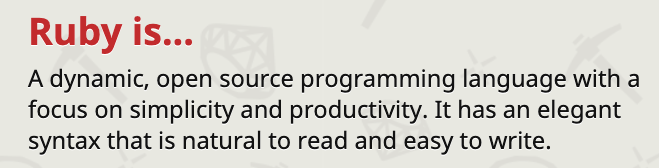

# 💎 Ruby

## Ruby a programmer's best friend

Some of our projects use [Ruby](https://www.ruby-lang.org/en/) so this page
tries to be an easy to use tutorial on all things [Ruby](http://ruby-doc.org).

Ruby dates back to the 1990's and was first created by a Japanese man named
[Yukihiro "Matz" Matsumoto](https://en.wikipedia.org/wiki/Yukihiro_Matsumoto).

Hey come and check out the [Ruby in 4 seconds](https://youtu.be/ayx4fASYkZU)
video.

[Ruby](https://www.ruby-lang.org/en/) is very
[powerful](https://www.ruby-lang.org/en/documentation/success-stories/), is
growing in popularity and is currently ranked 11th on the
[TIOBE Index](http://www.tiobe.com/tiobe_index).

There are two types of Ruby files: .rb, .rbw

[Matz](https://twitter.com/matz_translated) made run Ruby fun and easy to learn,
so don't be scared and first check out a short Ruby YouTube video I created.

[Ruby in 29 seconds](https://youtu.be/2ei7S0FU65E)

## Links

- [Ruby](https://www.ruby-lang.org/en/)
- [Ruby Best Practice](https://github.com/rubocop-hq/ruby-style-guide)
- [Ruby Syntax Checker](https://github.com/rubocop-hq/rubocop)
- [Introduction to Test Driven Development in Ruby](https://blog.makersacademy.com/an-introduction-to-tdd-in-ruby-72f0a8536509)
- [Ruby Gems](https://rubygems.org/)
- [Alternative Ruby Shell, Pry, With More Features](https://github.com/pry/pry)
- [Ruby Productivity with Vim and TMUX](https://www.youtube.com/watch?v=9jzWDr24UHQ)
- [Refactoring Ruby](https://martinfowler.com/books/refactoringRubyEd.html)
- [Practical Object Oriented Design - An Agile Primer Using Ruby](https://martinfowler.com/books/refactoringRubyEd.html)
