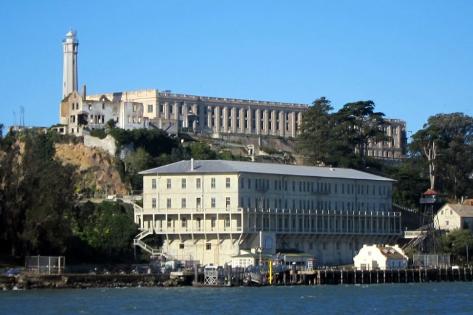

# 🇺🇸 San Francisco

San Francisco is a city in the United States capable of falling in love at first sight with its Victorian-style houses and its geographical location around the bay. This city is far from the chaotic and noisy big American cities, San Francisco also has delicious cuisine and a mild climate.

We are going to guide you through this article through the main tourist attractions of the city.

## The Golden Gate

The Golden Gate Bridge is the quintessential symbol of San Francisco and was built in 1937, it measures almost 3 km wide and 227 m high, it is on the list of the most beautiful bridges in the world and to enjoy it is advisable to access one of the viewpoints that are around the bridge, one of the favorites is Battery Spencer or any of the others that are on the side of Conzelman Road, where you can get fantastic views of the Golden Gate, the city and the bay background.

## The Presidio Park

In this huge park, families gather to enjoy a quiet day or relax on Crissy Field beach, but if you are looking for a beach with a better view of the bridge or something quieter, you can go to Baker beach, and then finish visiting the Walt Disney museum located inside the park and learning about the history of this celebrity.

## Fisherman's Wharf

Fisherman's Wharf is the fishermen's quarter and the old port that has been restored until it has become a beautiful tourist site. You can start the route through the different piers from Ghirardelli Square, such as seeing the historic ships at Hyde Street Pier or the USS Pampanito submarine along with the SS Jeremiah O'Brien, both from World War II, at Pier 35. You can also visit the Musée Mecanique where you will find hundreds of old arcade machines and finally, go to the famous Pier 39 that has an open-air shopping center, an impressive colony of underwater lions that you can see them lying in the sun and try the clam chowder that is one of the typical dishes of the city, consists of a round homemade bread with clam chowder served inside the bread.

## Alcatraz Island

This island was a military fort before becoming one of the most famous prisons in the world known as The Rock. This prison operated from 1934 to 1963 and is currently one of the best visits and experiences to do in San Francisco. To get to the island you must board one of the boats that are taken at Pier 33 and when you arrive at Alcatraz you will be able to see the cells and the different rooms of the prison, such as the one where Al Capone was.

## Castro neighborhood

The Castro neighbourhood is known for being one of the places where the current rights of the LGBTI community and the acceptance of sexual diversity were fought the most. Among the most outstanding sites is the former home of Harvey Milk, who was one of the great representatives of this community, the theater, the Victorian houses in the colorful streets located around number 18 and some of the best restaurants such as the Bar & Seafood Market or the Anchor Oyster and a famous bakery like the Hot Cookie.

## Haight-Ashbury

Haight-Ashbury is the place where the hippie movement was born in the 60s where you can see Jimmy Hendrix's house, the Victorian houses that are on Waller Street, second-hand hippie-style stores such as Buffalo Exchange, a store for buy vinyl and places to listen to live music.

## Painted Ladies

The Painted Ladies are Victorian-style houses that are painted in different pastel colors located on Steiner Street between 710 and 722. While it is true that the city had more than 50,000 houses before the 1906 earthquake in this same style, they still exist many very well preserved and scattered throughout the city, although these are the best known.

## Twin Peaks

Go up the Twin Peaks hill to get one of the best panoramic views of the entire city, these twin hills are almost 300 m high that will allow you to see Alcatraz or the Golden Gate on a clear day. It is advisable to see the fabulous sunset towards sunset.

## Golden Gate Park

The Golden Gate Park is a large green expanse that measures 5 km long by 1 km wide and there you can visit streets such as Shakespeare's Garden, the Japanese Garden, the Rose Garden, Stow Lake and the Great Dutch Mill, among many others. During the walk you will be surrounded by trees and plants from half the world and in its meadows live a whole community of American buffalo and coyotes. The other essential site to visit in the park is the Museum of the California Academy of Sciences, it is considered one of the best museums in the world where you can see skeletons of a great blue whale or tyrannosaurus rex. At the end of the park you can find an extensive beach bathed by strong currents from the Pacific Ocean, it is perfect for surf lovers but somewhat dangerous for swimmers in general.

## Chinatown

Chinatown in San Francisco is the oldest Chinatown in the United States and the largest outside of Asia. Inside you will find a world of red lanterns, theaters, temples such as the Tin How and tea houses around Grant Avenue and enjoy the typical atmosphere of the locals in Portsmouth Square and Stockton Street, where you can see people playing games of table and tai chi.

## Little Italy

The Little Italy neighborhood is a quaint neighborhood where you can sample delicious Italian food at restaurants like Golden Boy Pizza, Piccolo Forno, and Molinari Delicatessen. You can also visit the San Pedro y San Pablo church which was where Marilyn Monroe married Joe Di Maggio.

## Japantown

Japantown is the largest and oldest Japanese neighborhood in the United States where you can see several tourist attractions such as the Japan Center, the Peace Square, a five-story pagoda and a shopping center with Japanese restaurants and shops.

San Francisco is one of the most beautiful cities in the United States and if you have the chance, just don't miss it!!!

## About the Author

Idais, Graduated in Mechanical Engineering, and a master’s degree in teaching component, she gave classes in several institutes of mathematics and physics, but she also dedicated several years of my life as a television producer, she did the scripts for mikes, the camera direction, editing of video and even the location. Later she was dedicated to SEO writing for a couple of years. She likes poetry, chess and dominoes.
