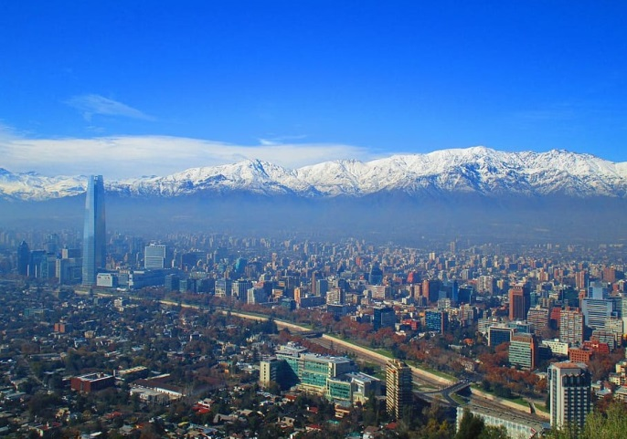
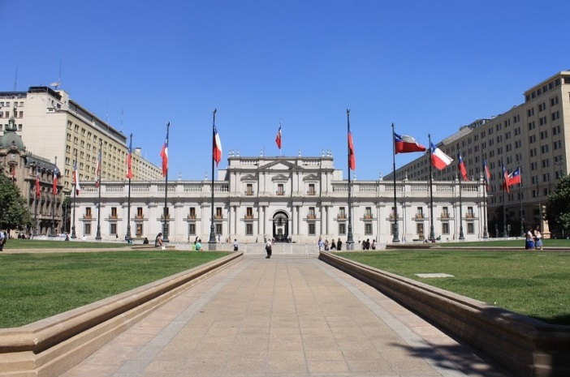
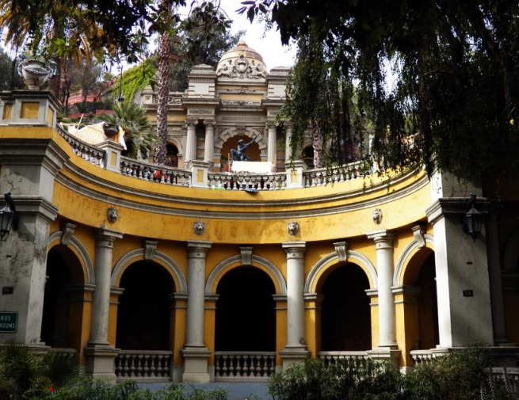

# 🇨🇱 Santiago de Chile

Santiago de Chile is a city that offers you a host of charming places
and a lot of experiences. It is the capital of Chile and its buildings
are preserved from the Spanish colonial era, you can see the city from
the viewpoints, enjoy the most bohemian neighborhoods and relax in any
of its parks.

This article will take you by the hand to recommend the essential places
you should visit if you want to get to know this wonderful city.

## Main Square

The most iconic buildings in the city are concentrated in the main
square, being the meeting point between locals and tourists. This plaza
was built during the colonial era and is located in the heart of the
historic center. There you can find emblematic buildings of the city
such as the Post Office, the building of the Municipality of Santiago,
the National Historical Museum and the Metropolitan Cathedral. However,
in addition to visiting each of these points of interest, you can also
enjoy the particular atmosphere of this square by seeing the locals
playing chess, artists performing plays and street musicians.

## The Coin Palace

The Coin Palace is the seat of the President of the Republic and where
President Salvador Allende barricaded himself on September 11, 1973, to
face the coup d\'état commanded by the military Pinochet and ended up
committing suicide. His death led to a period of just over 20 years of
darkness in which the dictator Pinochet committed endless torture,
murder and human rights violations.

Today you can visit the interior of the old Casa de la Moneda, which
still preserves some shots from the coup plotters on its facades. You
can visit the "Patio de los Cañones", the patio of the Naranjos and the
Canelo.

## The San Cristobal hill

One of the best activities you should do in the city is to go up the
cable car or funicular to the San Cristóbal hill, for this you must take
it in the Plaza Caupolicá and once up, you can enjoy the beautiful views
of Santiago and the imposing Cordillera de The Andes.

## The Metropolitan Park

This park is located in the beautiful Bellavista neighborhood and is the
largest urban park in the country, it has approximately 700 hectares
where you can find hiking trails, a Sanctuary and the viewpoint of the
Virgin.

## Santa Lucia Hill

You can climb the small Santa Lucia Hill walking its 69 m height located
in the heart of the city. There is the Hidalgo Castle with its different
terraces, where you will find a French-style park that has the Vicuña
Mackenna Hermitage and the beautiful Neptune Fountain. On the other
hand, this hill was where the conqueror Pedro de Valdivia founded the
city in 1541 and there is a stone with an extract of the letter written
by Valdivia to Carlos V of Spain.

Castillo Hidalgo photo taken by Carolina Sanchez

## The Bellavista neighborhood

Bellavista is the most charming and bohemian neighborhood to visit in
the city. You can find picturesque buildings with their colorful
facades, restaurants, art galleries and several emblematic buildings
such as Lehuedá Castle, La Chascona or Casa Roja. Around the patio of
Bellavista are the famous and recommended places to taste Chilean
cuisine such as \"Krossbar\", \"Como Agua para Chocolate\", \"Uncle
Fletch\" and \"Ciudad Vieja\".

## The Chascona

The Chascona is one of the houses where the famous poet Pablo Neruda
lived. The writer bought this land and began construction in 1953, to
live with Matilde Urrutia (his lover) who was nicknamed La Chascona for
having long red hair. After separating from his old partner, he stayed
living with his mistress until his death in 1973. There you can see 11
rooms and learn a little about the history of this famous writer.

## Lastarria neighborhood

This is an old neighborhood of artists and intellectuals and it is there
where most of the city\'s leisure and cultural offerings are
concentrated. You can find numerous museums, cafes, cultural centers,
quality restaurants, original shops and excellent places to have a drink
to have fun with your loved ones.

The recommendation is to access Merced Street and visit the most
emblematic sites such as the National Museum of Fine Arts, the Church of
Veracruz, the Bruna Palace, the Gabriela Mistral Cultural Center and see
a large number of buildings built at the beginning of the 20th century.
Each of these places has a particular structure to show, you will surely
find some history and relevant things that will especially call your
attention as you will not regret having visited them.

## Central Market

In the Central Market we recommend you try traditional Chilean dishes
such as crab cake, fried conger eel, paila marina, empanadas in the
\"Emporio Zunino\" and spider crab. You can also find excellent
souvenirs or crafts to give as gifts. The other market that you can
visit is El Mercado de la Vega, which although it is less touristy can
be more authentic than the Central. There you can find meats, fruits,
spices, vegetables and international products from neighboring Latin
American countries and also from Asia.

## Paris London neighborhood

This neighborhood is characterized by having a European architectural
style with its narrow cobblestone streets. The most important site is
the Church of San Francisco, which is the oldest temple in the country
built in colonial times, the other places of historical importance are
the local Londres 38, which was the center of extermination and/or
repression between the years 1973 and 1975, in addition to the
O\'Higginian Institute.

## Museum of Memory and Human Rights

In this museum you can feel what happened during the military
dictatorship of Augusto Pinochet. You will be able to see videos,
photographs, testimonies of the tortured survivors and the tragic
history of all the victims of the dictatorship. This is to prevent the
past from repeating itself. Then you can go to the Plaza de la Memoria,
where you can see the Universal Declaration of Human Rights inscribed on
one of its walls.

Santiago de Chile is a capital loaded with memory, it is a very
interesting city to know and visit.

## About the Author

Idais, Graduated in Mechanical Engineering, and a master’s degree in teaching component, she gave classes in several institutes of mathematics and physics, but she also dedicated several years of my life as a television producer, she did the scripts for mikes, the camera direction, editing of video and even the location. Later she was dedicated to SEO writing for a couple of years. She likes poetry, chess and dominoes.
