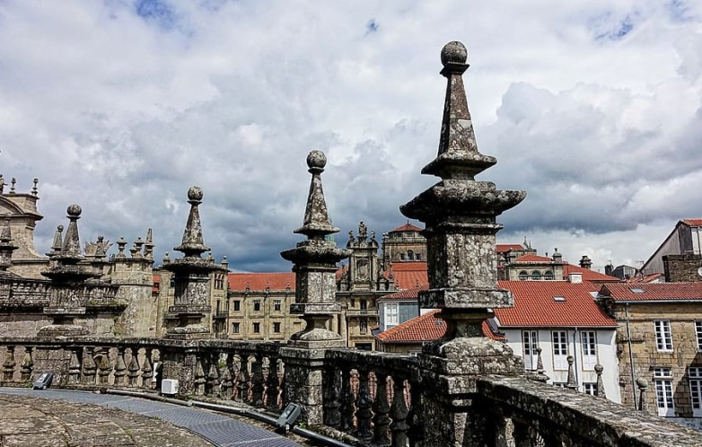

# 🇪🇸 Santiago de Compostela

Santiago de Compostela is a city that is located in the northwest of Spain and is one of the main places of pilgrimage of Christianity. This city falls in love at first sight with the beautiful streets of the old town, declared a World Heritage Site, for its monumental Cathedral and its prestigious university that is more than 500 years old.

In Santiago de Compostela you can taste excellent cuisine where seafood and fish predominate, such as Galician octopus, scallops, Galician empanada, barnacles or the famous Santiago cake.

We have made a list of the essential places that you must visit if you go to Santiago de Compostela, so that you do not miss the most important things.

## The Cathedral of Santiago of Compostela

The Cathedral was built between 1075 and 1211 with baroque and gothic elements mixed with the romantic style, in order to house the tomb of the Apostle Santiago. Its façade is impressive and you can enter its interior through the Puerta de Platerías to visit its 16 chapels. In the back of the High Altar of the Cathedral is the image of the apostle Santiago, where many believers stop to embrace it.

The jewel of this temple is the Pórtico de la Gloria, which has numerous religious figures and you can also be surprised by the huge 50-kilo censer, set in motion to swing it during religious celebrations.

## Obradoiro Square

The Square Obradoiro, in addition to the cathedral, has several interesting places to see such as the Pazo de Raxoi, which is the current seat of the town hall, the old episcopal palace, the Pazo de Xelmirez, and the old college of the city, the Colexio de Saint Xerome. However, the building preferred by most is the hospital of the Catholic Monarchs, which was built in 1501 to give shelter to pilgrims on the Camino de Santiago, today it is a hotel known as the Parador de Santiago and its interior is a true wonder.

## Historic helmet

Around the Plaza de Obradoiro is the Historic Quarter that was declared a World Heritage Site, full of cobbled streets, squares, stately homes, palaces, fountains and churches that take you back to medieval times. Among the most outstanding sites are the Plaza de las Platerías, de la Quintana, de Cervantes, the stately homes of Deán, da Balconada, de la Parra and its most emblematic streets such as Rúa Raíña, Rúa do Franco, Rúa Nova and the Rúa do Vilar, all surrounded by old buildings and that are really worth visiting.

In this area there are also some of the best restaurants in the city such as Gato Negro, A Noiesa or Mesón 42. If you prefer to eat octopus, the recommendation is to go to Mesón do Pulpo and if it is a special occasion, you can go to Casa Marcelo that has a simply delicious tasting menu.

## Convent of San Francisco

The Convent of San Francisco is a monastery built at the beginning of the 13th century and, according to tradition, it was San Francisco de Asís himself who ordered its construction. Although it is true that the monastery collapsed at the beginning of the 18th century and today only its Cloister, five Gothic arches and the tomb of Cotolay remain from the original building. The current building is the neoclassical baroque style and is worth a tour.

## Food Market

The Food Market is the second most visited site after the Cathedral. There you can see local people buying seafood, fish, vegetables, fruits, meats, cheeses, etc. but you can also consume fresh products from the market such as oysters at A Ostrería, at Pulperia Abastos try their exquisite octopus or they cook for you at the moment at Mariscomania what you have bought in the market, for approximately five euros per diner.

## Galician People's Museum

The Museo do pobo Galego offers you a walk through Galician culture through its history, it is located in the Santo Domingo de Bonaval convent. You will be able to hallucinate with its triple helicoidal staircase and the Church, where the remains of famous Galicians such as the poet Rosalía de Castro are found.

## Climb Mount Pedroso

The recommendation is to climb Monte Pedroso either on foot or by car towards sunset, the views of the city, the natural surroundings and the cathedral are magnificent. The other very popular viewpoint is Monte do Gozo, which is located on a 380-meter hill 5 km from the city.

## Monastery of San Martin Pinario

The Monastery of San Martín Pinario is located in the Plaza de la Inmaculada. This Benedictine monastery was built in the 10th century and stands out for its façade with various religious figures, its two cloisters and the Church, which houses a major baroque-style altarpiece and the beautiful choir stalls.

## Alameda Park

The Alameda Park offers you walks among eucalyptus, chestnut and oak trees as well as several statues such as that of Rosalía de Castro, that of the two Marías and that of the playwright Valle Inclán. You can also go to the viewpoints on the Paseo de la Herradura where you will get fantastic views of the historic center and the Cathedral.

## River walk along the Sarela River

Bordering the Sarela River, you can take a pleasant walk, starting with the Iglesia del Carmen de Abaixo.

Another worthwhile route is the Sar river path with its beautiful natural landscapes and you will be able to see a Romanesque temple such as the Colexiata de Santa María do Sar, built in the 12th century where you will be impressed by its interior and the inclination of its columns. Near this area there is an architectural complex designed by the architect Peter Eisenman, which is the City of Culture of Galicia, you will be pleasantly surprised by its design and its forms, in addition to its unique buildings offering an extensive cultural offer, which you cannot Stop watching.

Santiago de Compostela is a city steeped in history, which still preserves its medieval structures.

## About the Author

Idais, Graduated in Mechanical Engineering, and a master’s degree in teaching component, she gave classes in several institutes of mathematics and physics, but she also dedicated several years of my life as a television producer, she did the scripts for mikes, the camera direction, editing of video and even the location. Later she was dedicated to SEO writing for a couple of years. She likes poetry, chess and dominoes.
