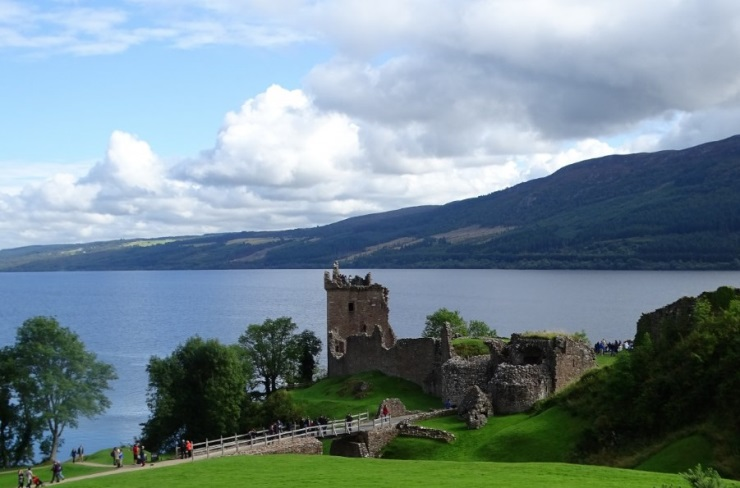
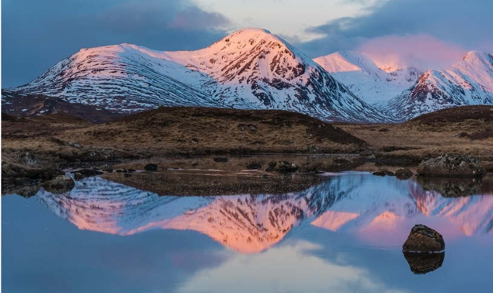
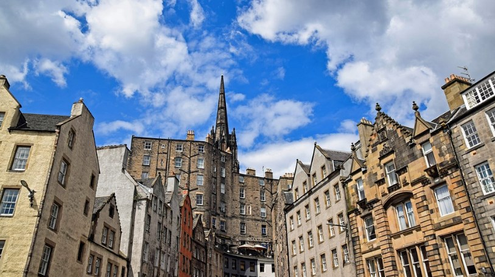

# 🏴󠁧󠁢󠁳󠁣󠁴󠁿 Scotland

Scotland is part of the 4 countries that make up the United Kingdom.
Together with Wales and England it forms part of the great island of
Great Britain and consists of more than 790 islands. Scotland, more than
monuments and cities, is a country that impresses with its landscapes,
its lakes and dreamy castles.

The recommendation to get to know Scotland is to rent a car either in
Glasgow or Edinburgh, to have the freedom to stop wherever and whenever
you want, in front of a beautiful waterfall, a castle or on the shore of
a lake, this is simply priceless.

We leave you a list of the most incredible places you can see in
Scotland

## Eilean Donan Castle

Eilean Donan Castle located in the Highlands, which in turn is on the
small island of Loch Duich. This castle was the setting for movies like
Braveheart or The Immortals. The best photos you can take from the shore
of the lake or from the back after the visit.

## Neist Point on the Isle of Skye

Neist Point is known as the end of the Scottish world, it is located on
the Isle of Skye and you can climb a small hill to sit on the edge of
the cliff, where you will enjoy impressive views of the sea and there
you will also find a beautiful lighthouse to visit .

## Urquhart Castle and Loch Ness

Loch Ness is probably one of the most famous places in Scotland for the
legend of the monster. This deep lake of dark waters began to be famous
with a photograph of what seemed like a sighting of a monster in 1933,
although later it was proven that it was not true, the legend continued
over the years. But really the best place on the lake is Urquhart
Castle, which although it is in ruins, it is a beautiful place.

## Glen Coe

Glen Coe are great mountains that surround a deep glacial valley,
located in the Highlands and of volcanic origin. It is one of the best
places in Scotland for mountain sports and hiking. However, you can also
make your way to Stalker Castle before you get to Glen Cloe on the
island of Loch Laich, which is really worth seeing.

Also, while you cross the glacial valley you will find waterfalls,
rivers, mountains and the incredible landscapes that surround it.

## Saint Andrews

Saint Andrews is known worldwide for being the birthplace of golf and is
a historic university town where you will be pleasantly surprised. One
of the emblematic sites is its cathedral, where you can walk among its
ruins surrounded by tombs from all eras. However, the best place where
you can have the best panoramic views of the cathedral, the sea and the
city, is from the tower that belongs to the church of Sant Rule.

Saint Andrews is a charming medieval town with its cafes, shops and
markets. But you can also visit the beautiful beach of West Sands and
next to it you can see people playing golf on the Old Course, which is
one of the oldest in the world.

## Whiskey distillery

Scotland is definitely the land of whiskey and you can visit any of its
108 distilleries, to the point that there is a whiskey route where they
will teach you every part of the process of making this malt beverage,
you can also taste various types of whiskey. Glenfiddich is one of the
most renowned distilleries and can be a curious experience.

## Dunnottar Castle**

Dunnottar Castle is one of the most famous castles for its location, you
will find it on top of the sea on a rocky cliff and it is a perfect
place to defend against enemy attacks, being only accessible by a steep
and narrow path. You will be able to see the ruins dating back to the
14th and 15th centuries, what remains of the stables, the palace, the
chapel and other rooms that turn out to be just as impressive.

## Rosslyn Chapel and The Borders

South of Edinburgh is the Borders area, a region full of charming
villages and impressive ruins of medieval Abbeys. Be sure to see the
Rosslyn Chapel, which was built in the mid-15th century and is full of
symbols, gargoyles, figures carved in stone, reliefs and according to
legend, the Templars hid the Holy Grail in this place. A little further
south you can find Melrose Abbey which is another incredible place and
you can also include some interesting abbeys in your visits, such as
Jedburg and Dryburgh.

## Stirling

The town of Stirling is famous for its castle, but you can also visit
the medieval town of Stirling, its beautiful cemetery, cross its famous
bridge or visit the old prison. Near the town you can see the monument
to William Wallace immortalized by the movie Bravehart.

The monument is represented by a huge Victorian tower from where you
will have fantastic views of the surroundings. Inside is the huge sword
of William Wallace and you will learn something about the history of
this famous character.

## Loch Lomond and the Trossachs National Park

Stirling and the gateway to this beautiful park full of forests, lakes,
mountains and valleys, perfect for lovers of hiking and in its center is
Loch Lomond, which is the largest and most beautiful lake in all of
Great Britain. There are also other interesting places to see such as
the beautiful Argyll Forest, Lake Katrine and the small town of
Aberfoley.

## Edinburgh

Edinburgh is the capital of Scotland and it is an extremely welcoming
city, as well as having a great atmosphere in all its pubs. In this
city, the fabulous Edinburgh Castle stands out and has two quite
different parts that are the New Town and the Old Town. In this city
there are many activities to do and places to see, but the most
important are visiting the castle, having a drink of malt whiskey in one
of its many taverns, strolling along Circus Lane and the Royak Mile,
visiting the Palace of Holyrood and climb Calton Hill to watch the
sunset, where you will have an excellent view of Edinburgh.

Scotland is full of history, it is embodied in each of its impressive
castles and its beautiful landscapes will leave you pleasantly surprised

## About the Author

Idais, Graduated in Mechanical Engineering, and a master’s degree in teaching component, she gave classes in several institutes of mathematics and physics, but she also dedicated several years of my life as a television producer, she did the scripts for mikes, the camera direction, editing of video and even the location. Later she was dedicated to SEO writing for a couple of years. she like poetry, chess and dominoes.