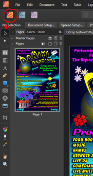
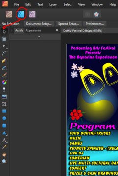

# 📙 Serif Software

## Image editing

### Overview

I’m perhaps the Fuchsia Team member with the shortest relevant work history. I’m
a newcomer to the world of graphic design, having spent most of my life working
in the aerospace electronics and gaming industries, which both demand precise
adherence to rules and proper work procedures. So when I decided I wanted to be
a graphic designer, I did some research and I chose Serif Software for my design
work. Serif Software is published in England and provides comprehensive and
extremely capable suites of apps that include design, photo and publishing
programs at prices, and with upgrade policies, far better than Adobe software.

I originally used Serif DrawPlus, PhotoPlus, PagePlus and Web Plus (yes,
specifically for website design) on my Windows PC and then Serif introduced the
award winning Affinity line of design apps: Affinity Designer, Affinity Photo
and Affinity Publisher. Affinity was originally introduced for use on Macs and
iPads and then Serif expanded Affinity to include apps for Windows (all file
format outputs are interchangeable).

I find that there are some features of the older Plus line (the LAGACY apps)
that I prefer and many features of the Affinity line that I prefer. In the
course of my design work, I’m even able to use a mixture of the older legacy
Plus apps and the newer Affinity apps. In addition, the Affinity apps can all
seamlessly switch from one to the other, so that the different functions are ALL
available when working on any design without any interruption in work flow.

These excellent apps let me choose the projects I apply for, with a degree of
confidence that is very reassuring. Since I’m not an expert, I seek to expand my
capabilities in a controlled and thoughtful way, so I can learn and yet not get
“in over my head”. The point is, I want to learn, but never fail to give my
clients all they deserve and ask for. And from the reviews I have read, the
learning curve with Serif Software is not as steep as with Adobe. That’s a plus
for this old guy!

### About Affinity apps from Serif Software

I will be sending myself to school (tutorials) for the apparently massive
capabilities of the Affinity apps. I have known for some time that these apps
were more capable than the very good line of legacy apps from Serif, but in
researching Affinity for this short article, I discovered that I have an
incredible amount to learn. I’m the kind of person who likes to learn by doing.

When it comes to software I just play with it, poke around and see what I can
do, but with Affinity, that isn’t enough for me. Since I have never taken
classes in graphic design, and I have only read a little on basic design
principles, with the older legacy, Plus line of apps, I needed just a few
[tutorials. But Affinity is amazing. The point I would like to make is that
Affinity is tremendously capable and worth investigating and it’s NOT a
subscription service. At the end of this article I will include some links to
several wepages relevant to both Affinity apps and the Serif legacy apps.

The thing I like most about Affinity is that all of the apps, Publisher,
Designer and Photo are seamlessly connected, so that when working on any
document, one can switch between designing, photo editing and publishing with
just a couple mouse clicks and without saving and exporting. There is a
screenshot attached that shows this:

Affinity Publisher is the most connected and comprehensive app when it comes to
its range of capabilities. All of the apps use “Personas” that each bring up
different toolbars and functions within that app. Select the Persona and then
you will see all the functions for that Persona in a toolbar on the left. See
the screenshots that illustrate the Personas that are available within Affinity
Publisher. You can work in the Publisher Persona or the Photo Persona or the
Designer Persona and have most of the essential functions of all the apps
available within just the Publisher app.

For more detailed and thoroughly comprehensive capabilities, the individual apps
are easy to switch to seamlessly.

The Designer app has the Designer Persona for vector drawing, the Pixel Persona
for bitmap work, and the Export Persona for, you guessed it, exporting designs.
It’s really easy and quick to switch between the Personas and your design file
is automatically and non-destructively updated as you go.

The Photo app has a Photo Persona, a Liquify Persona for mesh warping images and
text, a Develop Persona for detailed photo adjustments, a Tone Mapping Persona
for more detailed adjustments (I need to learn much more about this), and again,
an Export Persona with multiple choices for your exports. OK, check out the
screenshots and then check out Affinity.

- [Affinity tutorials](https://affinity.serif.com/en-us/learn/)
- [AffinitybySerif Twitter](https://twitter.com/AffinitybySerif)
- [Affinitybyserif Facebook](https://www.facebook.com/affinitybyserif/)
- [Affinity home page](https://affinity.serif.com/en-us/)
- [Affinity Forums, all apps](https://forum.affinity.serif.com/)
- [All Affinity product tutorials](https://affinity.serif.com/en-us/learn/)
- [Legacy products forum and tutorials](https://community.serif.com/tutorials)
- [Serif legacy products support](https://community.serif.com/)
- [Reviews and comparisons on Capterra, of Affinity products to other design software](https://www.capterra.com/p/110533/WebPlus-X4/)

## About The Author

Harley Armentrout is a happy husband and father, former silversmith, aerospace
electronics prototype assembler, test, calibration & repair technician, also
writing test procedures at [BallAerospace](https://www.ball.com/aerospace). Then
21 years in the gaming industry, in a range of positions, culminated as a Gaming
Inspector, observing and reporting on rules violations, safety issues and
criminal activities for the
[Yavapai Prescott Indian Tribe](https://buckyscasino.com/). After “retiring”
Harley taught himself a few graphic design skills and he works as a freelance
designer.
