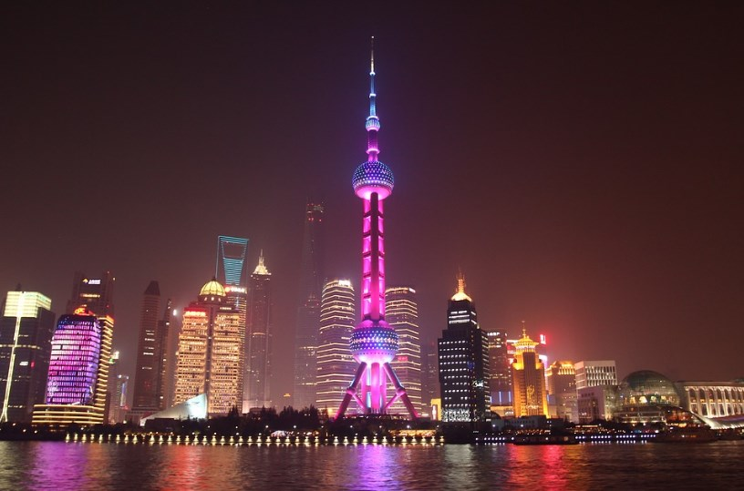
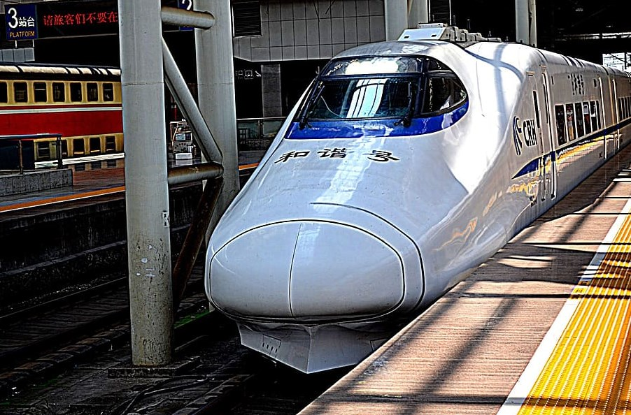

# 🇨🇳 Shanghai

Shanghai is the largest city in China with a population of more than 24 million inhabitants and is one of the busiest ports in the world, due to its geographical position not only because of the mouth of the Yangtze River but also because of its inland waterways. It boasts world-class art galleries and museums, numerous lovely parks and gardens, as well as many traditional pagodas and ancient temples, a world-class transit system with impressive-speed train connections to other major cities.

We are going to guide you through this article through the most important sites in Shanghai so that you can visit the most emblematic places in the city.

## Shanghai Promenade: The Bund

This beautiful promenade is located along the banks of the Huangpujiang River and is very popular with tourists because the area is European-style, you can find old English and French buildings that are now restaurants, offices, galleries and boutiques. You will find 52 buildings built in various styles where you will see Romanesque, neoclassical, Gothic, Baroque, Renaissance influences and one of the most impressive collections of Art Deco architecture on the planet. Other emblematic buildings are: the old headquarters of Hong Kong, the customs office of the port that has a fabulous bell tower, the Bank of China, the Shanghai Banking Corporation with a dome that you cannot miss and the old Peace Hotel. At the Bund you can also board a boat around the harbor and cruise over the confluence of the Yangtze and Huangpujiang rivers.

## Yu Garden

Also called the Garden of Happiness, it was inaugurated in 1559 and covers an area of approximately 20,000 m². The main room of the park has a building with walls adorned by dragons and beautiful ornaments on the ceiling, it consists of an exterior garden and an interior one. The Spring Hall is the most well-known building and the rocks in this area of the garden are of great historical importance, as it is the only surviving work of the garden master Zhang Nanyang. The newest of the gardens dates back to 1709 with attractive pavilions, miniature mountain ranges, decorative stones, small ponds and a beautifully decorated theater stage.

## The Jade Buddha Temple

The current building was rebuilt in 1928 to replace the original temple that had been built in 1882. The temple is divided into two courtyards, three halls, and includes the Hall of the Kings of Heaven, notable for two Shakyamuni sculptures and his four statues. of the heavenly kings that are almost 2 meters tall. The charming Hall of the Great Hero features 18 figures of Luohan and his Buddhas of the Three Ages. Another of the most important Buddhist sites in the city is the Jing'an Temple on Nanjing West Road.

## The Shanghai Museum

This museum was opened in 1952 and the most important classical art museum in China, the building is a work of art in itself with its unique round-square base and its four floors that include collections of ceramics and bronze, from prehistory until the nineteenth century. It also has large collections of jade, furniture from the Ming and Qing period (1368-1912), and coins. Even the Shanghai Natural History Museum is worth a visit.

## Longhua Temple and Pagoda

Longhua Temple is one of the oldest religious sites in China and stands next to a 40m-high brick and wood pagoda that was built in 242 AD. It consists of five large rooms where you can find a great statue of Buddha, the Great Hall of the Great Sage and the Hall of the Heavenly King. Among the highlights is the 5-ton, 2-meter-high bell tower built in 1382 and the impressive view of approximately 500 Buddhas.

## The Oriental Pearl Tower

This tower is 468 meters high and offers you an excellent view over the historic Bund Promenade, its name is due to 11 spheres of various sizes, the tallest of them being the Spatial Module where the outer shell and the floor are of glass. The tower offers you 15 observation areas, including a revolving restaurant with an excellent panoramic view.

## Shopping on Nanjing Road

Nanjing Road in the main commercial street in Shanghai where you can find from street vendors to luxurious boutiques, there you can find typical Chinese souvenirs and large shopping centers such as Yibai and Jiubai. It is also home to many cinemas, restaurants and is also the center of street performances in the city.

## Town square

It is where the Zhang Shanghai Museum, the City Hall, the Grand Theater Technique and the Urban Planning Exhibition Center are located, where you will find magnificent models with the existing buildings and can get a fascinating perspective of this modern metropolis.

## The French Connection: Tianzifang

Tianzifang is the fascinating place for handicrafts, it has many handicraft shops and small galleries, instead of the big shopping malls found in other parts of the city. But it is also a very fun place to visit at night, since there you can find traditional Chinese food in numerous restaurants and also discover places with live music and artist workshops.

## Xujiahui Cathedral and Sheshan Basilica

Xujiahui Cathedral is the largest Catholic site in Shanghai with a pair of 50-meter-high bell towers, an interior filled with fine stained glass windows, and a beautiful surrounding park worth visiting. The other important religious place is the Sheshan Basilica, a beautiful old Catholic church where tourists often zigzag through the 14 Stations of the Cross, they are uphill to reach the church and on the way you can enjoy splendid views of the city. city.

## Shanghai Science and Technology Museum

This museum is the largest of its kind in all of China, where you can find many interactive multimedia exhibits, state-of-the-art science, permanent exhibits, exhibits of animals native to the region, robotics, space travel exhibits, the Shanghai Aquarium with a 120-meter transparent tunnel capable of providing a close-up view of the region's marine fauna and the Shanghai Zoo, with a large collection of species including South China tigers and giant pandas.

## The Chinese Art Museum

It is the largest gallery in Asia and houses the most important works of modern art in China and if you are an art lover in general you should also visit the Center for Oriental Art, where you can watch classical music, opera, ballet and theater performances.

## The Maglev

The Maglev is a train line that operates at high speed by means of magnetic levitation, it is the fastest transport service in the world and reaches a speed of up to 431 km/h, traveling the 30-kilometer stretch that goes from the Pudong International Airport to Longyand Road Station in about 7 minutes.

Shanghai, a modern city full of interesting places to visit!
